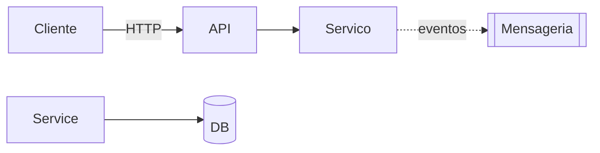

# Target Architecture

> Target architecture of the new system, respecting the paradigm chosen in `paradigm_decision.md` and the strategy confirmed in `migration_strategy.md`.

## Overview

## Diagrama (Mermaid)

## Components

| Component | Type | Responsibility | Origin (legacy/new/fused) |
|---|---|---|---|
| <name> | API / Service / Worker / DB / Queue | <text> | <ref for legacy or "new"> |

## Bounded contexts

### BC-01: <name>
- **Responsibility**: <text>
- **Grouping/separation justification**: <why this context was not decomposed 1-to-1 from legacy>
- **Internal components**: <list>
- **Eventos publicados** (se paradigma event-driven): <list>
- **Eventos consumidos**: <list>

<repeat for context>

## Architectural decisions (ADR-style in short)

### AD-01: <title>
- **Decision**: <text>
- **Alternativas descartadas**: <list>
- **Justification**: <text, linking to paradigm, strategy and appetite>
- **Traceability**: <reference to legacy or discard_log>

## Honor to the chosen paradigm

> Mandatory section when there is a paradigm shift. Demonstrates that the architecture honors the `paradigm_decision.md` decision.

- **Paradigma alvo**: <do `paradigm_decision.md`>
- **How ​​architecture honors this paradigm**:
- <ex: event-driven → explicit events, message schemas, eventual consistency strategy>
- <ex: OO with DI → interfaces, injection container, clear borders between layers>
- <ex: functional → immutable types, composition, absence of side effects in the domain>

## Borders with legacy during migration
- <ex: during Strangler Fig, the new API reroutes calls from legacy X to phase Y>

## Notas
<Additional design notes.>
