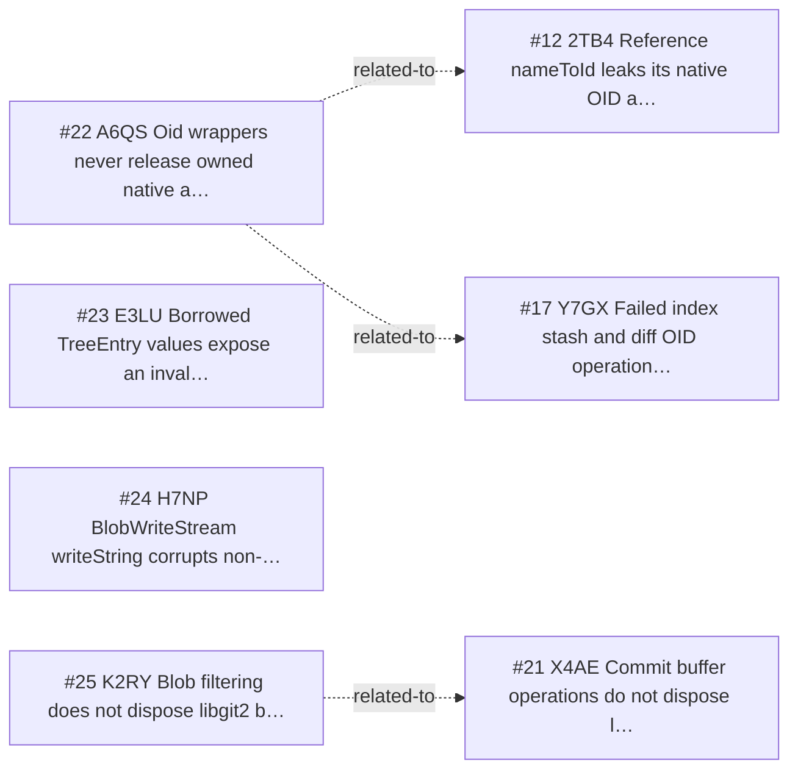

<!-- GENERATED, DO NOT EDIT: regenerated by /reversa-debugger-graph at 2026-08-20T16:32:54.017Z from 4 bugs -->

# Bug Graph: git-objects-and-object-database

## Clusters
- `git-objects-and-object-database`: _reversa_sdd/git-objects-and-object-database/design.md is shared by BUG-20260817-A6QS, BUG-20260817-E3LU, BUG-20260817-K2RY, indicating a common specification chain to review together.
- `git-objects-and-object-database`: _reversa_sdd/adrs/003-use-arenas-and-finalizers-for-native-memory.md is shared by BUG-20260817-A6QS, BUG-20260817-K2RY, indicating a common specification chain to review together.

## Impact score

Heuristic for triage only; it does not replace priority or severity.

| Bug | Score |
| --- | ---: |
| BUG-20260817-E3LU | 0 |
| BUG-20260817-A6QS | 0 |
| BUG-20260817-H7NP | 0 |
| BUG-20260817-K2RY | 0 |
