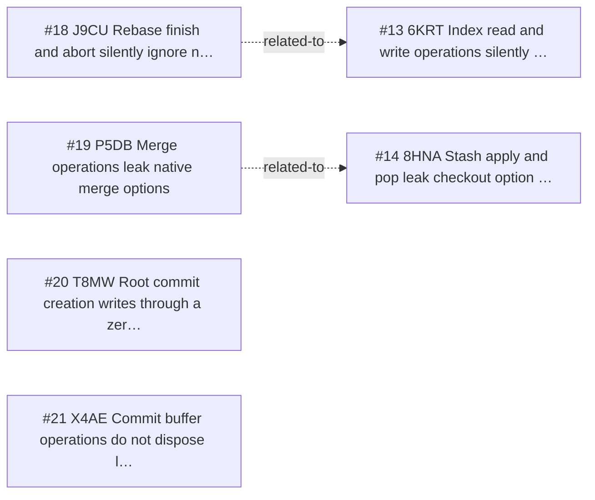

<!-- GENERATED, DO NOT EDIT: regenerated by /reversa-debugger-graph at 2026-08-20T15:47:08.721218Z from 4 bugs -->

# Bug Graph: history-and-integration-operations

## Clusters
- `history-and-integration-operations`: _reversa_sdd/history-and-integration-operations/edge-cases.md is shared by BUG-20260817-J9CU, BUG-20260817-T8MW, indicating a common specification chain to review together.
- `history-and-integration-operations`: _reversa_sdd/history-and-integration-operations/design.md is shared by BUG-20260817-P5DB, BUG-20260817-X4AE, indicating a common specification chain to review together.
- `history-and-integration-operations`: _reversa_sdd/adrs/003-use-arenas-and-finalizers-for-native-memory.md is shared by BUG-20260817-P5DB, BUG-20260817-X4AE, indicating a common specification chain to review together.

## Impact score

Heuristic for triage only; it does not replace priority or severity.

| Bug | Score |
| --- | ---: |
| BUG-20260817-T8MW | 0 |
| BUG-20260817-J9CU | 0 |
| BUG-20260817-P5DB | 0 |
| BUG-20260817-X4AE | 0 |
