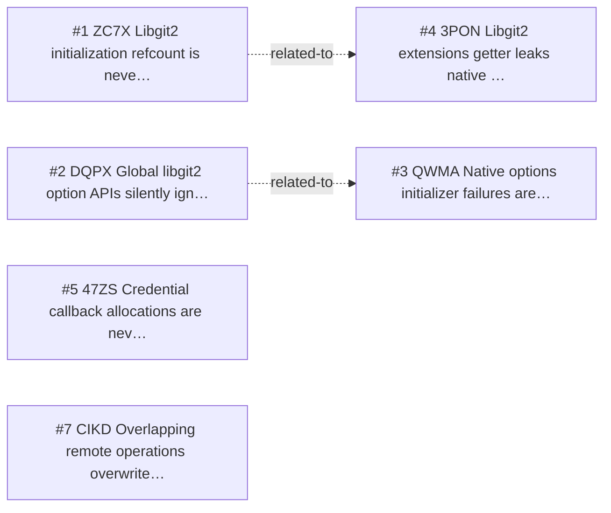

<!-- GENERATED, DO NOT EDIT: regenerated by /reversa-debugger-graph at 2026-08-21T05:03:12.641685Z from 7 bugs -->

# Bug Graph: native-runtime-and-platform-boundary

## Clusters
- `native-runtime-and-platform-boundary`: the requirements chain is shared by BUG-20260817-ZC7X, BUG-20260817-DQPX, BUG-20260817-QWMA, BUG-20260817-3PON, BUG-20260817-47ZS, BUG-20260817-CIKD.
- `libgit2.dart`: BUG-20260817-ZC7X, BUG-20260817-DQPX, BUG-20260817-3PON converge on this component.
- `repository.dart`: BUG-20260817-ZC7X, BUG-20260817-QWMA, BUG-20260817-CIKD converge on this component.
- `checkout.dart`: BUG-20260817-QWMA, BUG-20260817-CIKD converge on this component.
- `diff.dart`: BUG-20260817-QWMA, BUG-20260817-CIKD converge on this component.
- `merge.dart`: BUG-20260817-ZC7X, BUG-20260817-QWMA converge on this component.

## Impact score

Heuristic for triage only; it does not replace priority or severity.

| Bug | Score |
| --- | ---: |
| BUG-20260817-ZC7X | 0 |
| BUG-20260817-DQPX | 0 |
| BUG-20260817-QWMA | 0 |
| BUG-20260817-3PON | 0 |
| BUG-20260817-47ZS | 0 |
| BUG-20260817-CIKD | 0 |
