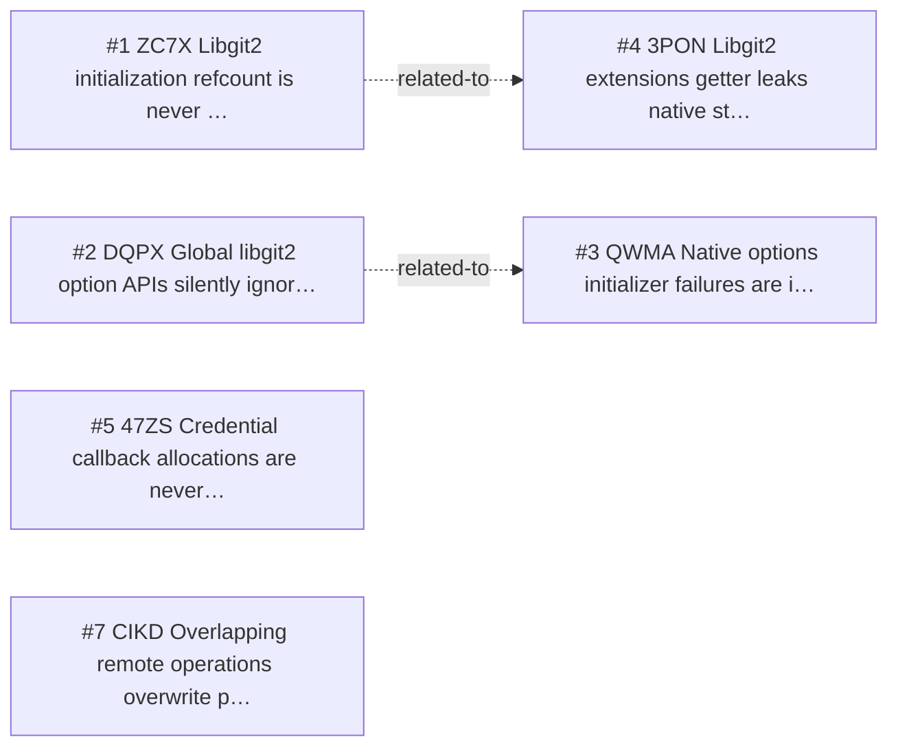

<!-- GENERATED, DO NOT EDIT: regenerated by /reversa-debugger-graph at 2026-08-20T15:47:08.721218Z from 7 bugs -->

# Bug Graph: native-runtime-and-platform-boundary

## Clusters
- `native-runtime-and-platform-boundary`: _reversa_sdd/native-runtime-and-platform-boundary/requirements.md is shared by BUG-20260817-ZC7X, BUG-20260817-DQPX, BUG-20260817-QWMA, BUG-20260817-3PON, BUG-20260817-47ZS, BUG-20260817-O3B3, BUG-20260817-CIKD, indicating a common specification chain to review together.
- `native-runtime-and-platform-boundary`: _reversa_sdd/native-runtime-and-platform-boundary/flows.md is shared by BUG-20260817-ZC7X, BUG-20260817-DQPX, BUG-20260817-47ZS, BUG-20260817-O3B3, indicating a common specification chain to review together.
- `native-runtime-and-platform-boundary`: _reversa_sdd/adrs/004-centralize-native-error-translation.md is shared by BUG-20260817-DQPX, BUG-20260817-QWMA, indicating a common specification chain to review together.
- `native-runtime-and-platform-boundary`: _reversa_sdd/adrs/003-use-arenas-and-finalizers-for-native-memory.md is shared by BUG-20260817-3PON, BUG-20260817-47ZS, indicating a common specification chain to review together.

## Impact score

Heuristic for triage only; it does not replace priority or severity.

| Bug | Score |
| --- | ---: |
| BUG-20260817-ZC7X | 0 |
| BUG-20260817-DQPX | 0 |
| BUG-20260817-QWMA | 0 |
| BUG-20260817-47ZS | 0 |
| BUG-20260817-O3B3 | 0 |
| BUG-20260817-CIKD | 0 |
| BUG-20260817-3PON | 0 |
