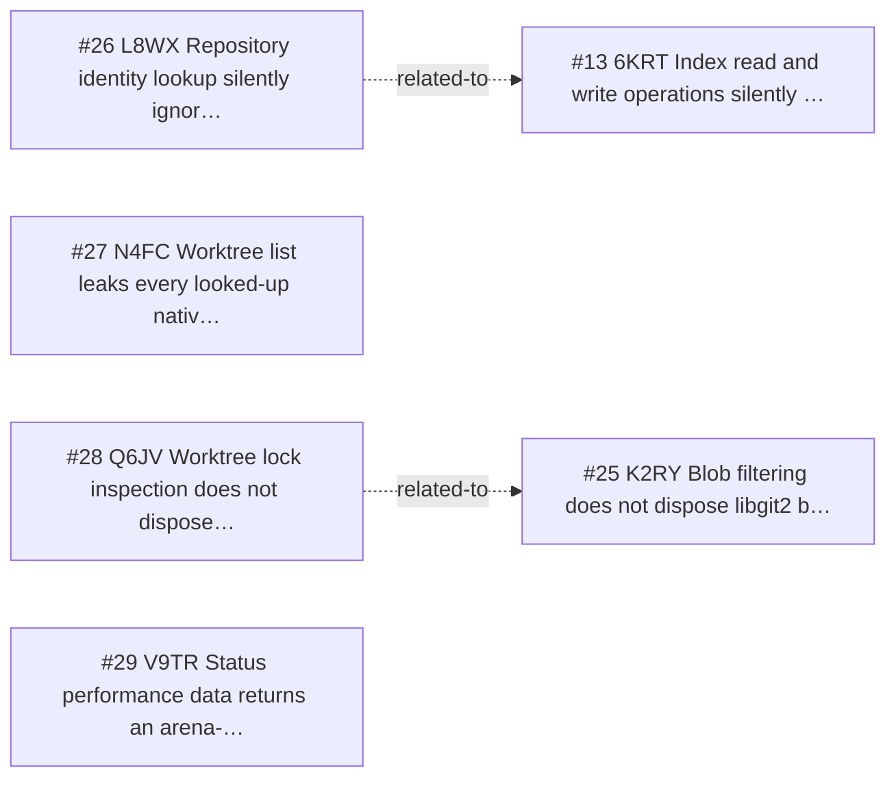

<!-- GENERATED, DO NOT EDIT: regenerated by /reversa-debugger-graph at 2026-08-20T15:47:08.721218Z from 4 bugs -->

# Bug Graph: repository-lifecycle

## Clusters
- `repository-lifecycle`: _reversa_sdd/repository-lifecycle/flows.md is shared by BUG-20260817-N4FC, BUG-20260817-Q6JV, indicating a common specification chain to review together.
- `repository-lifecycle`: _reversa_sdd/repository-lifecycle/edge-cases.md is shared by BUG-20260817-L8WX, BUG-20260817-V9TR, indicating a common specification chain to review together.

## Impact score

Heuristic for triage only; it does not replace priority or severity.

| Bug | Score |
| --- | ---: |
| BUG-20260817-V9TR | 0 |
| BUG-20260817-L8WX | 0 |
| BUG-20260817-N4FC | 0 |
| BUG-20260817-Q6JV | 0 |
