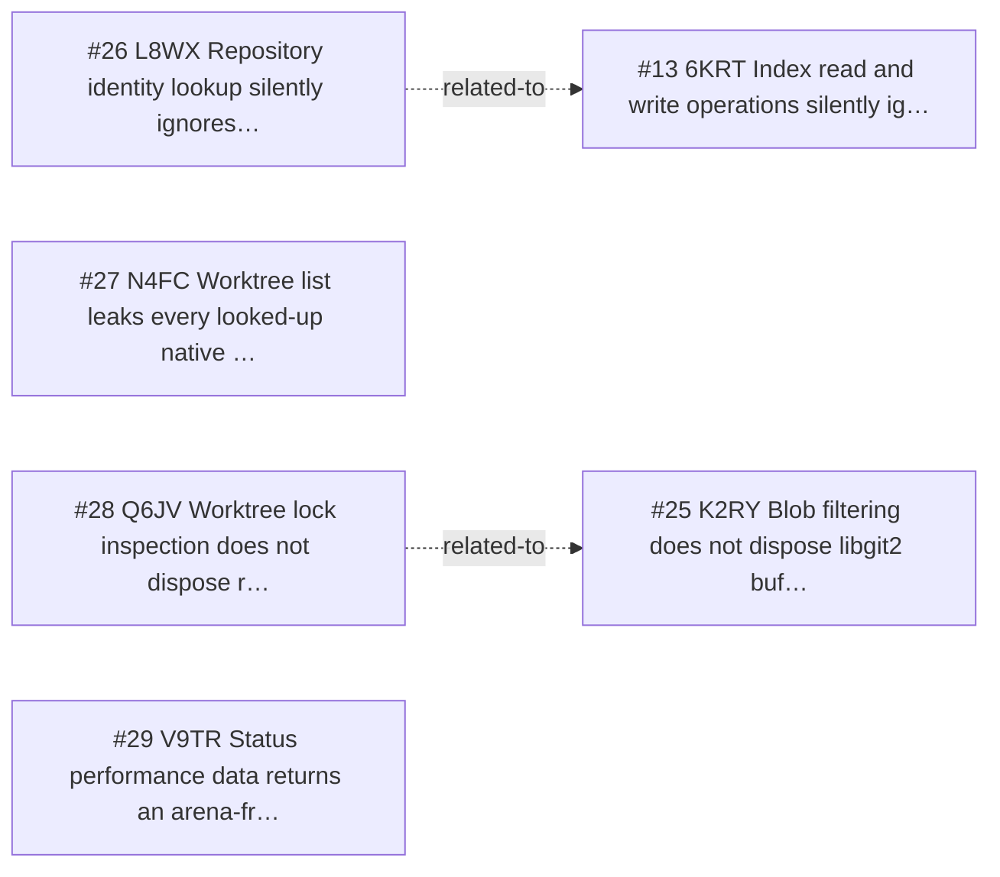

<!-- GENERATED, DO NOT EDIT: regenerated by /reversa-debugger-graph at 2026-08-20T17:48:27.308437Z from 4 bugs -->

# Bug Graph: repository-lifecycle

## Clusters

- `repository-lifecycle`: `_reversa_sdd/repository-lifecycle/flows.md` is shared by BUG-20260817-N4FC and BUG-20260817-Q6JV.
- `repository-lifecycle`: `_reversa_sdd/repository-lifecycle/edge-cases.md` is shared by BUG-20260817-L8WX and BUG-20260817-V9TR.

## Impact score

Heuristic only: caused*3 + blocked*2 + regressions*4 + related*1. It does not replace priority or severity.

| Bug | Score |
| --- | ---: |
| BUG-20260817-L8WX | 0 |
| BUG-20260817-N4FC | 0 |
| BUG-20260817-Q6JV | 0 |
| BUG-20260817-V9TR | 0 |
