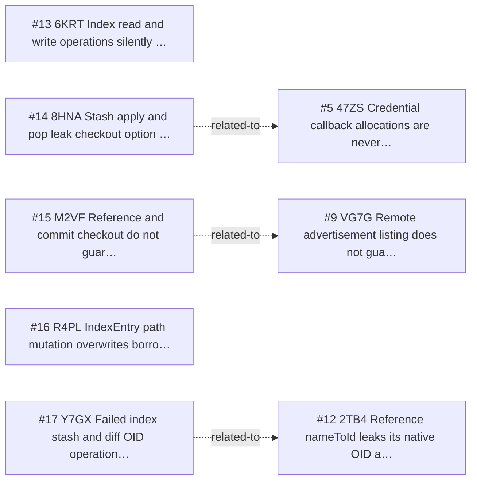

<!-- GENERATED, DO NOT EDIT: regenerated by /reversa-debugger-graph at 2026-08-20T15:47:08.721218Z from 5 bugs -->

# Bug Graph: working-tree-and-index

## Clusters
- `working-tree-and-index`: _reversa_sdd/working-tree-and-index/flows.md is shared by BUG-20260817-6KRT, BUG-20260817-8HNA, BUG-20260817-M2VF, indicating a common specification chain to review together.
- `working-tree-and-index`: _reversa_sdd/adrs/003-use-arenas-and-finalizers-for-native-memory.md is shared by BUG-20260817-8HNA, BUG-20260817-R4PL, BUG-20260817-Y7GX, indicating a common specification chain to review together.
- `working-tree-and-index`: _reversa_sdd/working-tree-and-index/design.md is shared by BUG-20260817-M2VF, BUG-20260817-R4PL, BUG-20260817-Y7GX, indicating a common specification chain to review together.

## Impact score

Heuristic for triage only; it does not replace priority or severity.

| Bug | Score |
| --- | ---: |
| BUG-20260817-6KRT | 0 |
| BUG-20260817-R4PL | 0 |
| BUG-20260817-8HNA | 0 |
| BUG-20260817-M2VF | 0 |
| BUG-20260817-Y7GX | 0 |
