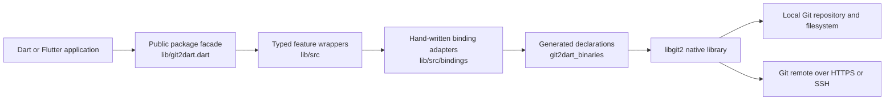

# Architecture Overview

> Architect synthesis for documentation level **Detailed**. This document describes the current repository as extracted; it does not prescribe a replacement architecture.

## Executive View

`git2dart` is an in-process Dart/Flutter library that presents an idiomatic, null-safe object model over libgit2. It is neither a server nor a Git hosting product. Its architectural purpose is to keep native ABI, pointer ownership, C errors, and platform loading details behind typed Dart APIs while retaining libgit2 performance. 🟢 **CONFIRMED**

The core dependency direction is intentionally one-way:

Raw pointers and generated declarations remain below the public facade. Persistent native objects are wrapped and released explicitly or by finalizers; call-scoped allocations normally use arenas. Native failures are translated into Dart exceptions at the binding boundary. 🟢 **CONFIRMED**

## Architectural Style

| Characteristic | Current realization | Confidence |
| --- | --- | --- |
| Delivery model | Reusable package embedded in a caller process | 🟢 CONFIRMED |
| Primary style | Layered façade and adapter architecture over a native library | 🟢 CONFIRMED |
| Domain model | Typed wrappers for repositories, objects, index/worktree, references/remotes, and integration operations | 🟢 CONFIRMED |
| Persistence | Git object database, refs, index, configuration, and working tree managed by libgit2 | 🟢 CONFIRMED |
| Remote communication | libgit2 transports using caller-supplied credentials, callbacks, proxy, and trust decisions | 🟢 CONFIRMED |
| Error boundary | Local Dart validation plus centralized translation of negative libgit2 return codes | 🟢 CONFIRMED |
| Resource boundary | Arena-scoped temporary allocation; owned pointer wrappers with explicit release and finalizers | 🟢 CONFIRMED |
| Platform boundary | Native artifacts and generated declarations supplied by `git2dart_binaries`; Android/iOS startup support is explicit | 🟢 CONFIRMED |

## Logical Layers and Responsibilities

### Public package facade

`lib/git2dart.dart` exports the supported Dart API vocabulary. It exposes the typed classes but does not export `lib/src/bindings/`. This is the compatibility boundary consumed by applications. 🟢 **CONFIRMED**

### Feature wrappers

Six cross-cutting feature groups form the high-level model:

1. **Repository lifecycle** — create, discover, open, clone, inspect, reset, and manage worktrees.
2. **Git objects and object database** — OIDs, commits, trees, blobs, tags, signatures, and raw object storage.
3. **Working tree and index** — status, staging, conflicts, checkout, diff, patch, stash, filters, and pathspecs.
4. **References and remotes** — references, branches, reflogs, refspecs, remote transfer, credentials, and certificates.
5. **History and integration operations** — revision parsing/walking, merge, rebase, blame, notes, packs, and submodules.
6. **Native runtime and platform boundary** — initialization, options, allocation, error conversion, callbacks, enums, and platform loading.

The source tree is mostly flat and type-oriented. These groups are architectural feature boundaries inferred from responsibility and dependency flow, not physical packages. 🟡 **INFERRED**

### Native binding adapters

The hand-written adapters allocate native inputs, invoke generated functions, check results, convert output, and dispose temporary buffers. They are the only intended layer for raw C calls and pointer arithmetic. 🟢 **CONFIRMED**

### Companion native package

`git2dart_binaries` supplies generated FFI declarations and platform binaries. Its constrained `1.12.x` dependency range limits accidental declaration/ABI drift, while the maintainer comparison tool supports deliberate upgrades. 🟢 **CONFIRMED**

## Principal Runtime Flows

### Local operation

1. The application calls a typed wrapper through the package API.
2. The wrapper validates Dart-level invariants and composes related owned objects.
3. The binding adapter marshals strings, flags, callbacks, and pointers.
4. libgit2 reads or mutates the repository, index, refs, object database, or worktree.
5. The binding translates failure immediately or returns a Dart value/owned wrapper.
6. Temporary memory is released when the arena exits; persistent ownership is released explicitly or by finalizer.

### Remote operation

1. The application supplies a URL/refspec and optional credentials, progress handlers, proxy, and certificate callback.
2. The remote adapter installs callback bridges and native options.
3. libgit2 opens an HTTPS or SSH transport, requests credentials, and validates the peer.
4. Objects and reference updates are transferred.
5. Progress and update callbacks project borrowed native data into Dart views.
6. The operation returns transfer statistics or throws a translated native error.

## Data Architecture

There is no relational application database. The durable model is Git-native:

- immutable objects addressed by `Oid` in an object database;
- mutable references and reflogs pointing to object identifiers;
- an index holding staged entries and three-way conflict stages;
- a working directory materializing file content;
- configuration, remotes, worktrees, stashes, notes, and submodule metadata.

`erd-complete.md` models the 55 extracted Dart/domain entities and their logical relationships. Cardinalities describe wrapper/domain relationships, not SQL foreign keys. 🟢 **CONFIRMED**

## External Integrations

| Integration | Direction | Protocol or format | Responsibility | Confidence |
| --- | --- | --- | --- | --- |
| `git2dart_binaries` | Consumed | Dart package and generated FFI declarations | Delivers native artifacts, generated ABI declarations, Android CA helper | 🟢 CONFIRMED |
| libgit2 | Consumed in-process | C ABI through Dart FFI | Implements Git storage, graph, checkout, merge, rebase, and transports | 🟢 CONFIRMED |
| Local repositories | Read/write | Git repository formats and OS filesystem I/O | Stores objects, refs, config, index, reflogs, and working files | 🟢 CONFIRMED |
| Git remotes | Bidirectional | Git smart transport over HTTPS or SSH | Advertisement, fetch, push, prune, submodule clone/update | 🟢 CONFIRMED |
| Platform runtime | Consumed | Dynamic/static native loading and CA certificate paths | Loads libgit2 and provides transport trust roots | 🟢 CONFIRMED |
| pub.dev | Produced | Dart package publication | Distributes `git2dart` releases | 🟢 CONFIRMED |
| GitHub Actions | Tooling | YAML workflow, GitHub events, secrets | Runs platform tests, analysis, formatting, and publication | 🟢 CONFIRMED |

The package produces no REST/GraphQL API, webhook, queue, or application event stream. Callbacks are in-process libgit2-to-Dart bridges. 🟢 **CONFIRMED**

## Security and Trust Boundaries

- The library inherits filesystem and network authority from its embedding process; it has no application RBAC.
- Remote authorization is owned by the remote server and caller-supplied credentials.
- Certificate validation defaults to libgit2 behavior unless the caller supplies a final trust decision callback.
- Global libgit2 options affect the process, not an individual repository object.
- Force checkout/reset, reference overwrite, delete, stash removal, and submodule update are explicitly caller-selected destructive capabilities.
- Borrowed callback data must not outlive the callback/native owner.

See `permissions.md` for the detailed capability matrix. 🟢 **CONFIRMED**

## Quality and Delivery Architecture

The declared quality path is formatting, zero-warning static analysis, and Flutter tests. GitHub Actions targets Ubuntu, macOS, Windows, iOS simulator, and Android emulator before publication. Tests tagged `remote_fetch` are skipped by default, so the standard suite does not prove current live-network interoperability. 🟢 **CONFIRMED**

The workflow publishes from `main` after tests and performs dry-run publication on release branches. pub.dev tokens are held as GitHub secrets; external branch protection and environment approvals were not inspected. 🟢 **CONFIRMED** / 🔴 **GAP**

## Technical Debt and Architectural Risks

| ID | Finding | Impact | Confidence |
| --- | --- | --- | --- |
| TD-01 | `Repository` is a broad façade spanning lifecycle, graph, status, reset, storage, and child-object access | High change fan-out and review burden | 🟡 INFERRED |
| TD-02 | Feature boundaries are semantic but the high-level source is physically flat | Ownership and navigation become harder as API coverage grows | 🟡 INFERRED |
| TD-03 | Static callback bridge state and process-global libgit2 options have no demonstrated overlapping-operation safety contract | Possible cross-operation interference under concurrency | 🔴 GAP |
| TD-04 | Default tests skip live-network cases | CI success is not proof of current HTTPS/SSH behavior | 🟢 CONFIRMED |
| TD-05 | No current end-to-end allocation/free audit covers every native error branch | Leak or double-release regressions may evade feature tests | 🔴 GAP |
| TD-06 | SHA-256 validation exists, but end-to-end SHA-256 repository support was not dynamically established | Object-format compatibility may be partial | 🔴 GAP |
| TD-07 | CI uses mutable action references including major tags and `master` | Tooling behavior can drift without a repository change | 🟢 CONFIRMED |
| TD-08 | The repository contains historical test output but no fresh Architect-phase test execution | Current runtime health remains unverified by this extraction | 🟢 CONFIRMED |
| TD-09 | Public wrapper coverage and native declaration coverage evolve separately | Dependency upgrades require coordinated ABI and wrapper review | 🟢 CONFIRMED |
| TD-10 | Thread-safety expectations for wrapper ownership, callbacks, and global configuration are not centralized | Consumers may assume unsupported concurrency behavior | 🔴 GAP |

No critically outdated runtime dependency was asserted: registry freshness and vulnerability status were outside this static architecture synthesis. 🔴 **GAP**

## Deployment Applicability

No `deployment.md` was generated. The Detailed-level deployment artifact is conditional on Docker, Compose, or cloud deployment configuration, and none is present. The package is embedded in consumer applications and delivered through pub.dev rather than deployed as an independent service. 🟢 **CONFIRMED**

## Architectural Gaps for Validation

1. 🔴 Prove callback isolation under concurrent remote operations.
2. 🔴 Run controlled live HTTPS/SSH tests on every supported platform.
3. 🔴 Audit owned, borrowed, transferred, and arena-scoped pointers on every success and error path.
4. 🔴 Establish the supported SHA-256 repository capability matrix.
5. 🔴 Confirm external branch protection and pub.dev release approval controls.
6. 🔴 Define and test thread-safety guarantees for global configuration and wrapper instances.

