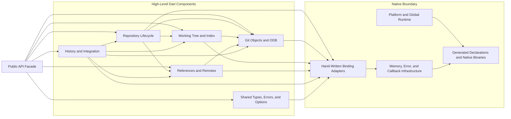

# C4 Components — Feature and Native Boundaries

## Component Catalog

| Component | Responsibilities | Representative types | Main collaborators | Confidence |
| --- | --- | --- | --- | --- |
| Public API Facade | Export consumer-supported symbols and hide binding adapters | `git2dart.dart` | All high-level components | 🟢 CONFIRMED |
| Repository Lifecycle | Repository acquisition, discovery, state, status, reset, worktrees, child access | `Repository`, `Worktree`, `RepositoryExtension` | Objects, worktree/index, refs/remotes, native adapters | 🟢 CONFIRMED |
| Git Objects and ODB | Immutable object lookup/creation, OID handling, raw ODB, signatures, streams | `Oid`, `Commit`, `Tree`, `Blob`, `Tag`, `Odb` | Repository, native adapters | 🟢 CONFIRMED |
| Working Tree and Index | Staging, conflict state, checkout, diff/patch, stash, filters/pathspec | `Index`, `Diff`, `Patch`, `Stash`, `Pathspec` | Repository, objects, native adapters | 🟢 CONFIRMED |
| References and Remotes | Refs, branches, reflogs, refspecs, transport, credentials, certificates | `Reference`, `Branch`, `Remote`, `Callbacks`, credentials | Repository, objects, native adapters | 🟢 CONFIRMED |
| History and Integration | Revision resolution/walking, merge/rebase, blame/notes, packs, submodules | `RevWalk`, `Merge`, `Rebase`, `Blame`, `PackBuilder`, `Submodule` | All core feature components | 🟢 CONFIRMED |
| Shared Types, Errors, Options | Enum vocabulary, option sets, package/native exception types | `GitObject`, `GitStatus`, `Git2DartError`, `LibGit2Error` | All components | 🟢 CONFIRMED |
| Platform and Global Runtime | Mobile initialization, library version/features, process-global libgit2 options | `PlatformSpecific`, `Libgit2` | Generated declarations, OS runtime | 🟢 CONFIRMED |
| Hand-Written Binding Adapters | Native calls and type-specific memory conversion | `lib/src/bindings/*` | Memory/error/callback infrastructure, generated declarations | 🟢 CONFIRMED |
| Memory, Error, and Callback Infrastructure | Arenas, UTF-8 marshalling, finalizers, native error translation, callback bridges | `checkErrorAndThrow`, extensions, callback functions | All adapters, generated declarations | 🟢 CONFIRMED |

## Dependency Principles

1. High-level components may depend on other typed wrappers and binding adapters.
2. Binding adapters may depend on generated declarations, FFI primitives, and shared conversion/error helpers.
3. Generated declarations and raw pointers must not become consumer-facing public API.
4. Repository-associated objects must retain correct repository and native ownership relationships.
5. Integration operations coordinate feature components but do not replace their ownership rules.
6. Process-global configuration and callback bridges require explicit concurrency discipline until dynamically validated.

## Hotspots

| Hotspot | Why it matters | Change impact |
| --- | --- | --- |
| `Repository` façade | Aggregate root and access point for many components | Most feature groups and broad test surface |
| Callback bridge | Crosses native/Dart boundary with borrowed state | Clone, fetch, push, submodule, trust, credentials, progress |
| Error helper | Normalizes nearly every native failure | All binding adapters and exception expectations |
| OID/object-kind conversion | Shared identity and polymorphic dispatch | Objects, refs, revision parsing, merge, index, remote advertisement |
| Index/workdir mutation | Mutable state and conflict lifecycle | Checkout, diff apply, merge, rebase, stash, reset |
| `git2dart_binaries` upgrade | Changes declarations and native ABI together | Every binding adapter and all supported platforms |

