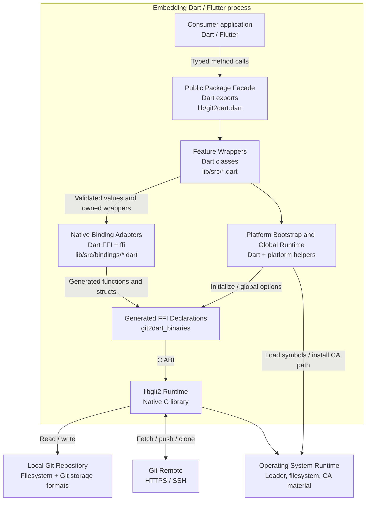

# C4 Containers — Logical Runtime Layers

> `git2dart` is a library, so these are logical in-process containers rather than independently deployable services.

## Container Catalog

| Container | Technology | Responsibility | Primary dependencies | Confidence |
| --- | --- | --- | --- | --- |
| Public package facade | Dart library exports | Defines the consumer-visible compatibility surface | Feature wrappers | 🟢 CONFIRMED |
| Feature wrappers | Null-safe Dart classes | Model Git concepts, validate local invariants, compose operations, own native handles | Binding adapters, shared types | 🟢 CONFIRMED |
| Native binding adapters | Dart FFI and `ffi` | Allocate, marshal, invoke, translate errors, convert output, release temporary resources | Generated declarations | 🟢 CONFIRMED |
| Platform bootstrap/global runtime | Dart, `dart:io`, companion helpers | Initialize Android CA support and iOS symbols; expose libgit2 global options | `git2dart_binaries`, OS runtime | 🟢 CONFIRMED |
| Generated declarations/native artifacts | `git2dart_binaries` | Supply FFI declarations, native binaries, and Android helper | libgit2, platform packaging | 🟢 CONFIRMED |
| libgit2 runtime | Native C | Execute Git storage, graph, working-tree, and transport operations | Filesystem, network, crypto | 🟢 CONFIRMED |

## Communication Rules

- Calls are synchronous in-process unless a platform helper exposes an asynchronous setup operation.
- Wrapper-to-adapter data is typed Dart state; adapter-to-native data is C-compatible memory.
- Persistent native pointers cross back only inside internal wrapper objects; raw pointers are not exported through the public barrel.
- Native callbacks synchronously project credentials, progress, update status, and certificate data into Dart.
- Temporary allocation should not cross the arena scope; borrowed callback views should not cross callback lifetime.

## Container-Level Risks

- 🔴 **GAP**: static callback bridge isolation under overlapping operations.
- 🔴 **GAP**: documented thread-safety boundaries for global and instance state.
- 🟢 **CONFIRMED**: dependency/API drift between adapters and generated declarations requires coordinated upgrades.
- 🟢 **CONFIRMED**: Android/iOS runtime setup differs from desktop loading and must remain tested separately.

