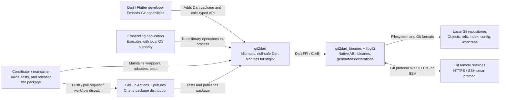

# C4 Context — git2dart

## System Context

## People and Responsibilities

| Person | Goal | Architectural concern | Confidence |
| --- | --- | --- | --- |
| Dart/Flutter developer | Use Git functionality without direct C or pointer management | Stable typed API, clear ownership, predictable exceptions | 🟢 CONFIRMED |
| Embedding application | Read and mutate repositories and communicate with remotes | OS permissions, credentials, certificate policy, platform initialization | 🟢 CONFIRMED |
| Contributor/maintainer | Extend bindings and release cross-platform packages | ABI compatibility, memory safety, tests, generated-declaration separation | 🟢 CONFIRMED |

## External System Contracts

| External system | Contract | Data crossing boundary | Confidence |
| --- | --- | --- | --- |
| `git2dart_binaries` | Compatible Dart dependency constrained to `>=1.12.1 <1.13.0` | Generated declarations, native libraries, platform helpers | 🟢 CONFIRMED |
| libgit2 | In-process C ABI | UTF-8 strings, structs, pointers, callbacks, status codes | 🟢 CONFIRMED |
| Local Git repository | Git formats plus filesystem calls | Objects, refs, config, index, worktree content | 🟢 CONFIRMED |
| Git remote | Git smart protocol over HTTPS/SSH | Advertisements, packs, ref updates, credentials, certificates | 🟢 CONFIRMED |
| GitHub Actions | Repository workflow | Source checkout, test results, secrets, publication job | 🟢 CONFIRMED |
| pub.dev | Dart package registry | Package archive and release credentials | 🟢 CONFIRMED |

## Context Constraints

- `git2dart` has no independent process boundary, database, HTTP server, or RBAC model. 🟢 **CONFIRMED**
- All local and remote effects occur with the authority of the embedding process. 🟢 **CONFIRMED**
- The certificate callback can override the native trust result and is therefore a caller-owned security boundary. 🟢 **CONFIRMED**
- Live remote interoperability and concurrent callback isolation remain dynamically unverified. 🔴 **GAP**

