# Complete Logical ERD

> This is a logical object/domain model, not a relational schema. Git persists objects, references, indexes, and configuration through libgit2. Attributes are the principal fields extracted from the Dart API. All 55 extracted entities are represented.

```mermaid
erDiagram
    Repository {
        native_pointer pointer
        string path
        string workdir
        enum state
    }
    RepositoryCallback {
        boolean bare
        string initialHead
        string originUrl
    }
    Identity {
        string name
        string email
    }
    Worktree {
        string name
        string path
        boolean isLocked
    }
    Oid {
        string sha
    }
    Commit {
        Oid oid
        string message
    }
    Signature {
        string name
        string email
        int time
    }
    Tree {
        Oid oid
    }
    TreeUpdate {
        string path
        Oid oid
        enum filemode
    }
    TreeEntry {
        Oid oid
        string name
        enum filemode
    }
    Blob {
        Oid oid
        bytes contentBytes
        int size
    }
    Tag {
        Oid oid
        string name
        Oid targetOid
    }
    Odb {
        int backendCount
    }
    OdbObject {
        Oid oid
        bytes dataBytes
        enum type
    }
    AnnotatedCommit {
        Oid oid
        string refName
    }
    BlobWriteStream {
        native_pointer pointer
    }
    Index {
        string path
        boolean hasConflicts
    }
    IndexEntry {
        Oid oid
        string path
        int stage
    }
    ConflictEntry {
        IndexEntry ancestor
        IndexEntry our
        IndexEntry their
    }
    IndexReucEntry {
        string path
        Oid ancestorOid
        Oid ourOid
        Oid theirOid
    }
    Diff {
        Oid patchOid
    }
    DiffDelta {
        enum status
        int similarity
    }
    DiffFile {
        string path
        Oid oid
        int size
    }
    Patch {
        DiffDelta delta
    }
    DiffHunk {
        string header
        int oldStart
        int newStart
    }
    Stash {
        int index
        string message
        Oid oid
    }
    PathspecMatchList {
        list entries
        list failedEntries
    }
    Reference {
        string name
        enum type
        Oid target
    }
    Branch {
        string name
        Oid target
        boolean isHead
    }
    RefLogEntry {
        Oid oldOid
        Oid newOid
        string message
    }
    Refspec {
        string source
        string destination
        boolean force
    }
    Remote {
        string name
        string url
        string pushUrl
    }
    RemoteReference {
        string name
        Oid oid
        Oid localId
    }
    TransferProgress {
        int totalObjects
        int receivedObjects
        int receivedBytes
    }
    Callbacks {
        Credentials credentials
        function certificateCheck
    }
    UserPass {
        string username
        string password
    }
    Keypair {
        string username
        string privateKey
        string publicKey
    }
    KeypairFromAgent {
        string username
    }
    GitCertificate {
        enum type
    }
    GitCertificateHostkey {
        int typeFlags
        bytes rawHostkey
    }
    RevSpec {
        Commit from
        Commit to
        set flags
    }
    RevWalk {
        native_pointer pointer
    }
    MergeAnalysis {
        set result
        enum mergePreference
    }
    Rebase {
        int currentOperation
    }
    RebaseOperation {
        enum type
        Oid oid
    }
    BlameHunk {
        int linesCount
        Oid finalCommitOid
        Oid originCommitOid
    }
    Note {
        Oid oid
        Oid annotatedOid
        string message
    }
    Mailmap {
        native_pointer pointer
    }
    PackBuilder {
        int length
        int writtenLength
        string name
    }
    Submodule {
        string name
        string path
        string url
        Oid headOid
    }
    Libgit2 {
        global_options options
    }
    CachedMemory {
        int current
        int allowed
    }
    Git2DartError {
        string message
    }
    LibGit2Error {
        native_error error
    }
    Git_enum_vocabulary {
        int value
    }

    Repository ||--o| RepositoryCallback : "created or cloned with"
    Repository ||--o| Identity : "resolves configured"
    Repository ||--o{ Worktree : manages
    Repository ||--|| Odb : exposes
    Repository ||--|| Index : exposes
    Repository ||--o{ Reference : owns
    Repository ||--o{ Remote : configures
    Repository ||--o{ Submodule : contains

    Odb ||--o{ OdbObject : stores
    OdbObject }o--|| Oid : identified_by
    Commit }o--|| Oid : identified_by
    Commit }o--|| Tree : snapshots
    Commit }o--o{ Commit : parents
    Commit }o--|| Signature : authored_by
    Commit }o--|| Signature : committed_by
    Tree ||--o{ TreeEntry : contains
    Tree ||--o{ TreeUpdate : updated_by
    TreeEntry }o--|| Oid : targets
    TreeUpdate }o--o| Oid : upserts_or_removes
    Blob }o--|| Oid : identified_by
    Tag }o--|| Oid : identified_by
    Tag }o--|| Oid : targets
    Tag }o--|| Signature : tagged_by
    AnnotatedCommit }o--|| Oid : identifies
    BlobWriteStream }o--|| Repository : writes_to

    Index ||--o{ IndexEntry : contains
    Index ||--o{ ConflictEntry : reports
    Index ||--o{ IndexReucEntry : retains_resolve_undo
    IndexEntry }o--|| Oid : targets
    ConflictEntry }o--o{ IndexEntry : has_sides
    Diff ||--o{ DiffDelta : contains
    DiffDelta ||--|| DiffFile : old_file
    DiffDelta ||--|| DiffFile : new_file
    DiffFile }o--|| Oid : identifies_content
    Patch }o--|| DiffDelta : projects
    Patch ||--o{ DiffHunk : contains
    Stash }o--|| Oid : identifies
    PathspecMatchList }o--o{ IndexEntry : may_match

    Branch ||--|| Reference : specializes
    Reference }o--|| Oid : resolves_to
    Reference ||--o{ RefLogEntry : records
    RefLogEntry }o--|| Signature : committed_by
    RefLogEntry }o--|| Oid : old_target
    RefLogEntry }o--|| Oid : new_target
    Remote ||--o{ Refspec : maps
    Remote ||--o{ RemoteReference : advertises
    RemoteReference }o--|| Oid : targets
    Remote ||--o| TransferProgress : reports
    Remote }o--o| Callbacks : uses
    Callbacks }o--o| UserPass : authenticates_with
    Callbacks }o--o| Keypair : authenticates_with
    Callbacks }o--o| KeypairFromAgent : authenticates_with
    Callbacks }o--o| GitCertificate : validates
    GitCertificateHostkey ||--|| GitCertificate : specializes

    RevSpec }o--|| Commit : from_commit
    RevSpec }o--o| Commit : to_commit
    RevWalk }o--o{ Commit : yields
    MergeAnalysis }o--o{ AnnotatedCommit : analyzes
    Rebase ||--o{ RebaseOperation : sequences
    RebaseOperation }o--|| Oid : targets
    BlameHunk }o--|| Oid : final_commit
    BlameHunk }o--|| Oid : origin_commit
    Note }o--|| Oid : note_object
    Note }o--|| Oid : annotates
    Note }o--|| Signature : authored_by
    Mailmap }o--o{ Signature : resolves
    PackBuilder }o--o{ Oid : packs
    Submodule }o--o| Oid : head_target

    Libgit2 ||--|| CachedMemory : reports
    LibGit2Error ||--|| Git2DartError : specializes
    LibGit2Error }o--|| Libgit2 : translated_from
    Git_enum_vocabulary }o--o{ Repository : configures
    Git_enum_vocabulary }o--o{ Index : configures
    Git_enum_vocabulary }o--o{ Diff : configures
    Git_enum_vocabulary }o--o{ Remote : configures
```

## Relationship Semantics

- Git objects are immutable and OID-addressed; wrappers do not imply separate persisted rows.
- A repository exposes storage and mutable projections but native handles still have individual ownership rules.
- Direct and symbolic references have different native representations; the diagram shows the resolved OID relation.
- Conflict entries contain up to three index-entry sides: ancestor, ours, and theirs.
- Callback credentials are alternatives selected by native credential requests, not simultaneous requirements.
- Certificate/progress/advertisement values passed through callbacks may be borrowed views.
- `Git_enum_vocabulary` represents many concrete enums and combinable flag sets consolidated for architectural readability.

## Data Gaps

- 🔴 Complete end-to-end SHA-256 storage and remote compatibility is not established.
- 🔴 Native pointer ownership has not been dynamically audited on every error path.
- 🟡 Some logical relationships are constructed on demand from libgit2 rather than retained by Dart wrapper fields.

