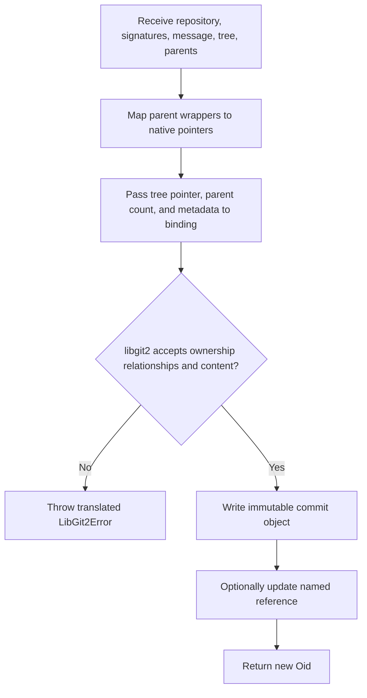

# Commit.create

```mermaid
flowchart TD
    A["Receive repository, signatures, message, tree, parents"] --> B["Map parent wrappers to native pointers"]
    B --> C["Pass tree pointer, parent count, and metadata to binding"]
    C --> D{"libgit2 accepts ownership relationships and content?"}
    D -- No --> E["Throw translated LibGit2Error"]
    D -- Yes --> F["Write immutable commit object"]
    F --> G["Optionally update named reference"]
    G --> H["Return new Oid"]
```

Evidence: `lib/src/commit.dart:77-100`.

