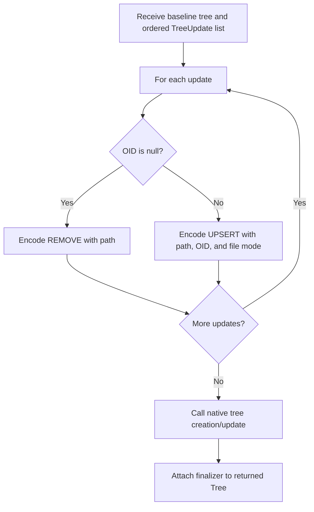

# Tree.createUpdated

```mermaid
flowchart TD
    A["Receive baseline tree and ordered TreeUpdate list"] --> B["For each update"]
    B --> C{"OID is null?"}
    C -- Yes --> D["Encode REMOVE with path"]
    C -- No --> E["Encode UPSERT with path, OID, and file mode"]
    D --> F{"More updates?"}
    E --> F
    F -- Yes --> B
    F -- No --> G["Call native tree creation/update"]
    G --> H["Attach finalizer to returned Tree"]
```

Evidence: `lib/src/tree.dart:63-90`.

