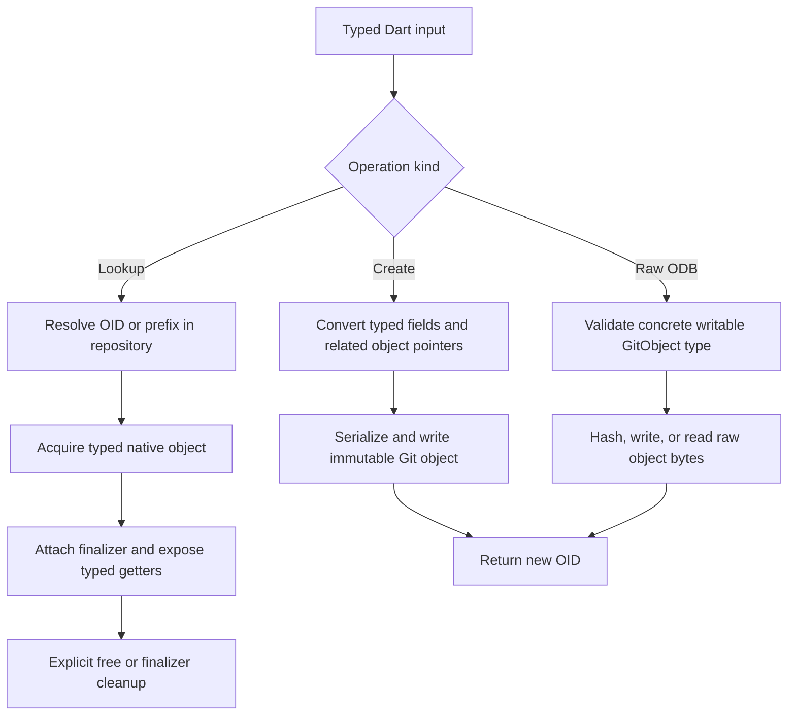

# Git Objects and Object Database Flow

```mermaid
flowchart TD
    A["Typed Dart input"] --> B{"Operation kind"}
    B -- Lookup --> C["Resolve OID or prefix in repository"]
    B -- Create --> D["Convert typed fields and related object pointers"]
    B -- Raw ODB --> E["Validate concrete writable GitObject type"]
    C --> F["Acquire typed native object"]
    D --> G["Serialize and write immutable Git object"]
    E --> H["Hash, write, or read raw object bytes"]
    F --> I["Attach finalizer and expose typed getters"]
    G --> J["Return new OID"]
    H --> J
    I --> K["Explicit free or finalizer cleanup"]
```

