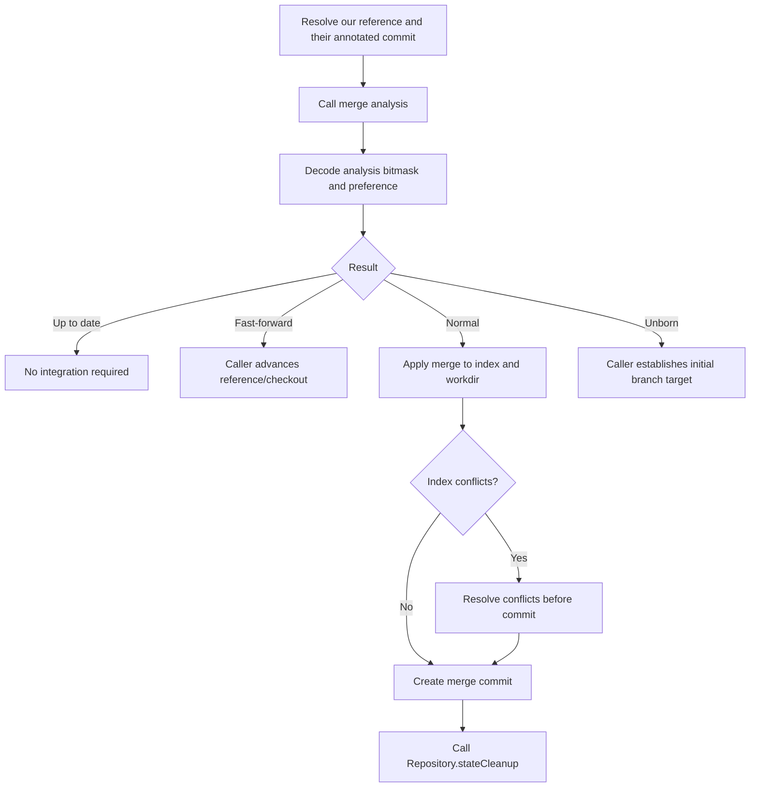

# Merge Analysis and Execution

```mermaid
flowchart TD
    A["Resolve our reference and their annotated commit"] --> B["Call merge analysis"]
    B --> C["Decode analysis bitmask and preference"]
    C --> D{"Result"}
    D -- Up to date --> E["No integration required"]
    D -- Fast-forward --> F["Caller advances reference/checkout"]
    D -- Normal --> G["Apply merge to index and workdir"]
    D -- Unborn --> H["Caller establishes initial branch target"]
    G --> I{"Index conflicts?"}
    I -- Yes --> J["Resolve conflicts before commit"]
    I -- No --> K["Create merge commit"]
    J --> K
    K --> L["Call Repository.stateCleanup"]
```

Evidence: `lib/src/merge.dart:99-158`.

