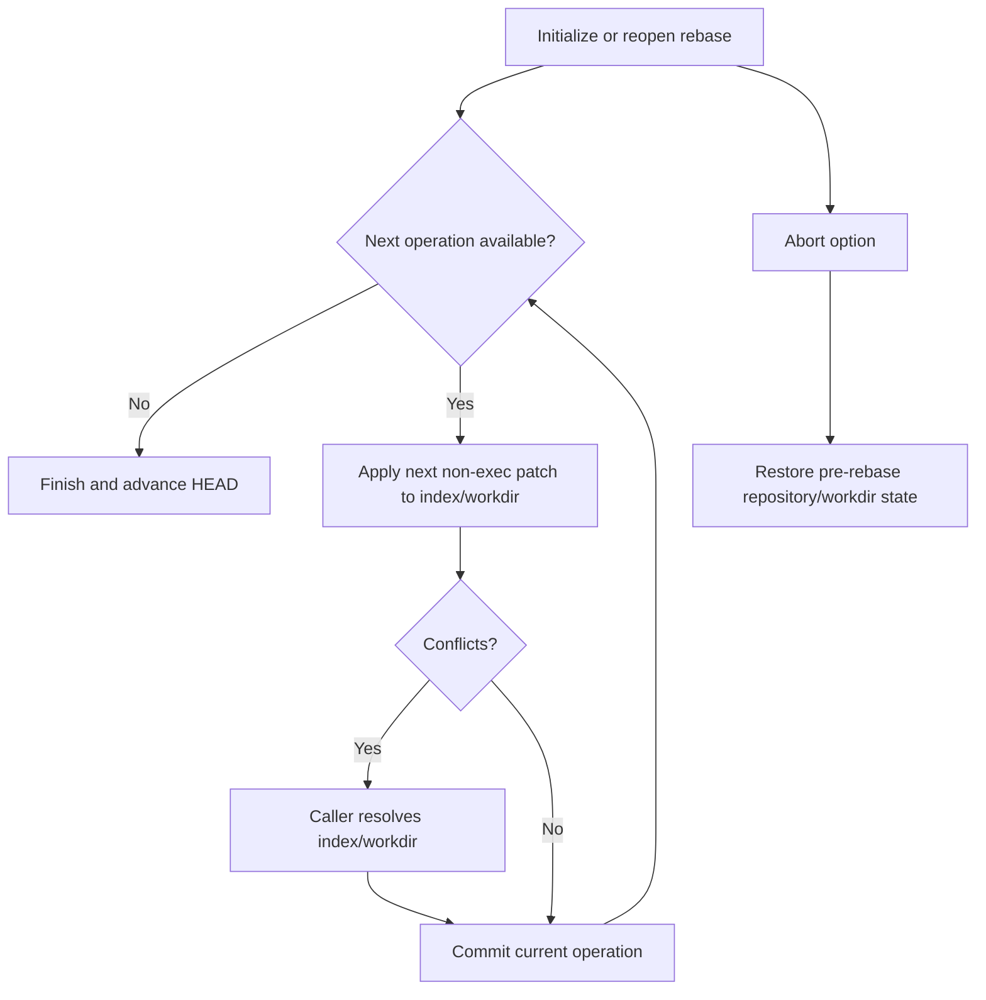

# Rebase State Machine

```mermaid
flowchart TD
    A["Initialize or reopen rebase"] --> B{"Next operation available?"}
    B -- No --> H["Finish and advance HEAD"]
    B -- Yes --> C["Apply next non-exec patch to index/workdir"]
    C --> D{"Conflicts?"}
    D -- Yes --> E["Caller resolves index/workdir"]
    D -- No --> F["Commit current operation"]
    E --> F
    F --> B
    A --> G["Abort option"]
    G --> I["Restore pre-rebase repository/workdir state"]
```

Evidence: `lib/src/rebase.dart:29-158`.

