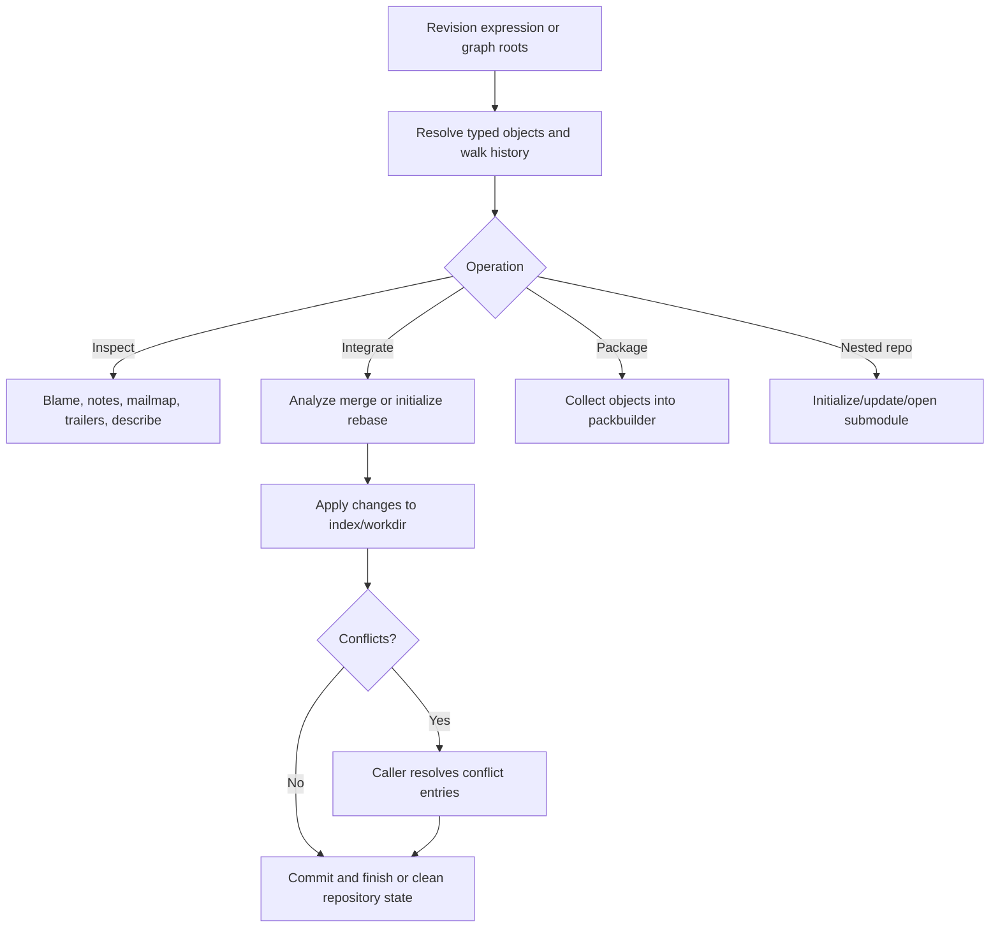

# History and Integration Operations Flow

```mermaid
flowchart TD
    A["Revision expression or graph roots"] --> B["Resolve typed objects and walk history"]
    B --> C{"Operation"}
    C -- Inspect --> D["Blame, notes, mailmap, trailers, describe"]
    C -- Integrate --> E["Analyze merge or initialize rebase"]
    C -- Package --> F["Collect objects into packbuilder"]
    C -- Nested repo --> G["Initialize/update/open submodule"]
    E --> H["Apply changes to index/workdir"]
    H --> I{"Conflicts?"}
    I -- Yes --> J["Caller resolves conflict entries"]
    I -- No --> K["Commit and finish or clean repository state"]
    J --> K
```

