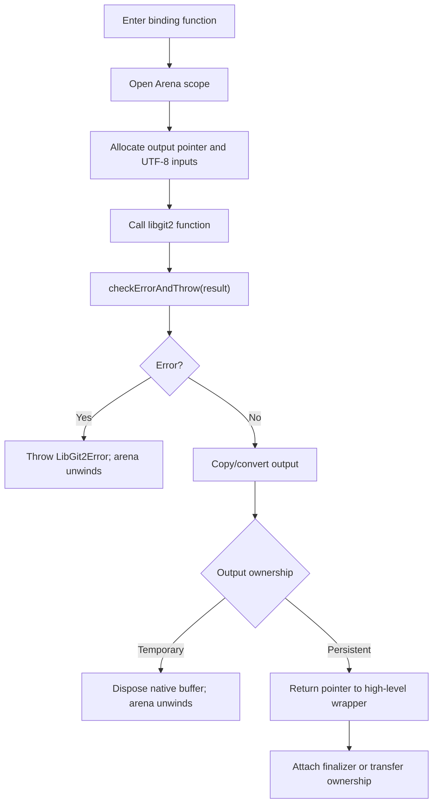

# Native Call and Ownership Pattern

```mermaid
flowchart TD
    A["Enter binding function"] --> B["Open Arena scope"]
    B --> C["Allocate output pointer and UTF-8 inputs"]
    C --> D["Call libgit2 function"]
    D --> E["checkErrorAndThrow(result)"]
    E --> F{"Error?"}
    F -- Yes --> G["Throw LibGit2Error; arena unwinds"]
    F -- No --> H["Copy/convert output"]
    H --> I{"Output ownership"}
    I -- Temporary --> J["Dispose native buffer; arena unwinds"]
    I -- Persistent --> K["Return pointer to high-level wrapper"]
    K --> L["Attach finalizer or transfer ownership"]
```

Evidence: `lib/src/helpers/error_helper.dart`, `extensions.dart`, and `lib/src/bindings/*.dart`.

