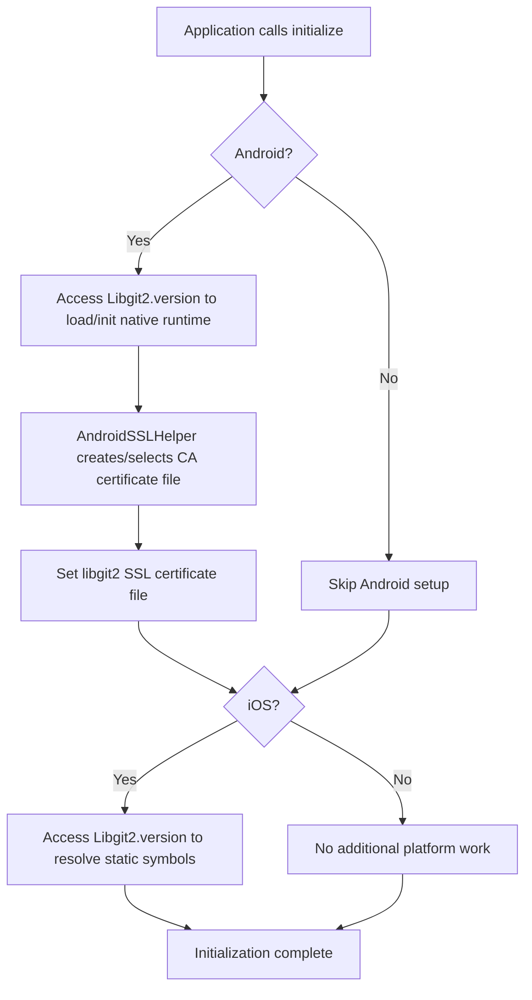

# PlatformSpecific.initialize

```mermaid
flowchart TD
    A["Application calls initialize"] --> B{"Android?"}
    B -- Yes --> C["Access Libgit2.version to load/init native runtime"]
    C --> D["AndroidSSLHelper creates/selects CA certificate file"]
    D --> E["Set libgit2 SSL certificate file"]
    B -- No --> F["Skip Android setup"]
    E --> G{"iOS?"}
    F --> G
    G -- Yes --> H["Access Libgit2.version to resolve static symbols"]
    G -- No --> I["No additional platform work"]
    H --> J["Initialization complete"]
    I --> J
```

Evidence: `lib/src/platform_specific.dart:5-35`.

