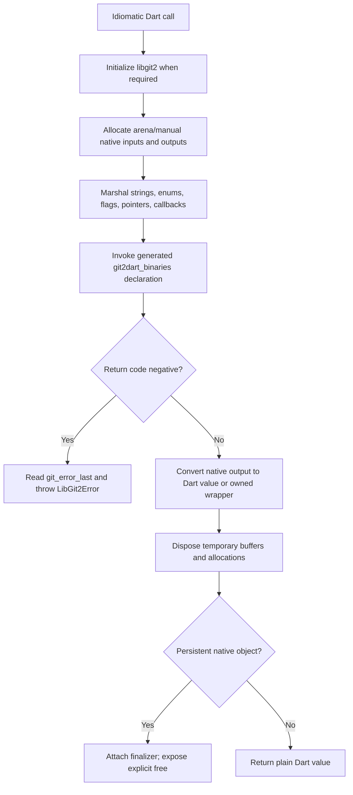

# Native Runtime and Platform Boundary Flow

```mermaid
flowchart TD
    A["Idiomatic Dart call"] --> B["Initialize libgit2 when required"]
    B --> C["Allocate arena/manual native inputs and outputs"]
    C --> D["Marshal strings, enums, flags, pointers, callbacks"]
    D --> E["Invoke generated git2dart_binaries declaration"]
    E --> F{"Return code negative?"}
    F -- Yes --> G["Read git_error_last and throw LibGit2Error"]
    F -- No --> H["Convert native output to Dart value or owned wrapper"]
    H --> I["Dispose temporary buffers and allocations"]
    I --> J{"Persistent native object?"}
    J -- Yes --> K["Attach finalizer; expose explicit free"]
    J -- No --> L["Return plain Dart value"]
```

