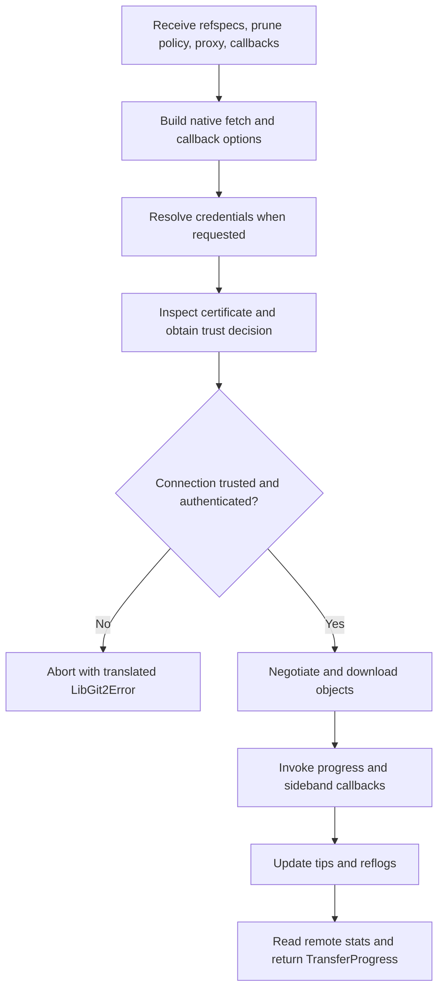

# Remote.fetch

```mermaid
flowchart TD
    A["Receive refspecs, prune policy, proxy, callbacks"] --> B["Build native fetch and callback options"]
    B --> C["Resolve credentials when requested"]
    C --> D["Inspect certificate and obtain trust decision"]
    D --> E{"Connection trusted and authenticated?"}
    E -- No --> F["Abort with translated LibGit2Error"]
    E -- Yes --> G["Negotiate and download objects"]
    G --> H["Invoke progress and sideband callbacks"]
    H --> I["Update tips and reflogs"]
    I --> J["Read remote stats and return TransferProgress"]
```

Evidence: `lib/src/remote.dart:285-322`, `lib/src/callbacks.dart`.

