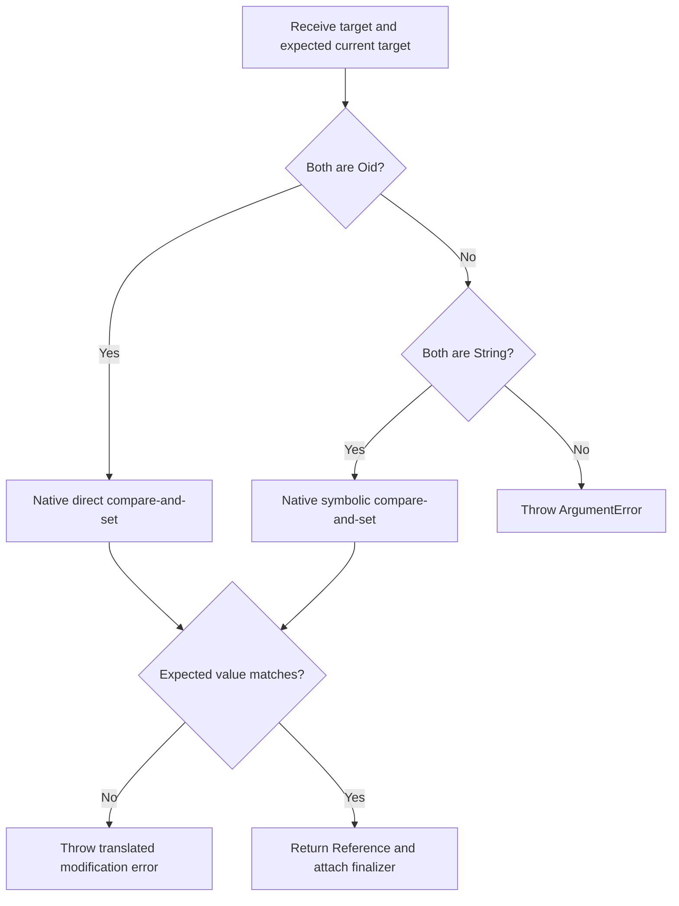

# Reference.createMatching

```mermaid
flowchart TD
    A["Receive target and expected current target"] --> B{"Both are Oid?"}
    B -- Yes --> C["Native direct compare-and-set"]
    B -- No --> D{"Both are String?"}
    D -- Yes --> E["Native symbolic compare-and-set"]
    D -- No --> F["Throw ArgumentError"]
    C --> G{"Expected value matches?"}
    E --> G
    G -- No --> H["Throw translated modification error"]
    G -- Yes --> I["Return Reference and attach finalizer"]
```

Evidence: `lib/src/reference.dart:85-116`.

