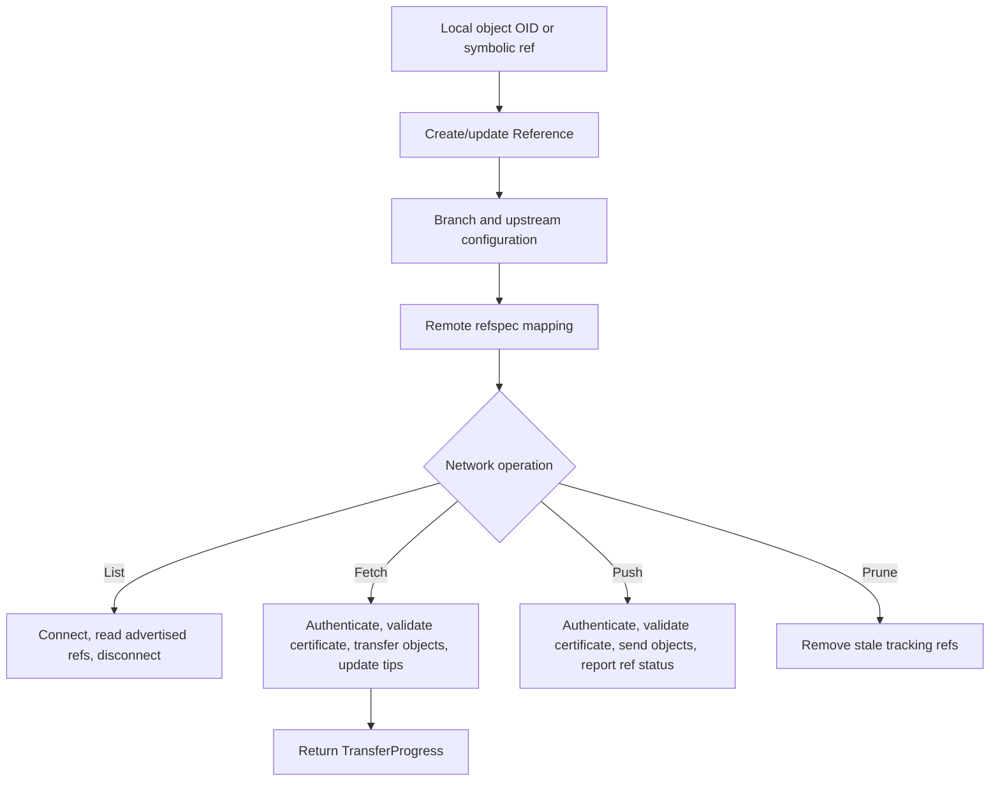

# References and Remotes Flow

```mermaid
flowchart TD
    A["Local object OID or symbolic ref"] --> B["Create/update Reference"]
    B --> C["Branch and upstream configuration"]
    C --> D["Remote refspec mapping"]
    D --> E{"Network operation"}
    E -- List --> F["Connect, read advertised refs, disconnect"]
    E -- Fetch --> G["Authenticate, validate certificate, transfer objects, update tips"]
    E -- Push --> H["Authenticate, validate certificate, send objects, report ref status"]
    E -- Prune --> I["Remove stale tracking refs"]
    G --> J["Return TransferProgress"]
```

