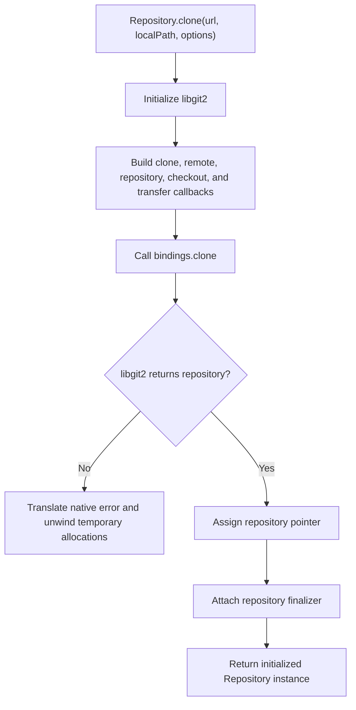

# Repository.clone

```mermaid
flowchart TD
    A["Repository.clone(url, localPath, options)"] --> B["Initialize libgit2"]
    B --> C["Build clone, remote, repository, checkout, and transfer callbacks"]
    C --> D["Call bindings.clone"]
    D --> E{"libgit2 returns repository?"}
    E -- No --> F["Translate native error and unwind temporary allocations"]
    E -- Yes --> G["Assign repository pointer"]
    G --> H["Attach repository finalizer"]
    H --> I["Return initialized Repository instance"]
```

Evidence: `lib/src/repository.dart:181-203` and `lib/src/bindings/repository.dart`.

