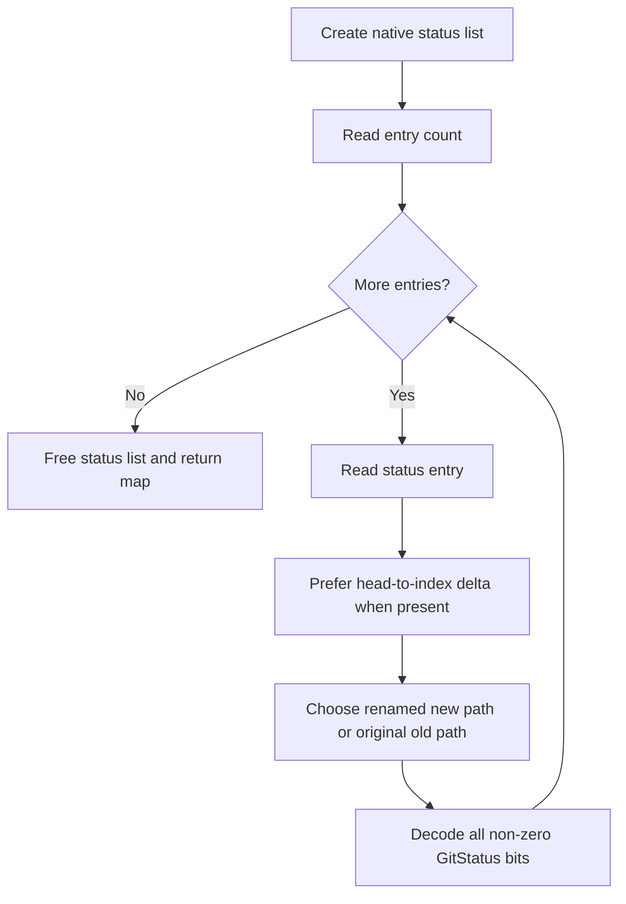

# Repository.status

```mermaid
flowchart TD
    A["Create native status list"] --> B["Read entry count"]
    B --> C{"More entries?"}
    C -- No --> H["Free status list and return map"]
    C -- Yes --> D["Read status entry"]
    D --> E["Prefer head-to-index delta when present"]
    E --> F["Choose renamed new path or original old path"]
    F --> G["Decode all non-zero GitStatus bits"]
    G --> C
```

Evidence: `lib/src/repository.dart:592-624`.

