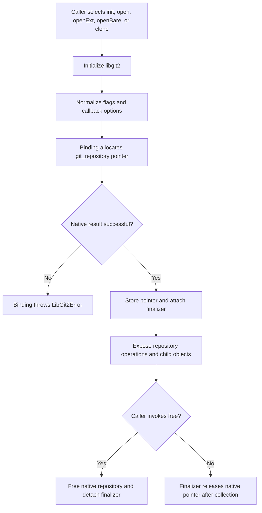

# Repository Lifecycle Flow

```mermaid
flowchart TD
    A["Caller selects init, open, openExt, openBare, or clone"] --> B["Initialize libgit2"]
    B --> C["Normalize flags and callback options"]
    C --> D["Binding allocates git_repository pointer"]
    D --> E{"Native result successful?"}
    E -- No --> F["Binding throws LibGit2Error"]
    E -- Yes --> G["Store pointer and attach finalizer"]
    G --> H["Expose repository operations and child objects"]
    H --> I{"Caller invokes free?"}
    I -- Yes --> J["Free native repository and detach finalizer"]
    I -- No --> K["Finalizer releases native pointer after collection"]
```

Evidence: `lib/src/repository.dart`, `lib/src/bindings/repository.dart`.

