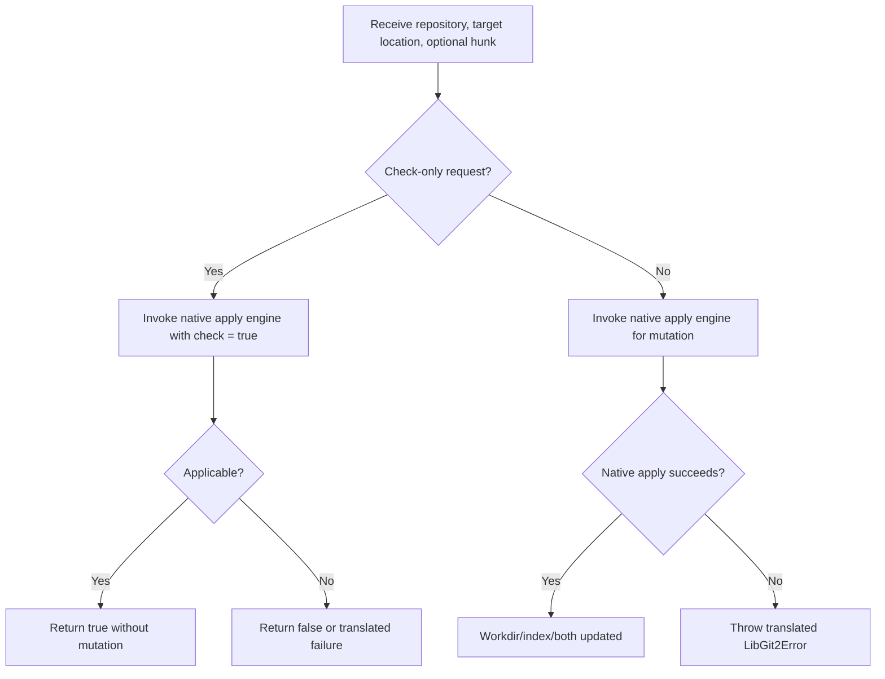

# Diff.apply and Diff.applies

```mermaid
flowchart TD
    A["Receive repository, target location, optional hunk"] --> B{"Check-only request?"}
    B -- Yes --> C["Invoke native apply engine with check = true"]
    B -- No --> D["Invoke native apply engine for mutation"]
    C --> E{"Applicable?"}
    E -- Yes --> F["Return true without mutation"]
    E -- No --> G["Return false or translated failure"]
    D --> H{"Native apply succeeds?"}
    H -- Yes --> I["Workdir/index/both updated"]
    H -- No --> J["Throw translated LibGit2Error"]
```

Evidence: `lib/src/diff.dart:338-382`.

