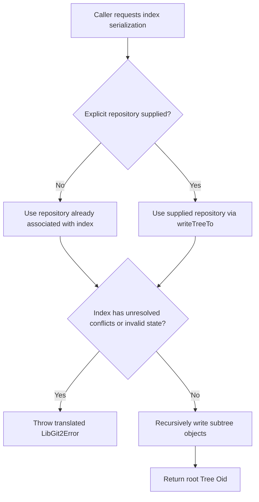

# Index.writeTree

```mermaid
flowchart TD
    A["Caller requests index serialization"] --> B{"Explicit repository supplied?"}
    B -- No --> C["Use repository already associated with index"]
    B -- Yes --> D["Use supplied repository via writeTreeTo"]
    C --> E{"Index has unresolved conflicts or invalid state?"}
    D --> E
    E -- Yes --> F["Throw translated LibGit2Error"]
    E -- No --> G["Recursively write subtree objects"]
    G --> H["Return root Tree Oid"]
```

Evidence: `lib/src/index.dart:391-413`.

