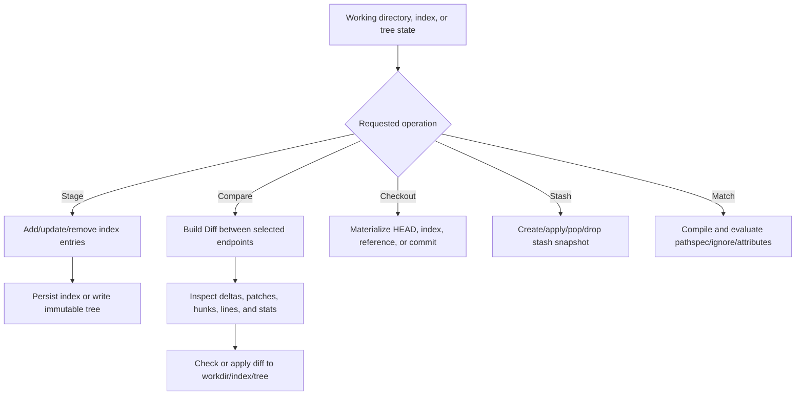

# Working Tree and Index Flow

```mermaid
flowchart TD
    A["Working directory, index, or tree state"] --> B{"Requested operation"}
    B -- Stage --> C["Add/update/remove index entries"]
    B -- Compare --> D["Build Diff between selected endpoints"]
    B -- Checkout --> E["Materialize HEAD, index, reference, or commit"]
    B -- Stash --> F["Create/apply/pop/drop stash snapshot"]
    B -- Match --> G["Compile and evaluate pathspec/ignore/attributes"]
    C --> H["Persist index or write immutable tree"]
    D --> I["Inspect deltas, patches, hunks, lines, and stats"]
    I --> J["Check or apply diff to workdir/index/tree"]
```

