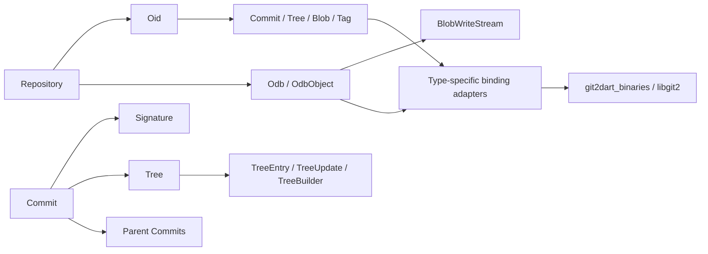
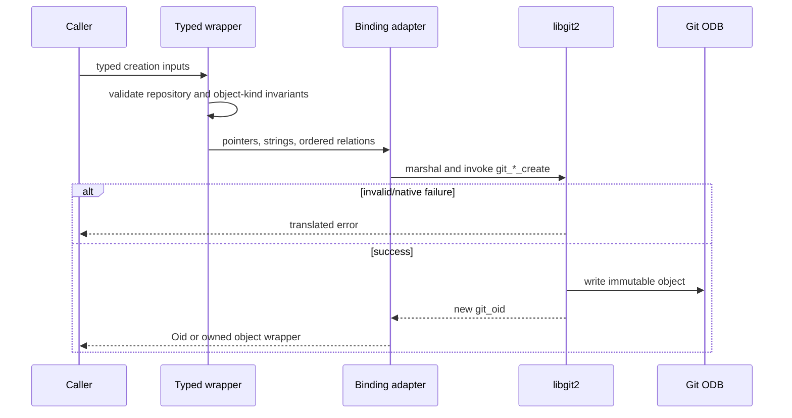
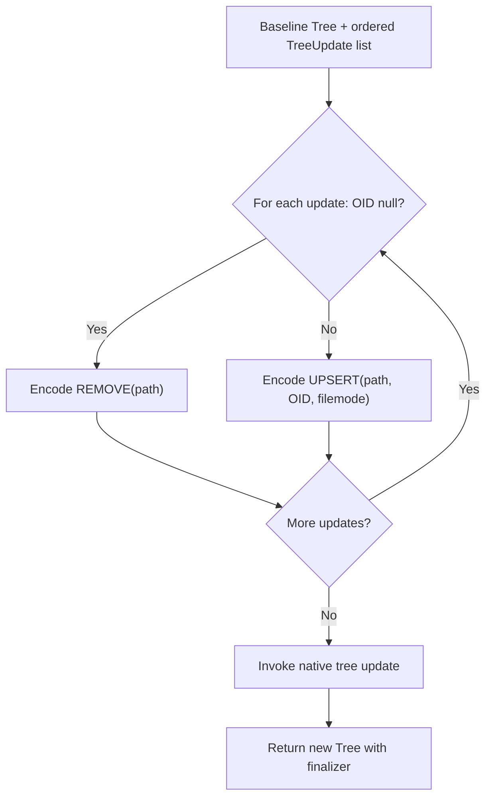

# Git Objects and Object Database — Technical Design

> 🟢 **CONFIRMED** — The unit is a family of typed owned wrappers backed by type-specific binding adapters and one repository-scoped native object database.

## Component Model

## Interface Summary

| Area | Principal symbols | Inputs | Outputs | Confidence |
| --- | --- | --- | --- | --- |
| OID | `Oid.fromSHA`, lookup/prefix, copy, shorten, compare | repository, hex/prefix, length | `Oid`, string, ordering | 🟢 CONFIRMED |
| Commit | lookup/create/createBuffer/amend, parents/tree/metadata | repo, OID, signatures, tree, parents | `Commit`, `Oid`, serialized buffer | 🟢 CONFIRMED |
| Tree | lookup, indexed/path/name access, createUpdated | repo, OID, selector, updates | `Tree`, `TreeEntry`, typed target | 🟢 CONFIRMED |
| TreeBuilder | create/insert/remove/write/filter | repo, optional source tree, path/OID/mode | entry or new tree OID | 🟢 CONFIRMED |
| Blob | lookup/create from disk/workdir/buffer/stream | repo, path, bytes/text, stream | `Blob` or `Oid` | 🟢 CONFIRMED |
| Tag | lookup/create/list/delete/peel | repo, name, target, tagger/message, force | `Tag`, OID, target object | 🟢 CONFIRMED |
| ODB | read/write/hash/exists/foreach/backends/stream | repo, OID, bytes, object type | `OdbObject`, OID, bool/list/stream | 🟢 CONFIRMED |
| Supporting | `Signature`, `AnnotatedCommit`, `CommitGraph` | identity/time/reference/graph inputs | typed wrappers and graph answers | 🟢 CONFIRMED |

## Object Creation Flow

## Commit Algorithm

1. 🟢 **CONFIRMED** — Receive repository, update reference, author, committer, message, tree, and ordered parents.
2. 🟢 **CONFIRMED** — Map tree/signature/parent wrappers to native pointers without changing their order.
3. 🟢 **CONFIRMED** — Pass parent count and pointer array to the commit binding.
4. 🟢 **CONFIRMED** — libgit2 serializes and writes the immutable commit, optionally updating a reference.
5. 🟢 **CONFIRMED** — Return the new OID; native failure is translated.

## Tree Update Algorithm

## ODB Type Gate

- 🟢 **CONFIRMED** — Concrete commit/tree/blob/tag types may be hashed or written.
- 🟢 **CONFIRMED** — `any`, `invalid`, and delta pseudo-types are rejected locally.
- 🟢 **CONFIRMED** — Raw reads preserve bytes and expose the detected object kind.
- 🟢 **CONFIRMED** — Enumeration callbacks project OIDs without transferring borrowed callback pointers.

## Polymorphic Object Dispatch

| Native kind | Dart wrapper | Unsupported behavior | Confidence |
| --- | --- | --- | --- |
| commit | `Commit` | n/a | 🟢 CONFIRMED |
| tree | `Tree` | n/a | 🟢 CONFIRMED |
| blob | `Blob` | n/a | 🟢 CONFIRMED |
| tag | `Tag` | n/a | 🟢 CONFIRMED |
| other/pseudo | none | `ArgumentError` or translated native error | 🟢 CONFIRMED |

## Ownership Model

| Resource | Ownership | Release | Confidence |
| --- | --- | --- | --- |
| Commit/Tree/Blob/Tag/Odb/OdbObject/AnnotatedCommit/CommitGraph wrappers | Persistent owned | Explicit `free()` and matching finalizer where implemented | 🟢 CONFIRMED |
| `Oid` native storage | Wrapper-owned allocation or copied returned OID | Wrapper-specific release/finalizer | 🟢 CONFIRMED |
| Tree entries and callback views | Borrowed or copied according to wrapper | Must not outlive native owner unless copied | 🟢 CONFIRMED |
| Temporary parent/update arrays and strings | Call-scoped | Arena unwind / explicit buffer disposer | 🟢 CONFIRMED |
| Blob write stream | Owned until committed/transferred or freed | Stream finalizer/destructor with transfer-aware detachment | 🟢 CONFIRMED |

## Error Model

- 🟢 **CONFIRMED** — Invalid OID syntax, invalid writable object kind, and unsupported polymorphic type fail at the Dart boundary.
- 🟢 **CONFIRMED** — Missing/ambiguous lookup, repository mismatch, duplicate tag policy, and native create/write failures surface as translated native errors where applicable.
- 🟢 **CONFIRMED** — No invalid object write is represented as nullable success.

## Design Decisions

| Decision | Consequence | Confidence |
| --- | --- | --- |
| Immutable operations return new OIDs/objects. | Git content identity remains explicit and previous objects remain unchanged. | 🟢 CONFIRMED |
| Typed wrappers hide native object-kind integers and pointers. | Consumer dispatch is safe but wrapper coverage must track native capabilities. | 🟢 CONFIRMED |
| Arenas plus finalizers manage distinct temporary/persistent lifetimes. | Cleanup is safer but ownership transfer must be exact. | 🟢 CONFIRMED |
| Raw bytes remain available beside text conveniences. | Binary Git content is preserved without lossy decoding. | 🟢 CONFIRMED |

## Observability and Gaps

- 🟢 **CONFIRMED** — The unit emits no logs/metrics/traces; outputs, object writes, and exceptions are observable.
- 🔴 **GAP** — Complete error-path allocation/free behavior is not dynamically audited.
- 🔴 **GAP** — Full SHA-256 operation compatibility is not established.
- 🔴 **GAP** — Thread-safety/lifetime guarantees for shared wrappers and borrowed entries are not centrally documented.

