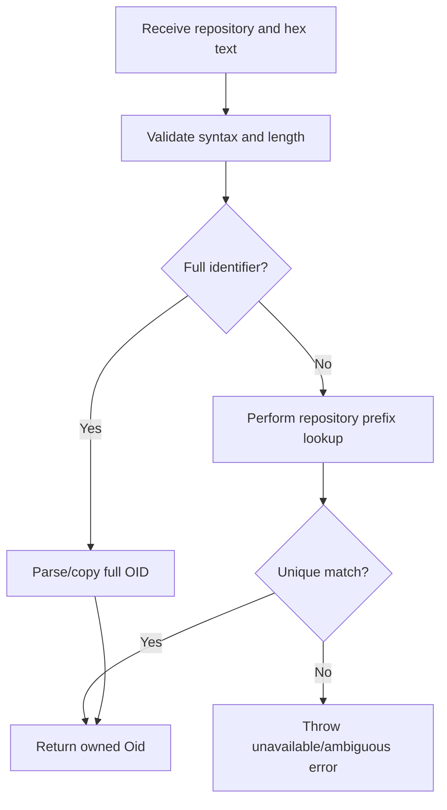
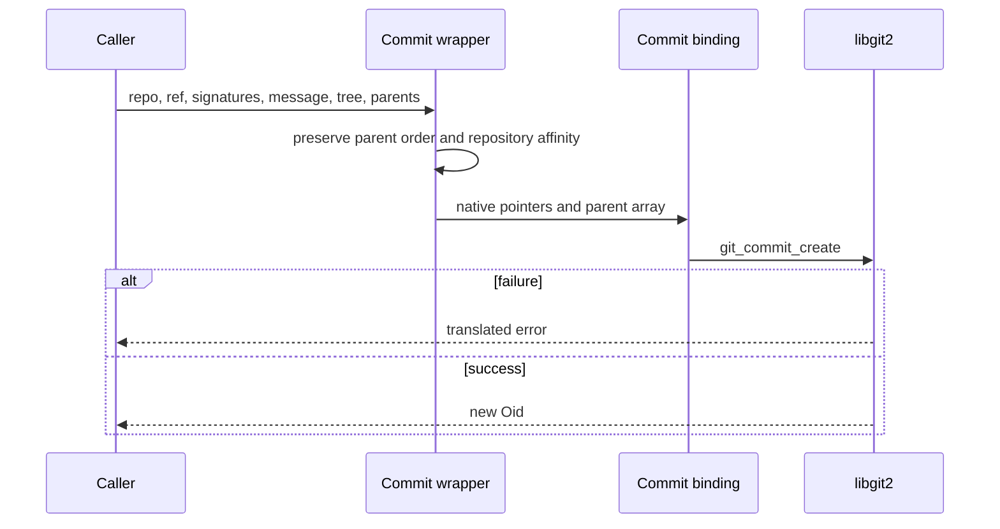
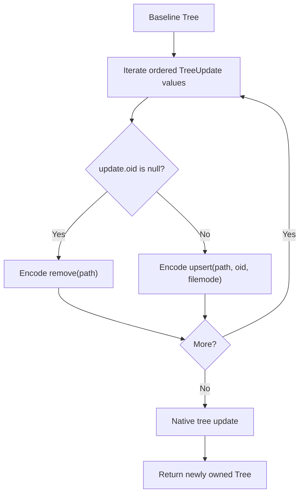
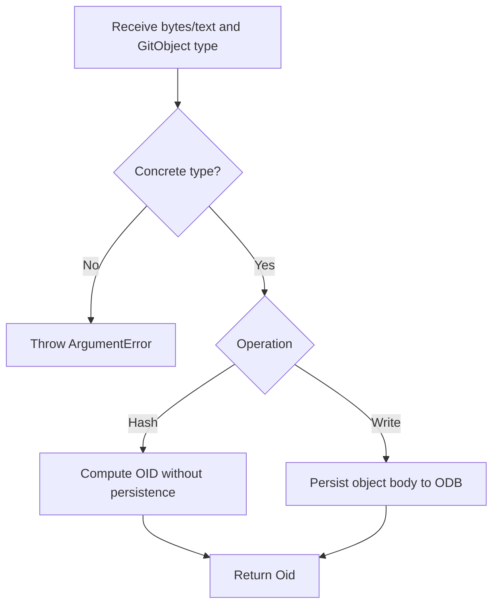
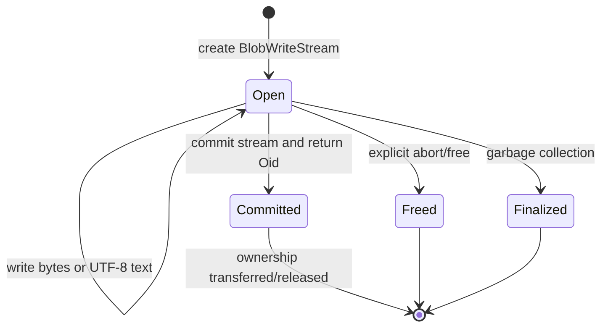

# Git Objects and Object Database — Operational Flows

> 🟢 **CONFIRMED** — These flows preserve the order-sensitive object and ownership behavior needed for faithful reconstruction.

## FL-OBJ-01 — Resolve an OID or Prefix

- 🟢 **CONFIRMED** — Invalid syntax fails locally; prefix resolution is repository-dependent.
- 🔴 **GAP** — All SHA-256 prefix lengths and ambiguity behavior require matrix validation.

## FL-OBJ-02 — Create a Commit

- 🟢 **CONFIRMED** — Zero parents creates a root commit; multiple ordered parents create merge ancestry.
- 🟢 **CONFIRMED** — Buffer creation follows the same serialization inputs without storing the commit.

## FL-OBJ-03 — Amend a Commit

1. 🟢 **CONFIRMED** — Read the existing commit's reference-independent fields and parent list.
2. 🟢 **CONFIRMED** — Replace author, committer, message, tree, or update reference only when the caller supplies a non-null value.
3. 🟢 **CONFIRMED** — Pass the unchanged ordered parents to native amendment.
4. 🟢 **CONFIRMED** — Return a new OID; keep the original commit immutable.
5. 🟢 **CONFIRMED** — Translate repository/field/native failures.

## FL-OBJ-04 — Apply Tree Updates

- 🟢 **CONFIRMED** — Update order is preserved when marshalled.
- 🟢 **CONFIRMED** — Target entries convert only to commit/tree/blob/tag wrappers.

## FL-OBJ-05 — Write or Hash Raw ODB Content

- 🟢 **CONFIRMED** — Commit/tree/blob/tag are concrete; any/invalid/delta types are rejected.
- 🟢 **CONFIRMED** — Binary input remains byte-preserving.

## FL-OBJ-06 — Stream a Blob

- 🟢 **CONFIRMED** — Commit finalizes the stream into a stored blob OID.
- 🟢 **CONFIRMED** — Transfer-aware cleanup must prevent a second destructor invocation.

## FL-OBJ-07 — Resolve a Polymorphic Target

1. 🟢 **CONFIRMED** — Obtain the native target kind from a tree entry or tag.
2. 🟢 **CONFIRMED** — Dispatch commit/tree/blob/tag to the corresponding typed lookup/wrapper.
3. 🟢 **CONFIRMED** — Reject an unsupported/pseudo kind with an explicit error.
4. 🟢 **CONFIRMED** — Attach ownership only when the native API returns an owned pointer.

## FL-OBJ-08 — Enumerate the ODB

1. 🟢 **CONFIRMED** — Register a native foreach callback for the repository ODB.
2. 🟢 **CONFIRMED** — Copy/project each callback OID into a Dart-safe value before callback lifetime ends.
3. 🟢 **CONFIRMED** — Stop/throw according to native callback/error result.
4. 🟢 **CONFIRMED** — Return the completed OID collection without retaining borrowed callback pointers.

## Cross-Flow Invariants

| Invariant | Confidence |
| --- | --- |
| Object creation never mutates an existing stored object. | 🟢 CONFIRMED |
| Related tree/parent/object pointers belong to the intended repository. | 🟢 CONFIRMED |
| Parent and update ordering is preserved. | 🟢 CONFIRMED |
| Binary content has a byte-preserving API. | 🟢 CONFIRMED |
| Temporary native arrays/strings do not escape call scope. | 🟢 CONFIRMED |
| Owned pointer and borrowed-view lifecycles are not interchangeable. | 🟢 CONFIRMED |
| Exhaustive SHA-256 and error-path ownership behavior is not yet proven. | 🔴 GAP |

