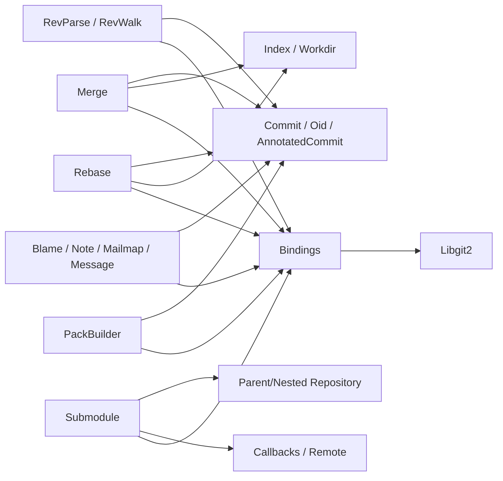
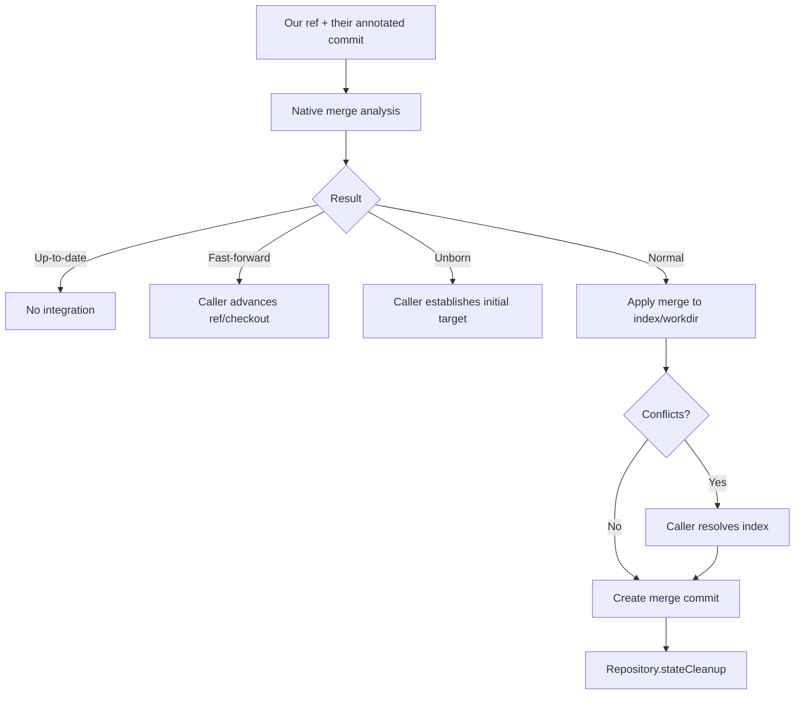
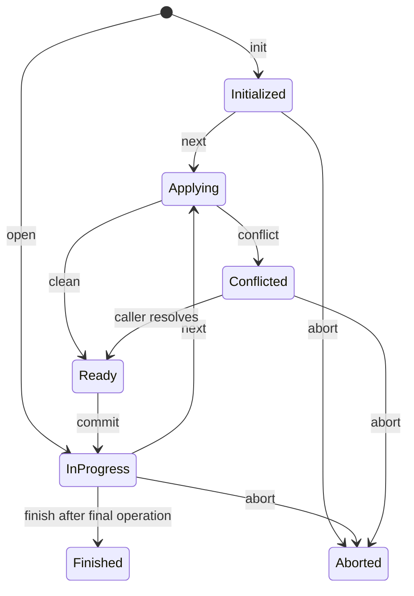

# History and Integration Operations — Technical Design

> 🟢 **CONFIRMED** — This orchestration layer composes repository, object, index/workdir, reference, remote, and native-boundary components.

## Component Model

## Interface Summary

| Area | Principal interface | Design contract | Confidence |
| --- | --- | --- | --- |
| Revision parse | single/ext/range | Dispatch native object kind and range flags to typed results. | 🟢 CONFIRMED |
| Revision walk | push/hide/range/glob/ref/head/sort/reset/walk | Mutable native walker with ordered materialization and completion reset. | 🟢 CONFIRMED |
| Merge | base/analysis/commit/cherry-pick/revert | Decode result bitsets; mutate index/workdir; preserve repository state until cleanup. | 🟢 CONFIRMED |
| Rebase | init/open/operations/next/commit/finish/abort | Sequential stateful native operation wrapper. | 🟢 CONFIRMED |
| Blame | file/buffer/options/hunks | Line attribution projection with commit/signature/path fields. | 🟢 CONFIRMED |
| Notes/Mailmap/Message | note lifecycle, identity resolution, prettify/trailers | Repository metadata helpers with typed values. | 🟢 CONFIRMED |
| PackBuilder | insert/walk/write/foreach/progress/threads | Mutable pack collector and output writer. | 🟢 CONFIRMED |
| Submodule | add/list/lookup/open/init/sync/reload/update/status | Coordinates parent config/index/workdir and nested repo/network. | 🟢 CONFIRMED |

## Merge Flow

## Rebase State

## Submodule Add/Update

- 🟢 **CONFIRMED** — Add performs setup, nested clone, then finalize parent metadata.
- 🟢 **CONFIRMED** — Update may initialize and uses remote callbacks/options.
- 🟢 **CONFIRMED** — Status is a bitset spanning HEAD/index/config/workdir relations; workdir OID alone is insufficient for dirtiness.
- 🟢 **CONFIRMED** — Nested repository and submodule handles have separate ownership.

## Ownership, Errors, Observability

- 🟢 **CONFIRMED** — Stateful walkers/rebases/packbuilders/submodules and returned metadata wrappers release matching native resources.
- 🟢 **CONFIRMED** — Invalid revision, no merge base, conflicts, invalid operation order, note/submodule absence, transport failures are explicit.
- 🟢 **CONFIRMED** — Repository state, index conflicts, returned operation lists, progress callbacks, output files, and exceptions are observability surfaces.
- 🔴 **GAP** — Crash/interruption recovery and idempotency across merge/rebase/submodule multi-step flows are not independently proven.
- 🔴 **GAP** — Live submodule transport and concurrent callback behavior remain unverified.

