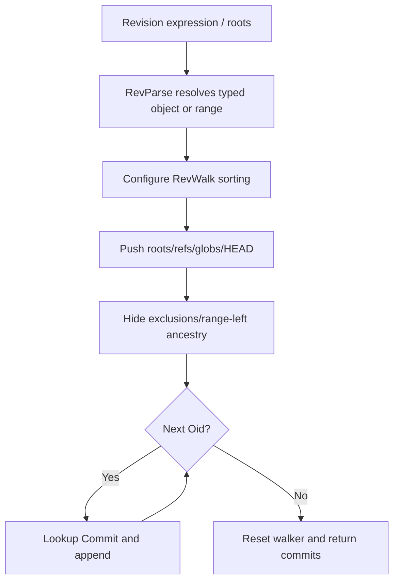
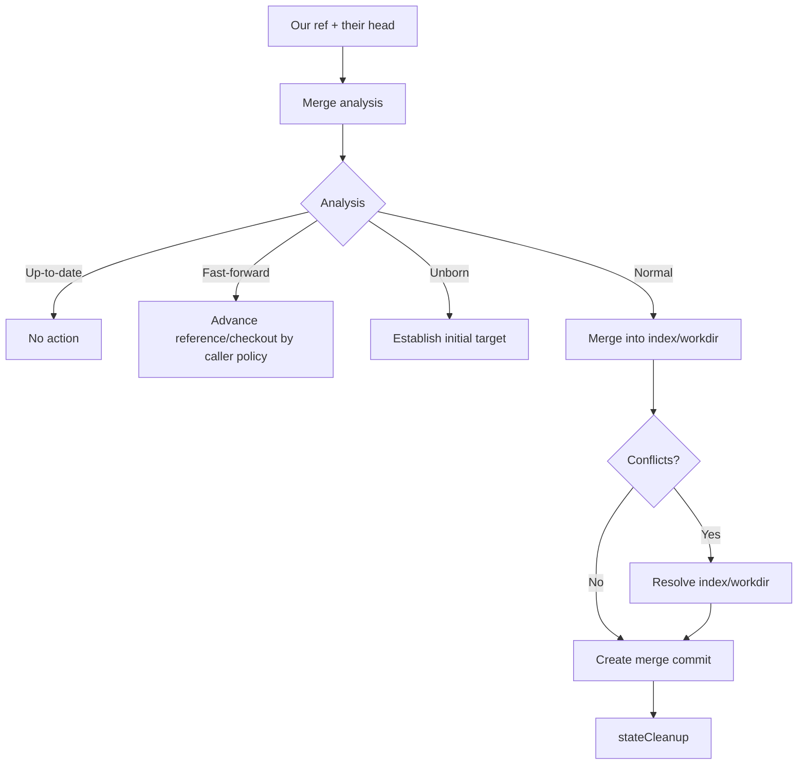
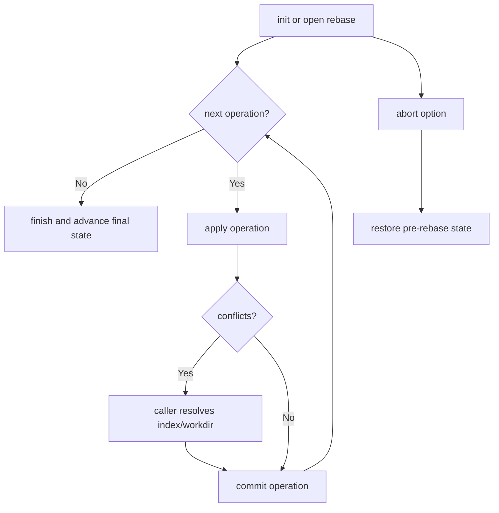
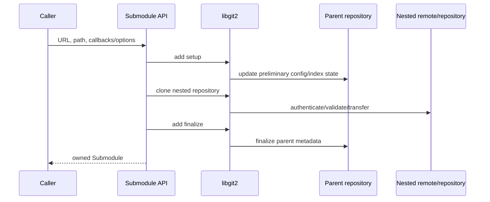

# History and Integration Operations — Operational Flows

> 🟢 **CONFIRMED** — These flows emphasize graph selection, conflict-mediated state, and cleanup.

## FL-HI-01 — Parse and Walk Revisions

- 🟢 **CONFIRMED** — No pushed root is invalid for walking.
- 🟢 **CONFIRMED** — `A..B` hides A ancestry and pushes B.

## FL-HI-02 — Analyze and Execute Merge

## FL-HI-03 — Rebase

## FL-HI-04 — Blame a File

1. 🟢 **CONFIRMED** — Marshal path, revision range, line bounds, and blame flags.
2. 🟢 **CONFIRMED** — Acquire native blame and enumerate hunks.
3. 🟢 **CONFIRMED** — Project final/origin commit OIDs, signatures, paths, and line positions.
4. 🟢 **CONFIRMED** — Optionally apply an in-memory buffer update.
5. 🟢 **CONFIRMED** — Release owned blame resource.

## FL-HI-05 — Add a Submodule

- 🟢 **CONFIRMED** — Update/init uses the same remote trust and credential boundary as remotes.
- 🔴 **GAP** — Partial parent/nested state after setup/clone/finalize failure needs characterization.

## FL-HI-06 — Build a Pack

1. 🟢 **CONFIRMED** — Create owned `PackBuilder` for a repository.
2. 🟢 **CONFIRMED** — Insert OIDs/trees/commits recursively or insert a revision walk.
3. 🟢 **CONFIRMED** — Configure threads/progress.
4. 🟢 **CONFIRMED** — Write to file or emit bytes through callback.
5. 🟢 **CONFIRMED** — Expose count/written length/name and release builder.

## Gaps

- 🔴 **GAP** — Power-loss/crash recovery across merge/rebase/submodule steps.
- 🔴 **GAP** — Idempotency of retry after partial native mutation.
- 🔴 **GAP** — Live submodule transport and callback overlap.
- 🔴 **GAP** — Complete stateful native resource cleanup proof.

