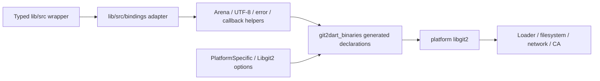
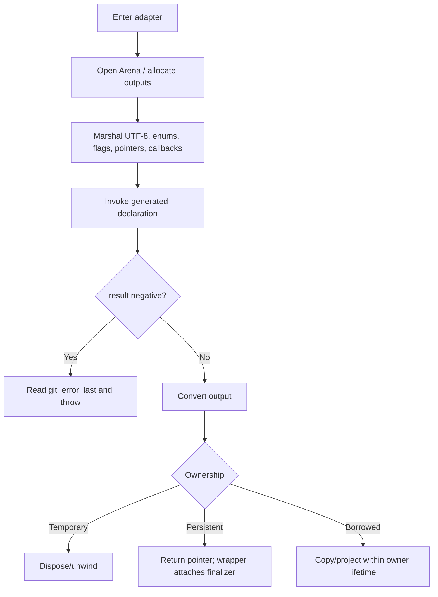
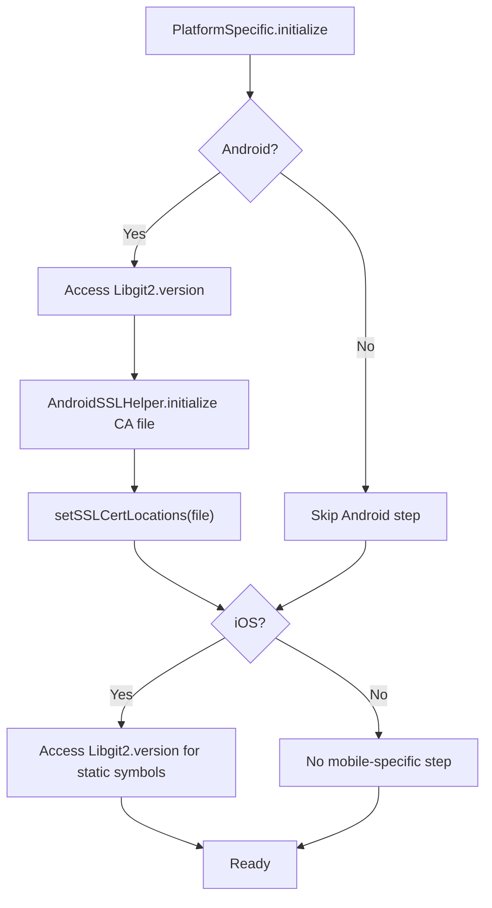

# Native Runtime and Platform Boundary — Technical Design

> 🟢 **CONFIRMED** — This boundary converts typed Dart calls into generated C declarations while making allocation, error, callback, and platform behavior explicit.

## Layer Model

## Native Call Pattern

## Ownership Categories

| Category | Example | Release | Confidence |
| --- | --- | --- | --- |
| Persistent owned | repository/object/index/remote/rebase handle | wrapper `free()` or finalizer | 🟢 CONFIRMED |
| Call-scoped arena | UTF-8 input, pointer arrays, option structs | automatic arena unwind | 🟢 CONFIRMED |
| Manual temporary | native result/list/buffer outside arena | matching free/dispose after conversion | 🟢 CONFIRMED |
| Borrowed | callback certificate/progress/ref, child entry | parent/callback bounded; copy before escape | 🟢 CONFIRMED |
| Transferred | committed write stream or pointer accepted by native owner | detach prior owner cleanup | 🟢 CONFIRMED |

## Platform Initialization

## Global Runtime Options

- 🟢 **CONFIRMED** — Search/template/SSL paths, mmap/cache limits, strict object/ref/hash/index safety, extensions, owner validation, and pack limits are process-global.
- 🟢 **CONFIRMED** — Sets/typed values convert to native option identifiers and C values.
- 🟢 **CONFIRMED** — Invalid locally knowable values such as negative pack maximum object size are rejected.
- 🔴 **GAP** — Atomic snapshot/restore and concurrent update guarantees are not exposed.

## Error and Callback Design

- 🟢 **CONFIRMED** — `checkErrorAndThrow` reads native error state immediately for negative results.
- 🟢 **CONFIRMED** — Native non-negative values may carry operation-specific status and are interpreted by the relevant adapter.
- 🟢 **CONFIRMED** — Callback bridge functions translate native inputs to typed Dart closures and translate the closure result back to native status/decision.
- 🔴 **GAP** — Static callback fields and callback exceptions under overlap require dynamic proof.

## Decisions and Risks

| Decision | Consequence | Confidence |
| --- | --- | --- |
| Separate binaries/generated declarations from hand-written adapters. | Reproducible artifacts; upgrades become explicit ABI migrations. | 🟢 CONFIRMED |
| Centralize error translation. | Consistent exceptions; native error must be read immediately. | 🟢 CONFIRMED |
| Arena temporary memory plus explicit/finalizer persistent ownership. | Safer cleanup; transfer/borrow contracts remain critical. | 🟢 CONFIRMED |
| Explicit mobile bootstrap. | Predictable CA/static loading; consumers must call it. | 🟢 CONFIRMED |

- 🔴 **GAP** — Exhaustive allocation/free audit.
- 🔴 **GAP** — Thread safety of global options/callbacks/wrappers.
- 🔴 **GAP** — ABI/load validation for every current platform artifact without a fresh run.

