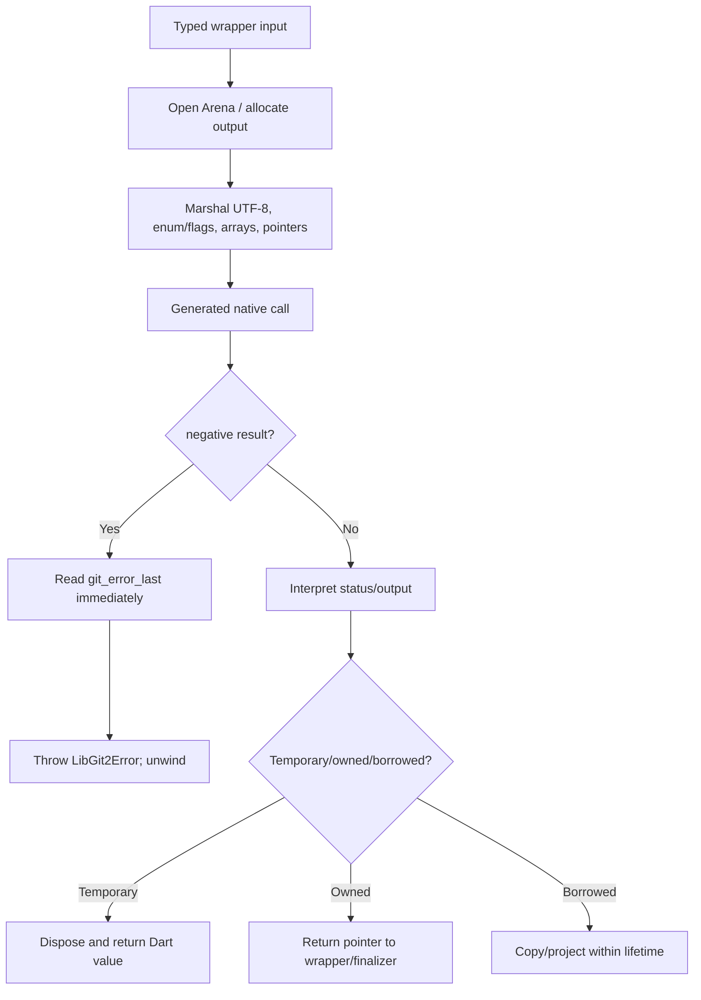
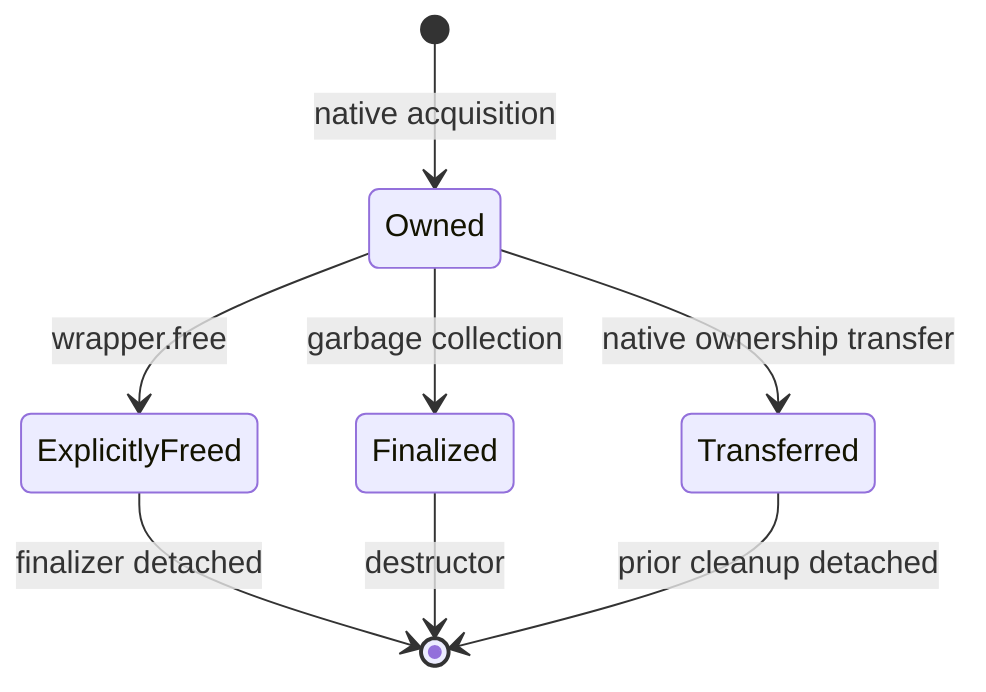
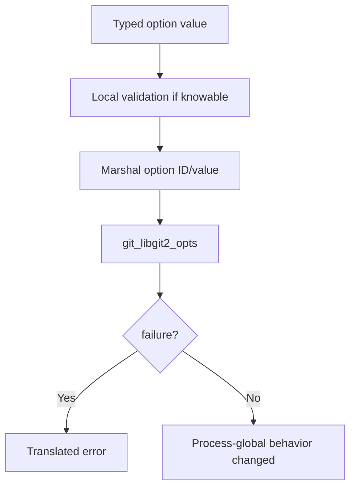

# Native Runtime and Platform Boundary — Operational Flows

> 🟢 **CONFIRMED** — These flows apply transversally to every feature adapter.

## FL-NP-01 — Standard Native Call

## FL-NP-02 — Explicit and Fallback Release

- 🟢 **CONFIRMED** — Borrowed views never enter this owned state machine.
- 🔴 **GAP** — Repeated-free/post-free guards are not universal.

## FL-NP-03 — Android Initialization

1. 🟢 **CONFIRMED** — Detect Android through `dart:io` platform state.
2. 🟢 **CONFIRMED** — Access `Libgit2.version` to load/initialize native runtime.
3. 🟢 **CONFIRMED** — Invoke companion `AndroidSSLHelper.initialize()`.
4. 🟢 **CONFIRMED** — Configure returned CA file with `setSSLCertLocations(file: ...)`.
5. 🟢 **CONFIRMED** — Complete before TLS-dependent Git operations.

## FL-NP-04 — iOS Initialization

1. 🟢 **CONFIRMED** — Detect iOS.
2. 🟢 **CONFIRMED** — Access `Libgit2.version` to resolve statically linked symbols and initialize native bindings.
3. 🟢 **CONFIRMED** — Return with no Android CA step.

## FL-NP-05 — Set a Global Option

- 🟢 **CONFIRMED** — SSL locations require file or path; pack object size rejects negative input.
- 🔴 **GAP** — No built-in transaction/snapshot for concurrent option changes is exposed.

## FL-NP-06 — Native Callback

1. 🟢 **CONFIRMED** — Native code invokes a registered bridge with borrowed pointers/status.
2. 🟢 **CONFIRMED** — Bridge converts input to typed callback-scoped Dart values.
3. 🟢 **CONFIRMED** — Caller closure returns credential/trust/progress/status response where applicable.
4. 🟢 **CONFIRMED** — Bridge converts result to native return/value and releases temporary conversion state.
5. 🔴 **GAP** — Overlap and Dart exception propagation need dynamic characterization.

## Gaps

- 🔴 **GAP** — Exhaustive allocation/free instrumentation.
- 🔴 **GAP** — Global option and static callback synchronization.
- 🔴 **GAP** — Current ABI/load proof on all five platforms.

