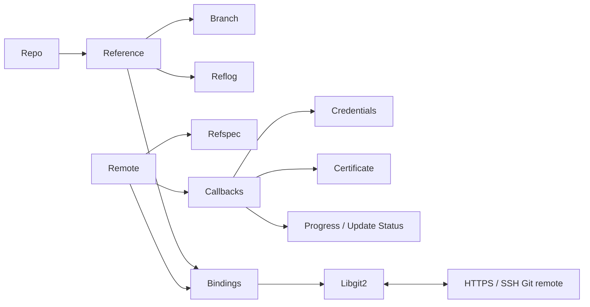
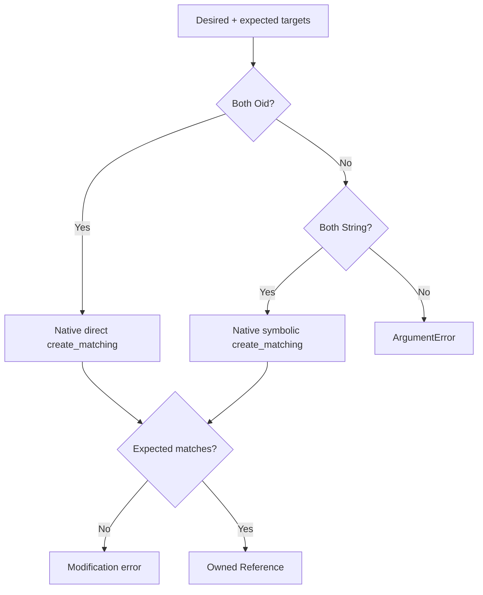
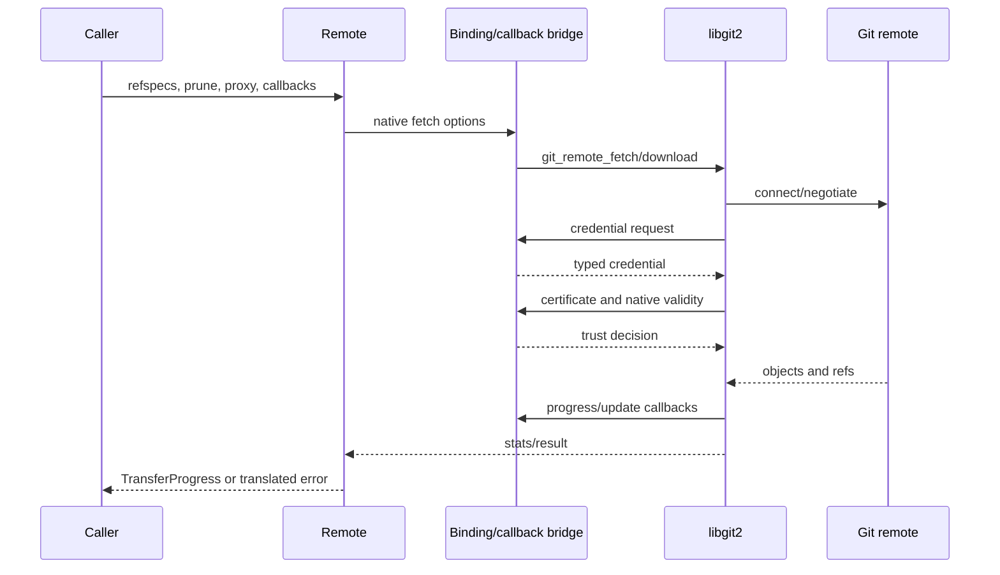

# References and Remotes — Technical Design

> 🟢 **CONFIRMED** — The unit joins mutable Git names to libgit2 transports through typed options and synchronous callback bridges.

## Components

## Interface Summary

| Component | Operations | Design notes | Confidence |
| --- | --- | --- | --- |
| Reference | create/createMatching/lookup/list/resolve/peel/setTarget/rename/delete | Runtime dispatch distinguishes OID/direct and String/symbolic. | 🟢 CONFIRMED |
| Branch | create/list/lookup/move/delete/upstream | Wraps refs plus HEAD/checked-out/tracking configuration. | 🟢 CONFIRMED |
| Reflog | read/write/append/drop/rename | Ordered native log entries with signatures and OID transitions. | 🟢 CONFIRMED |
| Refspec | parse/match/transform/rtransform | Native pattern mapping with fetch/push direction and force flag. | 🟢 CONFIRMED |
| Remote | create/config/list/ls/connect/fetch/download/push/prune | Repository config plus native transport operations. | 🟢 CONFIRMED |
| Callbacks | credentials/certificate/progress/sideband/update | Static/native bridge projects borrowed values to Dart closures. | 🟢 CONFIRMED |
| Credentials | user/password, keypair, agent, memory keypair | Caller-owned secrets selected by native allowed-type request. | 🟢 CONFIRMED |
| Certificate | X.509/hostkey projections | Borrowed callback-scoped data; caller bool is final decision. | 🟢 CONFIRMED |

## Reference Compare-and-Set

## Remote Fetch Sequence

## Ownership and Trust

- 🟢 **CONFIRMED** — Reference/branch/reflog/refspec/remote wrappers own native handles when returned as owned objects.
- 🟢 **CONFIRMED** — Advertisements, progress, and certificate values may be borrowed and must be copied or consumed synchronously.
- 🟢 **CONFIRMED** — No callback means native/default certificate validation remains active.
- 🟢 **CONFIRMED** — Returning true from `certificateCheck` may override native invalidity and therefore transfers trust responsibility to the caller.
- 🟢 **CONFIRMED** — The library does not persist credentials.

## Error and State Model

- 🟢 **CONFIRMED** — Reference type mismatch fails locally; stale compare-and-set, missing name, invalid refspec, auth/trust/network/ref rejection fail explicitly.
- 🟢 **CONFIRMED** — `ls` connects in fetch direction and disconnects after copying advertisements.
- 🟢 **CONFIRMED** — Fetch returns transfer stats; push reports per-reference status through callbacks and final error state.
- 🔴 **GAP** — Static callback storage isolation under overlapping remote operations is not proven.

## Observability and Gaps

- 🟢 **CONFIRMED** — Sideband, transfer, update-tip, push-transfer, and push-ref-status callbacks are the main runtime observability surface.
- 🔴 **GAP** — Live HTTPS/SSH behavior for current binaries/platforms is not proven by default tests.
- 🔴 **GAP** — Secret-redaction behavior belongs to embedding application logging and is not guaranteed here.
- 🔴 **GAP** — Callback exception/overlap lifetime behavior needs dynamic characterization.

