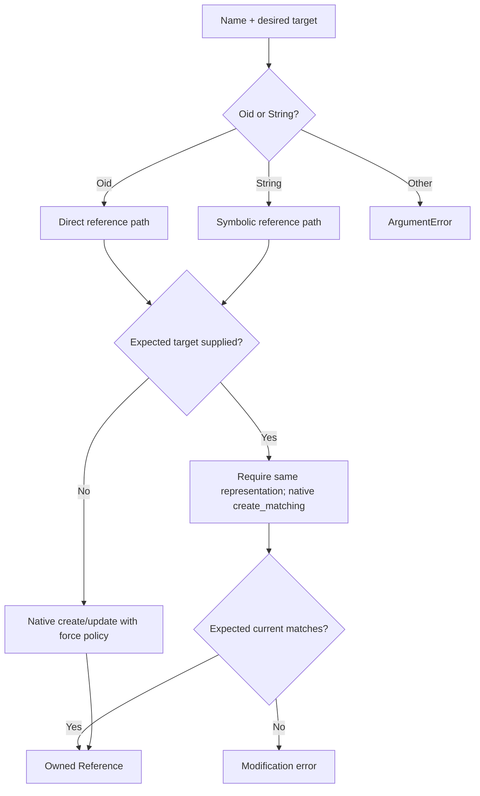
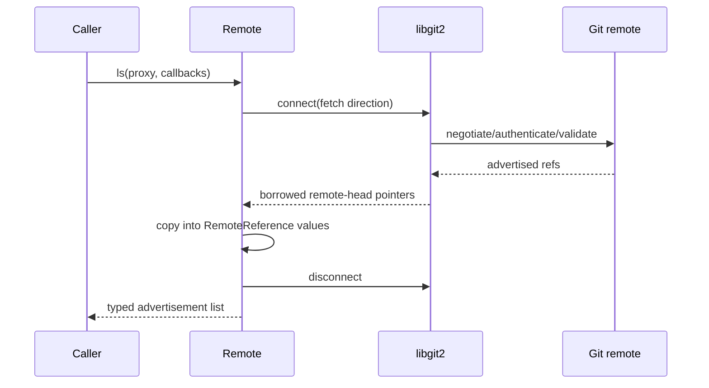
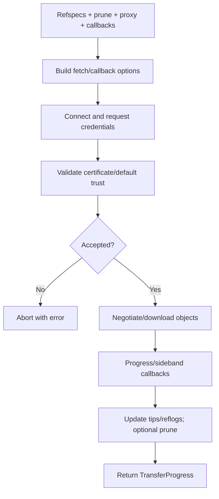
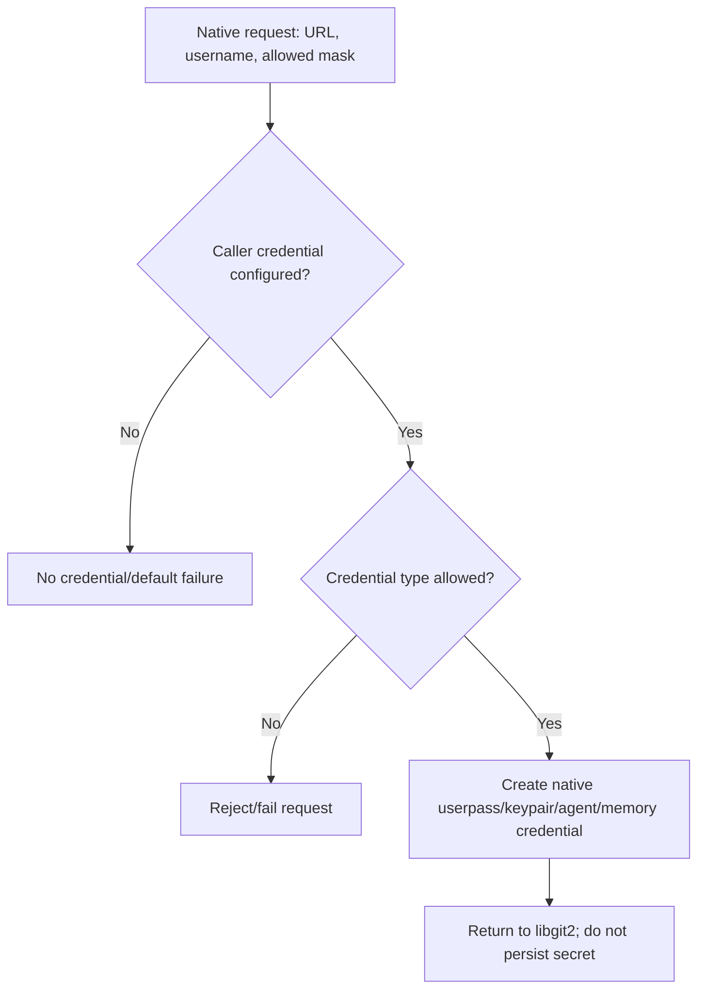

# References and Remotes — Operational Flows

> 🟢 **CONFIRMED** — Flows distinguish local reference integrity from remote transport and caller-owned trust decisions.

## FL-RR-01 — Create or Compare-and-Set a Reference

## FL-RR-02 — Resolve and Peel

1. 🟢 **CONFIRMED** — Start from a direct or symbolic reference.
2. 🟢 **CONFIRMED** — Resolve symbolic chains to a direct target.
3. 🟢 **CONFIRMED** — Ask libgit2 to peel to requested/native object type.
4. 🟢 **CONFIRMED** — Dispatch commit/tree/blob/tag to its typed wrapper.
5. 🟢 **CONFIRMED** — Throw for missing loop/target/unsupported type failures.

## FL-RR-03 — List Remote Advertisements

## FL-RR-04 — Fetch

## FL-RR-05 — Push

1. 🟢 **CONFIRMED** — Marshal push refspecs/proxy/callbacks.
2. 🟢 **CONFIRMED** — Authenticate and validate remote trust.
3. 🟢 **CONFIRMED** — Negotiate and send required objects.
4. 🟢 **CONFIRMED** — Receive transfer progress and per-reference status callbacks.
5. 🟢 **CONFIRMED** — Return success only when final native result succeeds; rejected refs remain observable.

## FL-RR-06 — Credential Callback

## FL-RR-07 — Certificate Decision

1. 🟢 **CONFIRMED** — Receive borrowed certificate pointer, host, and native validity.
2. 🟢 **CONFIRMED** — Project X.509/hostkey data only for callback duration.
3. 🟢 **CONFIRMED** — If no caller callback exists, preserve native/default validation.
4. 🟢 **CONFIRMED** — If callback exists, its bool becomes the final acceptance decision.
5. 🟢 **CONFIRMED** — Reject/exception aborts the remote operation.

## Cross-Flow Gaps

- 🔴 **GAP** — Overlapping operations with distinct static callback state.
- 🔴 **GAP** — Callback-thrown exception translation and cleanup on every engine/platform.
- 🔴 **GAP** — Current live HTTPS/SSH results and server-specific rejection behavior.
- 🔴 **GAP** — Secret-redaction guarantees in consumer logging.

