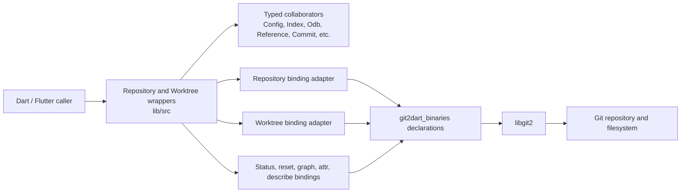
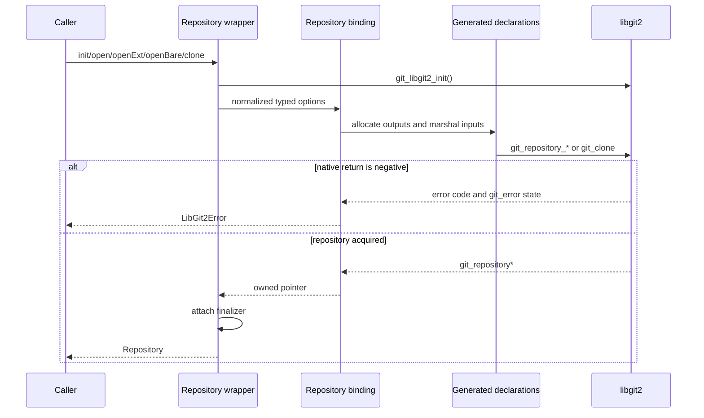
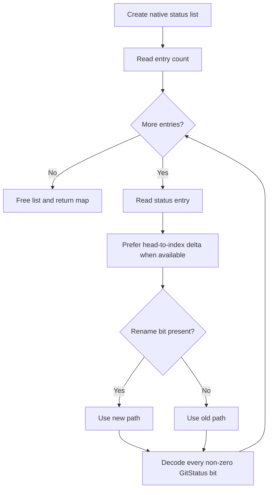
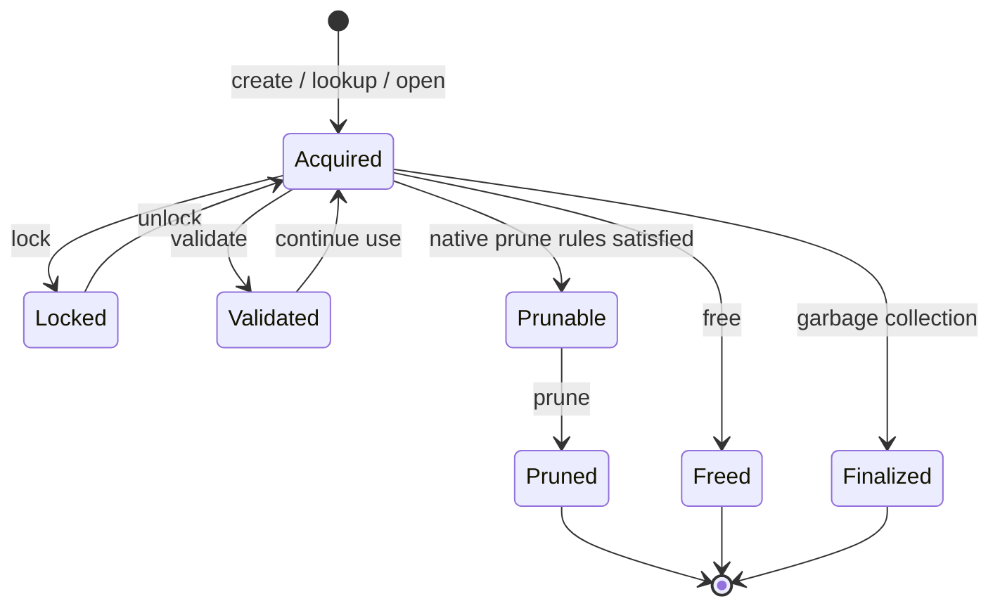

# Repository Lifecycle — Technical Design

> 🟢 **CONFIRMED** — This document specifies how the legacy repository-lifecycle unit is assembled. It complements `requirements.md`: requirements define observable obligations; this document defines layer boundaries, interfaces, control flow, native ownership, and error behavior.

## Component Boundary

- 🟢 **CONFIRMED** — `Repository` is the aggregate root and owns one `git_repository*`.
- 🟢 **CONFIRMED** — `Worktree` independently owns one `git_worktree*` returned by create, lookup, or open.
- 🟢 **CONFIRMED** — High-level wrappers compose typed Dart objects and delegate raw calls, allocation, conversion, and native error checks to binding modules.
- 🟢 **CONFIRMED** — The public barrel exports the wrappers but does not export `lib/src/bindings/`.

## Public Interface

### Repository acquisition

| Symbol | Input | Output | Design contract | Confidence |
| --- | --- | --- | --- | --- |
| `Repository(pointer)` | Owned `Pointer<git_repository>` | `Repository` | Stores an already-acquired pointer and attaches the repository finalizer. | 🟢 CONFIRMED |
| `Repository.init` | path, bare, flags, mode, workdir, description, template, initial HEAD, origin URL | `Repository` | Initializes libgit2, folds flags with bitwise OR, forces the bare flag when requested, then delegates extended initialization. | 🟢 CONFIRMED |
| `Repository.initBasic` | path, optional bare | `Repository` | Initializes libgit2 and performs the basic repository initializer. | 🟢 CONFIRMED |
| `Repository.open` | path | `Repository` | Initializes libgit2 and opens a standard repository path. | 🟢 CONFIRMED |
| `Repository.openExt` | path, flags, optional ceiling directories | `Repository` | Initializes libgit2 and performs extended repository search/open. | 🟢 CONFIRMED |
| `Repository.openBare` | bare repository path | `Repository` | Initializes libgit2 and opens a bare repository. | 🟢 CONFIRMED |
| `Repository.clone` | URL, local path, bare/checkout options, callbacks | `Repository` | Initializes libgit2 and delegates clone option/callback construction and native acquisition. | 🟢 CONFIRMED |
| `Repository.discover` | start path, optional ceiling directories | repository path string | Delegates repository discovery without constructing a repository wrapper. | 🟢 CONFIRMED |
| `Repository.operator []` | full or abbreviated SHA string | `Oid` | Resolves an object identifier in this repository. | 🟢 CONFIRMED |

### Repository metadata and mutable identity

| Symbol | Input | Output | Design contract | Confidence |
| --- | --- | --- | --- | --- |
| `path`, `commonDir`, `workdir` | none | `String` | Project native paths into Dart strings; bare workdir is represented according to binding behavior. | 🟢 CONFIRMED |
| `namespace` / `setNamespace` | optional namespace on set | `String` / `void` | Empty string represents no namespace; null removes it. | 🟢 CONFIRMED |
| `isBare`, `isEmpty`, `isShallow`, `isWorktree` | none | `bool` | Read native repository characteristics. | 🟢 CONFIRMED |
| `isHeadDetached`, `isBranchUnborn` | none | `bool` | Read current HEAD relationship state. | 🟢 CONFIRMED |
| `oidType` | none | `git_oid_t` | Expose the repository object-identifier format reported by libgit2. | 🟢 CONFIRMED |
| `setIdentity` / `identity` | optional name and email | `void` / `Identity` | Set or retrieve repository-scoped identity through the binding adapter. | 🟢 CONFIRMED |
| `message` / `removeMessage` | none | `String` / `void` | Read or remove operation message state such as merge message content. | 🟢 CONFIRMED |
| `state` / `stateCleanup` | none | `GitRepositoryState` / `void` | Decode native operation state and explicitly clean supported in-progress state. | 🟢 CONFIRMED |
| `setWorkdir` | path, update-gitlink flag | `void` | Assign a working directory and optionally update the repository link. | 🟢 CONFIRMED |

### HEAD and child-object access

| Symbol | Input | Output | Design contract | Confidence |
| --- | --- | --- | --- | --- |
| `head` | none | `Reference` | Wrap the native HEAD reference as an owned typed reference. | 🟢 CONFIRMED |
| `setHead` | `Oid` or `String` | `void` | Dispatch to detached OID or symbolic-name binding; reject another runtime type. | 🟢 CONFIRMED |
| `detachHead` | none | `void` | Detach HEAD at its current target. | 🟢 CONFIRMED |
| `setHeadDetachedFromAnnotated` | `AnnotatedCommit` | `void` | Detach HEAD using an annotated commit pointer. | 🟢 CONFIRMED |
| `headForWorktree` | worktree name | `Reference` | Resolve a linked worktree's HEAD. | 🟢 CONFIRMED |
| `isHeadDetachedForWorktree` | worktree name | `bool` | Read linked-worktree detached state. | 🟢 CONFIRMED |
| `config`, `configSnapshot` | none | `Config` | Return live or snapshot configuration wrappers. | 🟢 CONFIRMED |
| `index`, `odb` | none | `Index`, `Odb` | Return repository-associated staging and object-database wrappers. | 🟢 CONFIRMED |
| `setConfig`, `setIndex`, `setOdb` | corresponding typed wrapper | `void` | Replace the native subsystem used by the repository. | 🟢 CONFIRMED |
| `references`, `tags`, `branches`, `stashes`, `remotes`, `submodules`, `worktrees` | none | typed objects or names | Delegate enumeration to each feature's typed static/list operation. | 🟢 CONFIRMED |
| `defaultSignature` | none | `Signature` | Resolve the configured default author identity. | 🟢 CONFIRMED |

### Repository operations

| Symbol | Input | Output | Design contract | Confidence |
| --- | --- | --- | --- | --- |
| `log` | start OID, sorting flags | `List<Commit>` | Create a `RevWalk`, configure sorting, push the root, and materialize commits. | 🟢 CONFIRMED |
| `status` | none | `Map<String, Set<GitStatus>>` | Materialize a native status list, select a path per delta/rename rules, decode non-zero bits, then free the list. | 🟢 CONFIRMED |
| `statusFile` | path | `Set<GitStatus>` | Decode one status bitmask; native zero maps to an empty set. | 🟢 CONFIRMED |
| `fetchHeadEntries`, `mergeHeadOids` | none | lists | Project repository administrative-file state through the binding. | 🟢 CONFIRMED |
| `reset` | target OID, reset type, optional checkout options/pathspec | `void` | Look up a temporary generic object, execute reset, and release the object. | 🟢 CONFIRMED |
| `resetDefault` | nullable target OID, pathspec | `void` | Optionally look up a target and reset matching index entries. | 🟢 CONFIRMED |
| attribute methods | path/name/flags/commit context | values or entries | Delegate single, multiple, extended, and iterative attribute evaluation plus cache/macro operations. | 🟢 CONFIRMED |
| `aheadBehind` | local and upstream OIDs | two integers | Return graph distance counts from the native graph binding. | 🟢 CONFIRMED |
| `describe` | optional commit and formatting options | `String` | Acquire a native describe result, format it, then release the result. | 🟢 CONFIRMED |
| `hashFile` | path and object type | `Oid` | Ask libgit2 to hash filesystem content in repository context. | 🟢 CONFIRMED |
| `pack` | destination, optional object delegate and threads | object count | Populate and write a `PackBuilder`, optionally letting the caller select objects. | 🟢 CONFIRMED |
| `free` | none | `void` | Release `git_repository*` and detach its finalizer. | 🟢 CONFIRMED |

### Worktree interface

| Symbol | Input | Output | Design contract | Confidence |
| --- | --- | --- | --- | --- |
| `Worktree.create` | repository, name, path, optional reference | `Worktree` | Create a linked worktree and attach ownership to the returned pointer. | 🟢 CONFIRMED |
| `Worktree.lookup` | repository, name | `Worktree` | Resolve a configured worktree by name. | 🟢 CONFIRMED |
| `Worktree.openFromRepository` | repository | `Worktree` | Open the worktree associated with a worktree repository. | 🟢 CONFIRMED |
| `Worktree.list` | repository | `List<String>` | Obtain native worktree handles, project their names, and return the name list. | 🟢 CONFIRMED |
| `name`, `path`, `isLocked`, `isPrunable`, `isValid` | none | scalar values | Read current worktree metadata and administrative state. | 🟢 CONFIRMED |
| `lock`, `unlock` | none | `void` | Change the administrative lock state. | 🟢 CONFIRMED |
| `prune` | optional prune flags | `void` | Remove eligible worktree administrative data under caller-selected rules. | 🟢 CONFIRMED |
| `repositoryFromWorktree` | none | `Repository` | Acquire and wrap the repository associated with this worktree. | 🟢 CONFIRMED |
| `validate` | none | `void` | Ask libgit2 to validate the linked-worktree configuration. | 🟢 CONFIRMED |
| `free` | none | `void` | Release `git_worktree*` and detach its finalizer. | 🟢 CONFIRMED |

### Convenience extension

| Symbol | Input | Output | Design contract | Confidence |
| --- | --- | --- | --- | --- |
| `RepositoryExtension.headCommit` | none | `Commit` | Resolve `head.target` to a commit lookup in the same repository. | 🟢 CONFIRMED |
| `RepositoryExtension.createCommitOnHead` | file paths, message, author, committer | `Oid` | Clear and repopulate the index, write a tree, create one commit with current HEAD as parent, and update `HEAD`. | 🟢 CONFIRMED |

## Core Data Structures

| Structure | State | Ownership and invariants | Confidence |
| --- | --- | --- | --- |
| `Repository` | `_repoPointer: Pointer<git_repository>` | Owned pointer; attached to repository finalizer; child operations use the same repository identity. | 🟢 CONFIRMED |
| `RepositoryCallback` | optional bare/flags/mode/workdir/description/template/initialHead/originUrl | Immutable option carrier used during clone-created repository initialization. | 🟢 CONFIRMED |
| `Identity` | `name`, `email` | Immutable value object returned from repository identity lookup. | 🟢 CONFIRMED |
| `Worktree` | `_worktreePointer: Pointer<git_worktree>` | Independently owned pointer with explicit/finalizer cleanup. | 🟢 CONFIRMED |
| `GitRepositoryState` | decoded enum value | Represents native in-progress operation state; cleanup is explicit. | 🟢 CONFIRMED |
| `Map<String, Set<GitStatus>>` | path to status flags | One path may have multiple non-zero status bits; current/zero is omitted. | 🟢 CONFIRMED |

## Main Flow — Acquire and Own a Repository

1. 🟢 **CONFIRMED** — The selected constructor calls `git_libgit2_init()` before native repository acquisition.
2. 🟢 **CONFIRMED** — The wrapper normalizes flags and transports typed values to the repository binding.
3. 🟢 **CONFIRMED** — The binding allocates/marshals C-compatible inputs and invokes the generated declaration.
4. 🟢 **CONFIRMED** — A negative result is translated immediately; no usable wrapper is returned.
5. 🟢 **CONFIRMED** — A successful pointer is stored and registered with the repository finalizer.

## Main Flow — Decode Repository Status

- 🟢 **CONFIRMED** — The status list is explicitly freed after iteration.
- 🟢 **CONFIRMED** — The decoder never treats numeric zero (`current`) as a bitwise match.
- 🟢 **CONFIRMED** — Rename state selects the new path; other state selects the old path from the chosen delta.

## Main Flow — Reset

1. 🟢 **CONFIRMED** — Resolve the requested OID to a generic native Git object in the same repository.
2. 🟢 **CONFIRMED** — Convert reset and optional checkout/pathspec values at the binding boundary.
3. 🟢 **CONFIRMED** — Invoke native reset using the temporary object pointer.
4. 🟢 **CONFIRMED** — Release the temporary native object after the operation.
5. 🔴 **GAP** — A complete audit that proves temporary release on every exceptional binding path was not performed during extraction.

## Main Flow — Linked Worktree Lifecycle

- 🟢 **CONFIRMED** — `isLocked`, `isPrunable`, and `isValid` are queried from libgit2 rather than maintained as independent Dart booleans.
- 🟢 **CONFIRMED** — Prune behavior is parameterized by a set of native worktree-prune flags.
- 🟢 **CONFIRMED** — `repositoryFromWorktree` creates a separately owned `Repository` wrapper from the associated native pointer.

## Alternative and Error Flows

| Condition | Behavior | Confidence |
| --- | --- | --- |
| Extended open or discover cannot find a repository | The binding translates the native failure; no repository wrapper is constructed. | 🟢 CONFIRMED |
| Clone transport, callback, checkout, or repository callback fails | Clone aborts and surfaces a translated native error. | 🟢 CONFIRMED |
| `setHead` receives an unsupported runtime type | The wrapper throws `ArgumentError` before selecting a native target representation. | 🟢 CONFIRMED |
| HEAD is unborn | A symbolic branch name may be selected even though it has no commit target yet. | 🟢 CONFIRMED |
| Status is requested from a bare repository | The workdir-dependent native status operation fails and is translated. | 🟢 CONFIRMED |
| `statusFile` returns native zero | The wrapper returns an empty `Set<GitStatus>`. | 🟢 CONFIRMED |
| Default reset receives null OID | The wrapper omits target lookup and applies the supplied pathspec behavior. | 🟢 CONFIRMED |
| Worktree name/path is invalid or unknown | Create/lookup fails through the native error model. | 🟢 CONFIRMED |
| Worktree is not prunable under selected rules | `isPrunable` is false or prune fails according to native validation. | 🟢 CONFIRMED |
| Active repository operation finishes or aborts elsewhere | The caller must use the relevant finish/abort or `stateCleanup` contract to restore state. | 🟢 CONFIRMED |

## Dependencies

| Dependency | Usage | Failure impact | Confidence |
| --- | --- | --- | --- |
| `git2dart_binaries` | Generated declarations and native libgit2 artifacts | Repository acquisition and all operations become unavailable if ABI or packaging is incompatible. | 🟢 CONFIRMED |
| `ffi` / `dart:ffi` | Native pointers, arenas, UTF-8 conversion, finalizers | Incorrect allocation or ownership can leak, double-free, or crash the process. | 🟢 CONFIRMED |
| libgit2 repository APIs | Acquisition, metadata, state, child handles, worktrees | Native failure is the authoritative operational result. | 🟢 CONFIRMED |
| Git objects and ODB component | OIDs, commits, signatures, object database | Required for HEAD resolution, history, reset, hashing, packing, and commit convenience. | 🟢 CONFIRMED |
| Working tree and index component | Index, status, reset, pathspec, checkout options | Required for staging, status, workdir mutation, and commit convenience. | 🟢 CONFIRMED |
| References and remotes component | HEAD/reference, clone callbacks, remote lists | Required for clone, HEAD, and configured remotes. | 🟢 CONFIRMED |
| History and integration component | revision walk, operation state, pack/submodule access | Required for history and integration-facing repository methods. | 🟢 CONFIRMED |
| Operating-system filesystem | Paths, permissions, workdir and Git metadata | Invalid paths/permissions surface as native acquisition or mutation errors. | 🟢 CONFIRMED |

## Design Decisions Identified

| Decision | Evidence | Consequence | Confidence |
| --- | --- | --- | --- |
| Present idiomatic wrappers above hand-written adapters and generated declarations. | ADR-002, `lib/git2dart.dart`, `lib/src/repository.dart`, `lib/src/bindings/repository.dart` | Consumers use typed Dart APIs; each native addition requires adapter and wrapper review. | 🟢 CONFIRMED |
| Pair explicit release with finalizer fallback for owned repository/worktree pointers. | ADR-003, `lib/src/repository.dart:438-445`, `lib/src/worktree.dart:132-149` | Deterministic cleanup is available without relying solely on nondeterministic GC. | 🟢 CONFIRMED |
| Initialize libgit2 inside every repository acquisition constructor. | `lib/src/repository.dart:65-203` | Repository acquisition is self-initializing at the native runtime level. | 🟢 CONFIRMED |
| Keep `Repository` as a broad aggregate façade. | `lib/src/repository.dart` | Related capabilities are convenient to discover but changes can have broad fan-out. | 🟡 INFERRED |
| Dispatch polymorphic HEAD target by Dart runtime type. | `lib/src/repository.dart:300-313` | Direct and symbolic native representations remain explicit; unsupported types fail locally. | 🟢 CONFIRMED |
| Represent flag collections as Dart sets folded with bitwise OR at the boundary. | repository initialization and option bindings | Callers get typed combinable options while libgit2 receives integer masks. | 🟢 CONFIRMED |

## Internal State and Evolution

| State | Storage | Transition source | Confidence |
| --- | --- | --- | --- |
| Repository ownership | `_repoPointer` in `Repository` | Constructor acquisition; ends at explicit free or finalizer | 🟢 CONFIRMED |
| Worktree ownership | `_worktreePointer` in `Worktree` | Create/lookup/open; ends at explicit free or finalizer | 🟢 CONFIRMED |
| HEAD representation | Native repository references | `setHead`, detach operations, commits, integration flows | 🟢 CONFIRMED |
| Repository operation state | Native repository administrative state | Merge/rebase/cherry-pick/etc.; ends through finish/abort/cleanup | 🟢 CONFIRMED |
| Namespace and identity | Native repository configuration/state | Explicit set/unset operations | 🟢 CONFIRMED |
| Worktree lock/prune validity | Native worktree metadata | lock/unlock, filesystem/admin changes, prune | 🟢 CONFIRMED |
| Status result | Temporary native status list projected to a Dart map | Recomputed on every `status` call; list is freed before return | 🟢 CONFIRMED |

## Resource Ownership

| Resource | Category | Release rule | Confidence |
| --- | --- | --- | --- |
| `git_repository*` held by `Repository` | Persistent owned | `Repository.free()` or repository finalizer | 🟢 CONFIRMED |
| `git_worktree*` held by `Worktree` | Persistent owned | `Worktree.free()` or worktree finalizer | 🟢 CONFIRMED |
| Generic object used by reset | Temporary owned | Explicit object binding `free` after reset | 🟢 CONFIRMED |
| Native status list | Temporary owned | Explicit status-list free after projection | 🟢 CONFIRMED |
| Native describe result | Temporary owned | Explicit describe-result free after formatting | 🟢 CONFIRMED |
| UTF-8 strings and option buffers in adapters | Call-scoped | Arena unwind or matching native disposer | 🟢 CONFIRMED |
| Child wrappers such as `Config`, `Index`, `Odb`, `Reference` | Operation-specific owned wrappers | Each wrapper's own explicit/finalizer contract | 🟢 CONFIRMED |

## Error Model

- 🟢 **CONFIRMED** — Negative libgit2 results are translated through `checkErrorAndThrow` into `LibGit2Error` using current native error state.
- 🟢 **CONFIRMED** — Invalid `setHead` representation is rejected with `ArgumentError` at the high-level boundary.
- 🟢 **CONFIRMED** — Missing repository, invalid worktree, bare-workdir status, invalid reset target, and cleanup failures are not converted into nullable success.
- 🟢 **CONFIRMED** — Optional absence has explicit representations where documented, such as empty namespace, empty FETCH_HEAD/MERGE_HEAD lists, or nullable default-reset target.
- 🔴 **GAP** — Behavior after invoking methods on an explicitly freed wrapper is not defined as a supported contract by the extracted artifacts.

## Observability

- 🟢 **CONFIRMED** — The unit emits no application logs, metrics, or distributed traces.
- 🟢 **CONFIRMED** — Observable results are return values, typed wrapper state, repository/filesystem mutations, callbacks during clone, and thrown exceptions.
- 🟢 **CONFIRMED** — Native diagnostic detail is exposed through the translated libgit2 error rather than a separate logging subsystem.
- 🟡 **INFERRED** — Embedding applications must add their own structured logging around repository operations if operational telemetry is required.

## Test Design Evidence

| Test surface | Behaviors represented | Confidence |
| --- | --- | --- |
| `test/repository_test.dart` | Open/init/discover, config/index/ODB, history, namespace/workdir, HEAD, OID/hash, status, state cleanup, attributes, graph, release, value equality | 🟢 CONFIRMED |
| `test/worktree_test.dart` | Create/lookup/open/list, linked HEAD, invalid inputs, lock/unlock, prune, repository recovery, validate, release, equality | 🟢 CONFIRMED |
| Other feature tests | Clone callbacks, commits, resets, graph/object interactions where owned by their feature files | 🟡 INFERRED |

## Risks and Gaps

- 🔴 **GAP** — Concurrent use guarantees for one repository pointer, static callback bridges, and process-global libgit2 configuration are not established.
- 🔴 **GAP** — Complete success/error-path ownership auditing has not been dynamically performed.
- 🔴 **GAP** — End-to-end SHA-256 repository behavior is not proven by the extracted test evidence.
- 🔴 **GAP** — Live clone behavior across HTTPS/SSH and every supported platform is excluded from the default offline-oriented test path.
- 🟡 **INFERRED** — The breadth of `Repository` increases change fan-out even though type-specific bindings reduce native-boundary coupling.
- 🔴 **GAP** — Repeated `free()` and use-after-free behavior are not documented as safe public operations.

