# Repository Lifecycle — Operational Flows

> 🟢 **CONFIRMED** — These flows expand the repository-lifecycle algorithms beyond the summary diagrams in `design.md`. They describe observable sequencing, native boundaries, state changes, cleanup, and failure exits.

## Flow Index

| ID | Flow | Entry point | Result | Confidence |
| --- | --- | --- | --- | --- |
| FL-RL-01 | Initialize a repository | `Repository.init`, `Repository.initBasic` | Owned `Repository` | 🟢 CONFIRMED |
| FL-RL-02 | Discover or open a repository | `discover`, `open`, `openExt`, `openBare` | Path or owned `Repository` | 🟢 CONFIRMED |
| FL-RL-03 | Clone a repository | `Repository.clone` | Owned local `Repository` | 🟢 CONFIRMED |
| FL-RL-04 | Select or detach HEAD | `setHead`, `detachHead`, `setHeadDetachedFromAnnotated` | Updated HEAD state | 🟢 CONFIRMED |
| FL-RL-05 | Inspect and clean operation state | `state`, `message`, `stateCleanup` | State projection or cleanup | 🟢 CONFIRMED |
| FL-RL-06 | Materialize repository status | `status`, `statusFile` | Typed status map/set | 🟢 CONFIRMED |
| FL-RL-07 | Walk repository history | `log` | Ordered commits | 🟢 CONFIRMED |
| FL-RL-08 | Reset repository projection | `reset`, `resetDefault` | Updated HEAD/index/workdir projection | 🟢 CONFIRMED |
| FL-RL-09 | Manage a linked worktree | `Worktree` lifecycle methods | Updated worktree administration | 🟢 CONFIRMED |
| FL-RL-10 | Create a commit on HEAD | `createCommitOnHead` | New commit OID and advanced HEAD | 🟢 CONFIRMED |
| FL-RL-11 | Describe and pack repository state | `describe`, `pack` | Description string or packed-object count | 🟢 CONFIRMED |
| FL-RL-12 | Release native ownership | `Repository.free`, `Worktree.free`, finalizers | Native handle released | 🟢 CONFIRMED |

## FL-RL-01 — Initialize a Repository

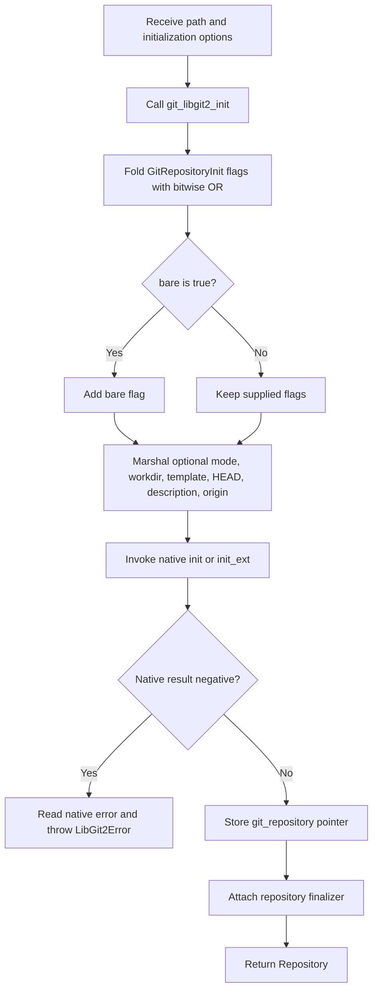

### Preconditions

- 🟢 **CONFIRMED** — The caller supplies a filesystem path and has the OS authority required to create repository files.
- 🟢 **CONFIRMED** — Extended options are optional and retain their declared Dart defaults when omitted.

### Steps

1. 🟢 **CONFIRMED** — Initialize the libgit2 runtime before repository acquisition.
2. 🟢 **CONFIRMED** — Convert typed initialization flags to one native bitmask.
3. 🟢 **CONFIRMED** — Force `GitRepositoryInit.bare` into the mask when `bare` is true.
4. 🟢 **CONFIRMED** — Marshal strings and options within the binding's temporary allocation scope.
5. 🟢 **CONFIRMED** — Invoke basic or extended native initialization.
6. 🟢 **CONFIRMED** — Translate a negative result immediately.
7. 🟢 **CONFIRMED** — Wrap the successful pointer and attach fallback finalization.

### Postconditions

- 🟢 **CONFIRMED** — Success returns an owned `Repository` that exposes the new metadata path and bare/non-bare state.
- 🟢 **CONFIRMED** — Failure returns no usable repository wrapper.

### Evidence

- 🟢 **CONFIRMED** — `lib/src/repository.dart:65-108` and `lib/src/bindings/repository.dart`.

## FL-RL-02 — Discover or Open a Repository

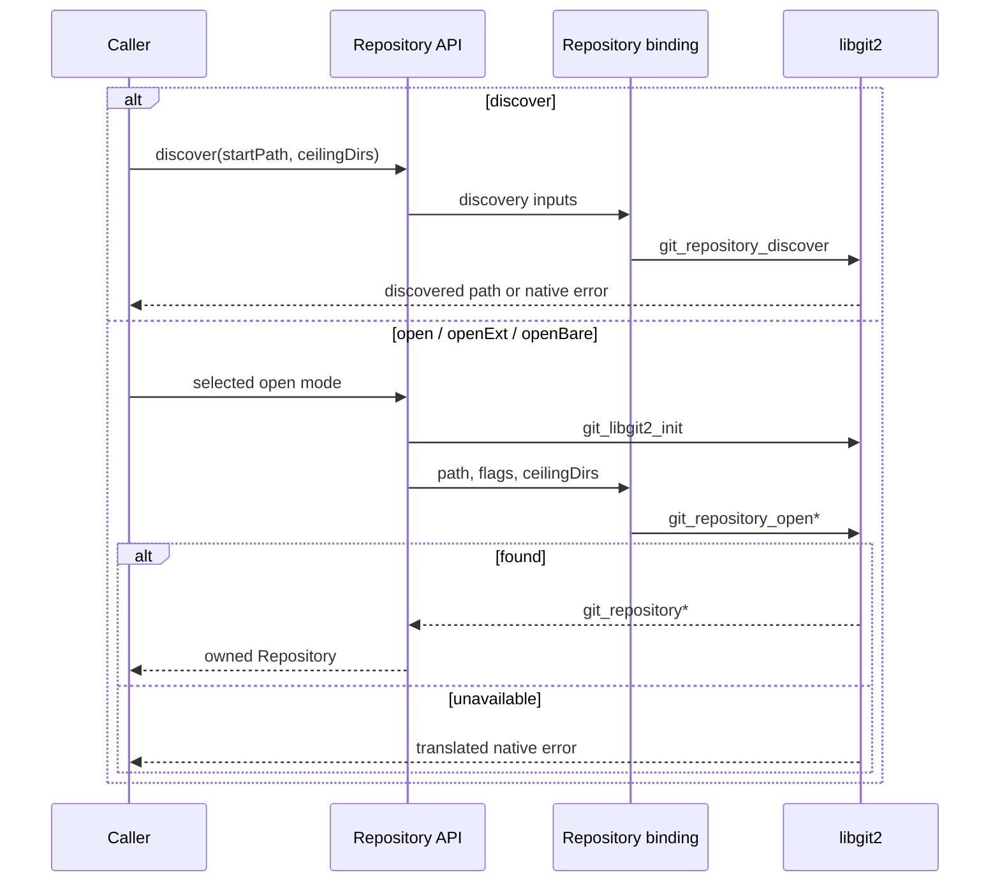

### Branches

- 🟢 **CONFIRMED** — `open` expects a repository path accepted by normal libgit2 open behavior.
- 🟢 **CONFIRMED** — `openExt` applies caller-supplied search flags and optional ceiling directories.
- 🟢 **CONFIRMED** — `openBare` uses the native bare-repository acquisition path.
- 🟢 **CONFIRMED** — `discover` returns the located repository path rather than constructing a wrapper.

### Failure exit

- 🟢 **CONFIRMED** — When libgit2 cannot locate or open the repository, the binding throws and no partial wrapper is exposed.

### Evidence

- 🟢 **CONFIRMED** — `lib/src/repository.dart:117-155`, `lib/src/repository.dart:220-222`, `test/repository_test.dart:37-74`, `test/repository_test.dart:119-132`.

## FL-RL-03 — Clone a Repository

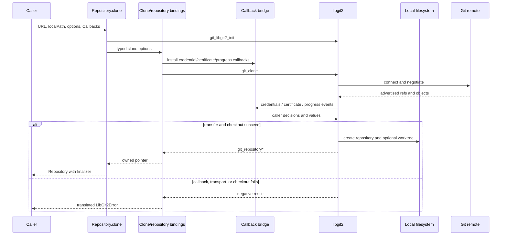

### Preconditions

- 🟢 **CONFIRMED** — The caller supplies the remote URL and local destination.
- 🟢 **CONFIRMED** — The embedding process owns network, credential, certificate, and filesystem authority.
- 🟢 **CONFIRMED** — Android consumers require platform certificate initialization before TLS-dependent remote use.

### Critical ordering

1. 🟢 **CONFIRMED** — Initialize libgit2.
2. 🟢 **CONFIRMED** — Compose repository, remote, checkout, and transfer options.
3. 🟢 **CONFIRMED** — Install callback bridges before the native transport begins.
4. 🟢 **CONFIRMED** — Let libgit2 drive authentication, trust, object transfer, checkout, and repository creation.
5. 🟢 **CONFIRMED** — Wrap only the successful final repository pointer.

### Failure and cleanup

- 🟢 **CONFIRMED** — Credential, certificate, network, repository callback, transfer, or checkout failure aborts clone through the shared error model.
- 🟡 **INFERRED** — Correct temporary-option cleanup depends on adapter arena/disposer behavior when a callback aborts midway.
- 🔴 **GAP** — Live clone interoperability is not established by the default network-skipping test configuration.

### Evidence

- 🟢 **CONFIRMED** — `lib/src/repository.dart:181-203`, repository/clone bindings, callback extraction, ADR-006, and `_reversa_sdd/flowcharts/repository-lifecycle-clone.md`.

## FL-RL-04 — Select or Detach HEAD

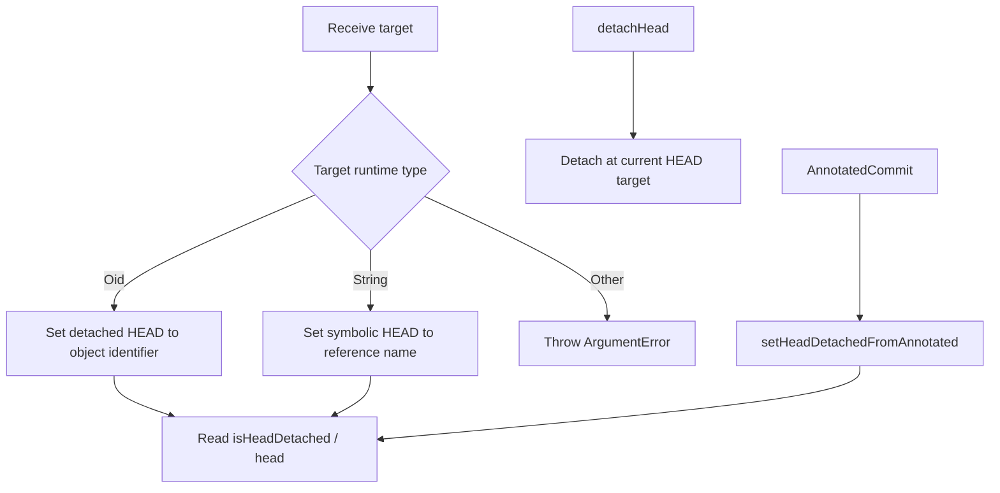

### Rules

- 🟢 **CONFIRMED** — `Oid` and `String` select different native APIs and cannot be silently interchanged.
- 🟢 **CONFIRMED** — A symbolic target may represent an unborn branch.
- 🟢 **CONFIRMED** — An unsupported target type fails locally with `ArgumentError`.
- 🟢 **CONFIRMED** — Native target lookup/state failure is distinct from local type rejection.

### Evidence

- 🟢 **CONFIRMED** — `lib/src/repository.dart:279-333`, `test/repository_test.dart:165-246`.

## FL-RL-05 — Inspect and Clean Operation State

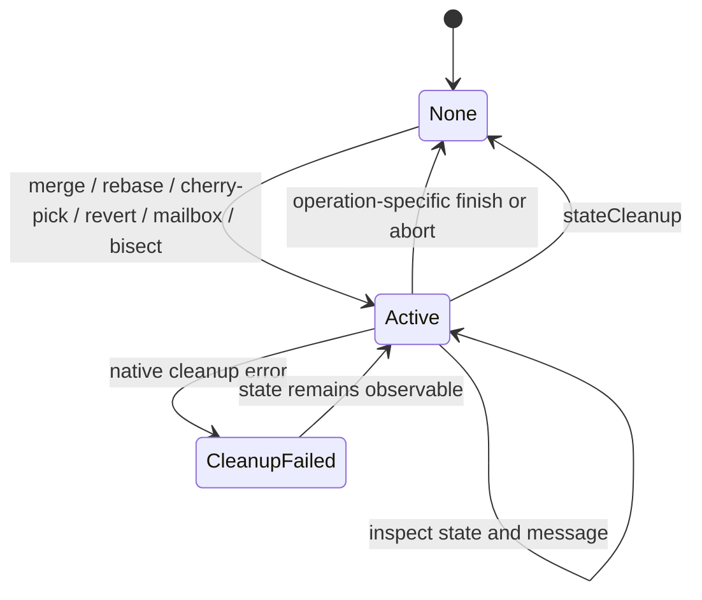

### Steps

1. 🟢 **CONFIRMED** — Read the native repository state integer.
2. 🟢 **CONFIRMED** — Decode it to `GitRepositoryState`.
3. 🟢 **CONFIRMED** — Optionally read or remove the repository operation message.
4. 🟢 **CONFIRMED** — Invoke operation-specific finish/abort or general `stateCleanup`.
5. 🟢 **CONFIRMED** — Re-read state when the caller needs confirmation of `none`.

### Failure exit

- 🟢 **CONFIRMED** — Cleanup failure throws and must not be reported as a successful state transition.

### Evidence

- 🟢 **CONFIRMED** — `lib/src/repository.dart:393-409`, `test/repository_test.dart:302-324`, `_reversa_sdd/state-machines.md`.

## FL-RL-06 — Materialize Repository Status

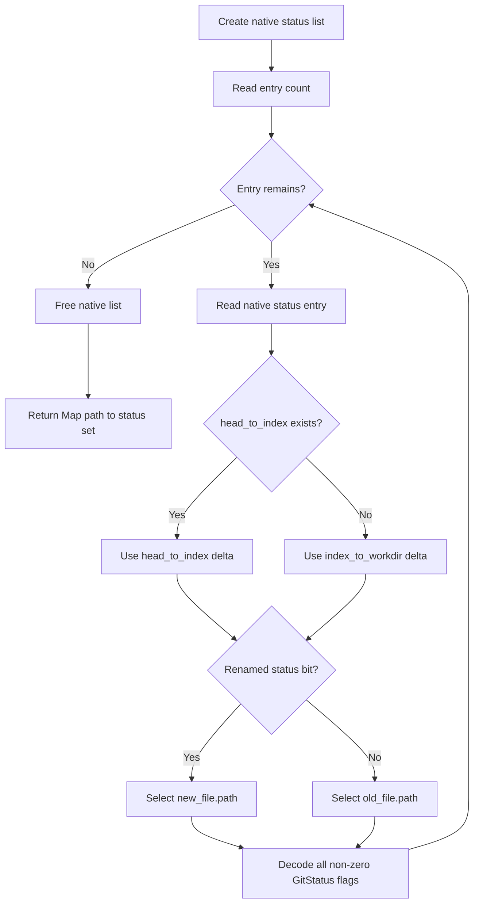

### Single-path alternative

1. 🟢 **CONFIRMED** — Call the native file-status operation with the repository pointer and path.
2. 🟢 **CONFIRMED** — Return an empty set when the native result equals zero/current.
3. 🟢 **CONFIRMED** — Otherwise decode every matching non-zero flag.

### Failure and cleanup

- 🟢 **CONFIRMED** — Bare repository or invalid path behavior is delegated to libgit2 and translated.
- 🟢 **CONFIRMED** — The native status list is released before the repository-wide status method returns.

### Evidence

- 🟢 **CONFIRMED** — `lib/src/repository.dart:584-654`, `test/repository_test.dart:255-337`, `_reversa_sdd/flowcharts/repository-lifecycle-status.md`.

## FL-RL-07 — Walk Repository History

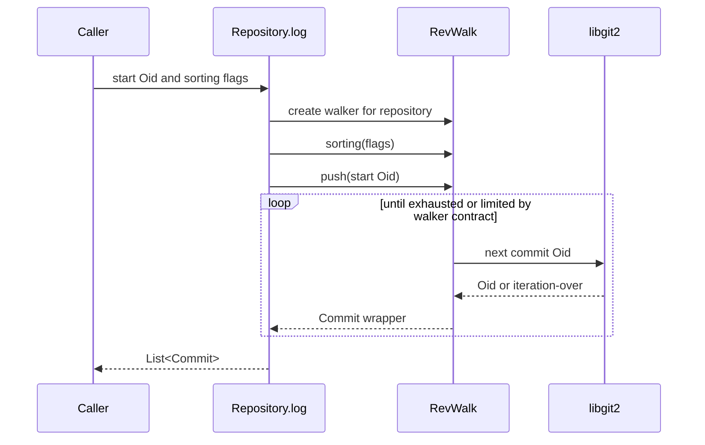

- 🟢 **CONFIRMED** — The repository helper configures and delegates traversal to `RevWalk` rather than implementing graph walking itself.
- 🟢 **CONFIRMED** — The starting OID is a required root for this helper.
- 🟢 **CONFIRMED** — Revision-walk exhaustion resets the walker according to the collaborating component contract.

### Evidence

- 🟢 **CONFIRMED** — `lib/src/repository.dart:572-582`, `test/repository_test.dart:103-118`, `lib/src/revwalk.dart`.

## FL-RL-08 — Reset Repository Projection

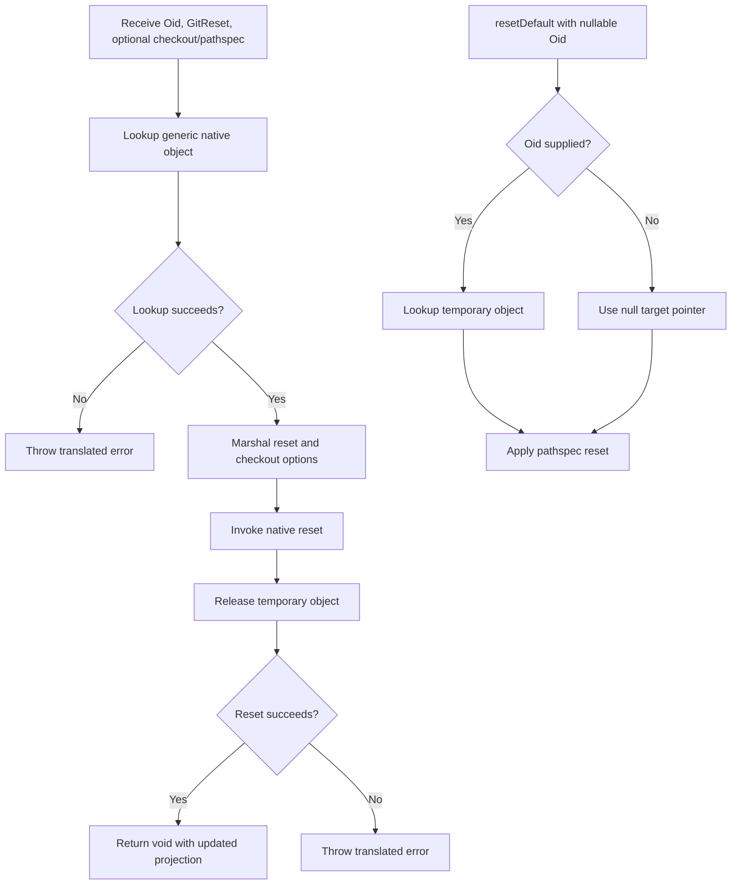

### Rules

- 🟢 **CONFIRMED** — Reset behavior is selected through typed `GitReset` and checkout options.
- 🟢 **CONFIRMED** — Default reset always receives a pathspec and may omit the target OID.
- 🟢 **CONFIRMED** — The target object is temporary and is not returned to the caller.
- 🔴 **GAP** — The extraction did not dynamically verify temporary-object release on every exceptional native branch.

### Evidence

- 🟢 **CONFIRMED** — `lib/src/repository.dart:674-723`, `lib/src/bindings/reset.dart`.

## FL-RL-09 — Manage a Linked Worktree

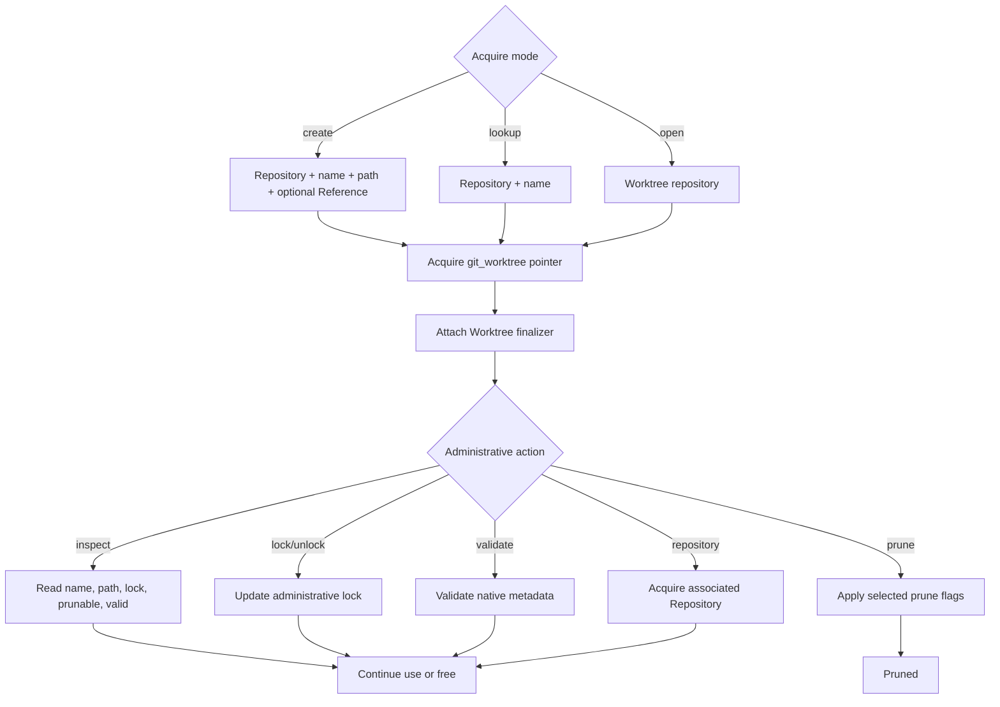

### Rules

- 🟢 **CONFIRMED** — Create requires a unique valid name and filesystem path accepted by libgit2.
- 🟢 **CONFIRMED** — A supplied `Reference` selects the worktree HEAD basis.
- 🟢 **CONFIRMED** — Lock, prune eligibility, and validity are native state, not cached Dart state.
- 🟢 **CONFIRMED** — `repositoryFromWorktree` returns a separately wrapped owned repository handle.
- 🟢 **CONFIRMED** — Explicit `free()` detaches the worktree finalizer.

### Evidence

- 🟢 **CONFIRMED** — `lib/src/worktree.dart`, `lib/src/bindings/worktree.dart`, `test/worktree_test.dart`.

## FL-RL-10 — Create a Commit on HEAD

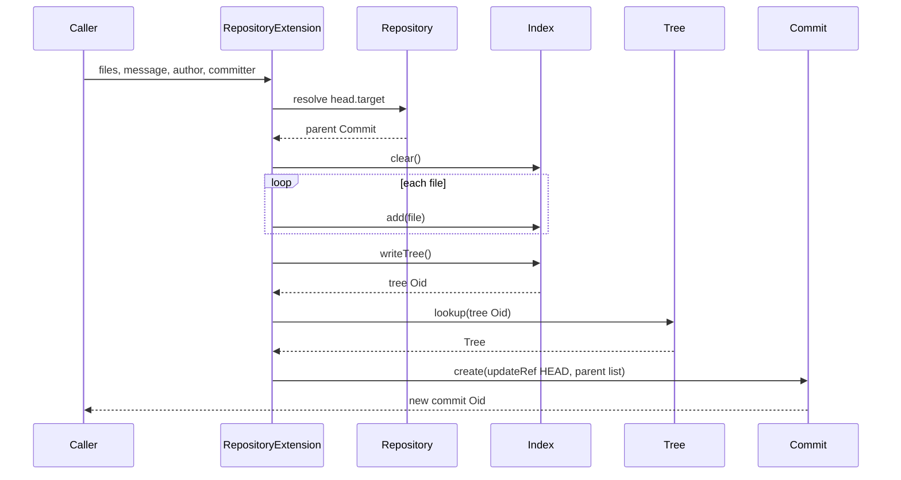

### Invariants

- 🟢 **CONFIRMED** — The current HEAD commit is the sole parent.
- 🟢 **CONFIRMED** — The index is cleared before the supplied files are staged.
- 🟢 **CONFIRMED** — Tree serialization precedes commit creation.
- 🟢 **CONFIRMED** — `HEAD` is the update reference passed to commit creation.
- 🔴 **GAP** — Dedicated legacy test coverage for this extension was not identified in the inspected repository test path.

### Evidence

- 🟢 **CONFIRMED** — `lib/src/extensions/repository.dart:6-37`.

## FL-RL-11 — Describe and Pack Repository State

### Describe

1. 🟢 **CONFIRMED** — Select repository-wide describe or commit-specific describe based on whether a commit was supplied.
2. 🟢 **CONFIRMED** — Marshal describe and formatting options.
3. 🟢 **CONFIRMED** — Acquire a native describe result.
4. 🟢 **CONFIRMED** — Format the result into a Dart string.
5. 🟢 **CONFIRMED** — Release the native describe result.

### Pack

1. 🟢 **CONFIRMED** — Create a `PackBuilder` for the repository.
2. 🟢 **CONFIRMED** — Apply the optional thread count.
3. 🟢 **CONFIRMED** — Invoke the caller's object-selection delegate or the default pack-all behavior.
4. 🟢 **CONFIRMED** — Write the pack to the requested path.
5. 🟢 **CONFIRMED** — Return the number of packed objects reported by the builder.

### Evidence

- 🟢 **CONFIRMED** — `lib/src/repository.dart:814-940`, describe and packbuilder bindings.

## FL-RL-12 — Release Native Ownership

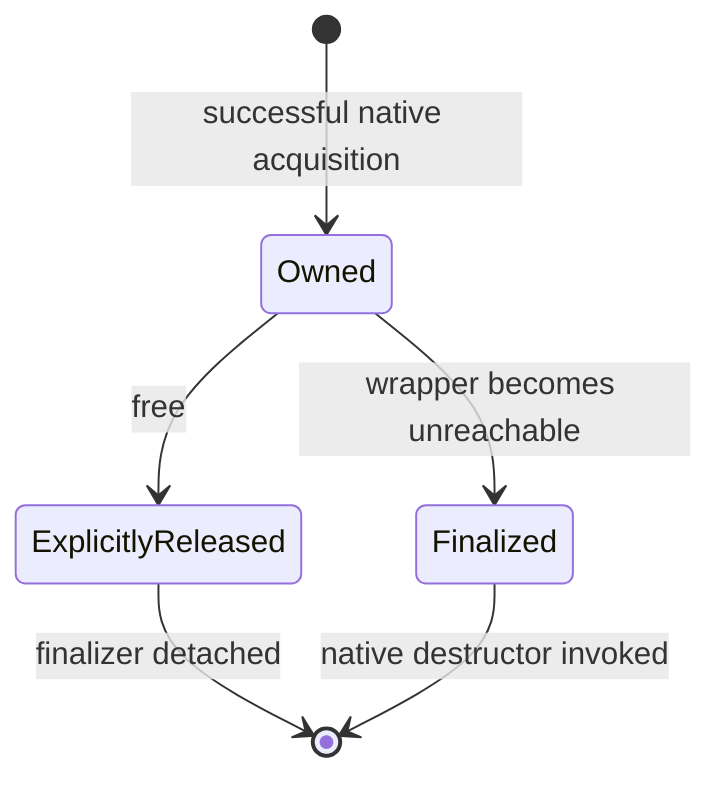

### Rules

- 🟢 **CONFIRMED** — Repository and worktree wrappers use distinct matching native destructors.
- 🟢 **CONFIRMED** — Explicit release detaches the wrapper's finalizer.
- 🟢 **CONFIRMED** — Finalization is a fallback and is not deterministic resource timing.
- 🔴 **GAP** — Repeated release and method calls after explicit release have no extracted safe-use contract.

### Evidence

- 🟢 **CONFIRMED** — `lib/src/repository.dart:438-445`, `lib/src/repository.dart:945-947`, `lib/src/worktree.dart:132-149`, ADR-003.

## Cross-Flow Invariants

| Invariant | Applies to | Confidence |
| --- | --- | --- |
| Initialize libgit2 before repository pointer acquisition. | Init, open, clone | 🟢 CONFIRMED |
| Never expose a successful wrapper when native acquisition failed. | Init, open, clone, worktree acquisition | 🟢 CONFIRMED |
| Keep raw pointer operations below the typed wrapper layer. | All flows | 🟢 CONFIRMED |
| Translate negative native results immediately while native error state is current. | All binding-backed flows | 🟢 CONFIRMED |
| Release temporary native results before returning or throwing. | Status, reset, describe, option marshalling | 🟢 CONFIRMED as design rule; 🔴 GAP for exhaustive dynamic proof |
| Attach cleanup only to owned pointers, not borrowed callback views. | Repository/worktree acquisition and remote callbacks | 🟢 CONFIRMED |
| Preserve repository identity for associated OIDs, commits, trees, index, and refs. | HEAD, log, reset, commit-on-HEAD | 🟢 CONFIRMED |
| Do not infer thread-safe overlapping mutation from the synchronous wrapper API. | All state-changing flows | 🔴 GAP |

## Flow-Level Validation Gaps

- 🔴 **GAP** — Controlled cross-platform live evidence for clone over HTTPS and SSH.
- 🔴 **GAP** — Exhaustive native allocation/free tracing during injected failure at every flow step.
- 🔴 **GAP** — Shared-wrapper and process-global behavior under concurrency.
- 🔴 **GAP** — End-to-end SHA-256 repository behavior in open, status, reset, history, describe, and pack flows.
- 🔴 **GAP** — Supported behavior after explicit wrapper release.

