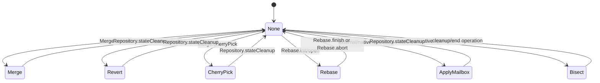
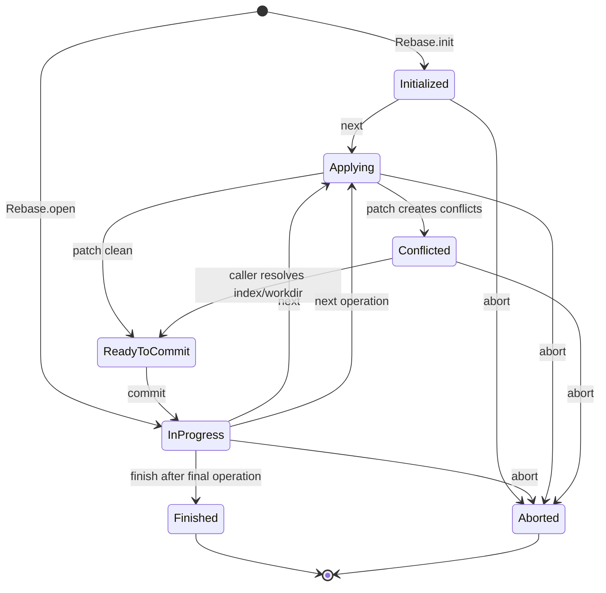
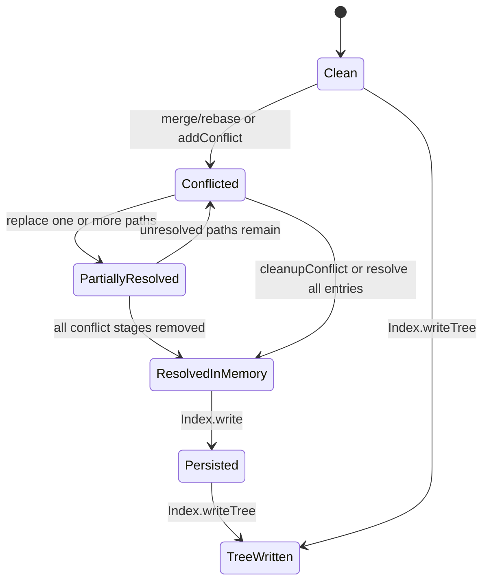
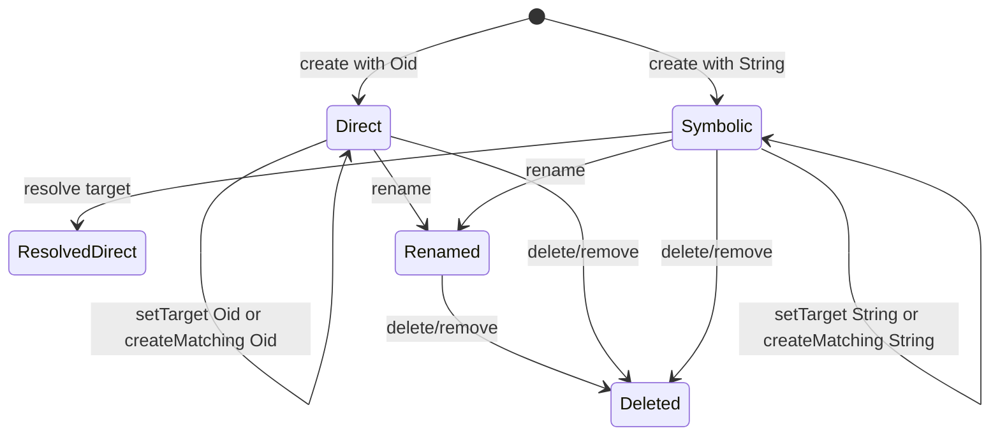
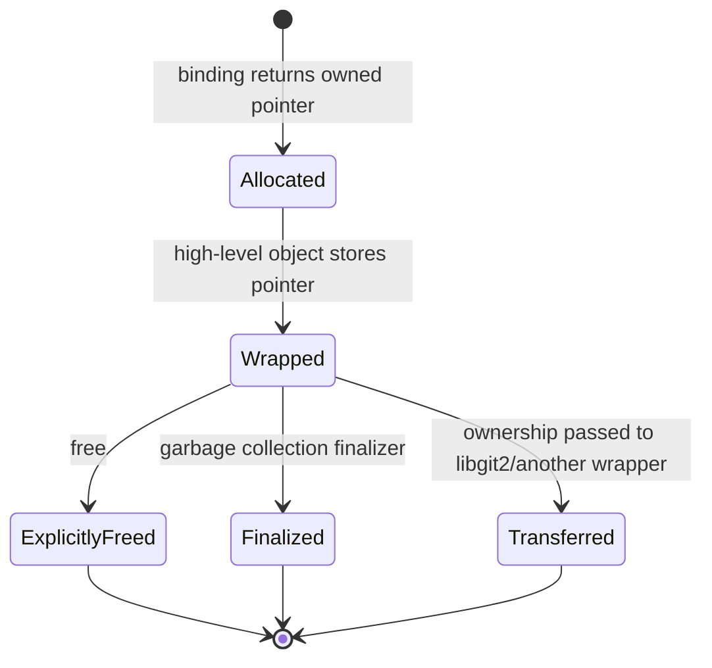
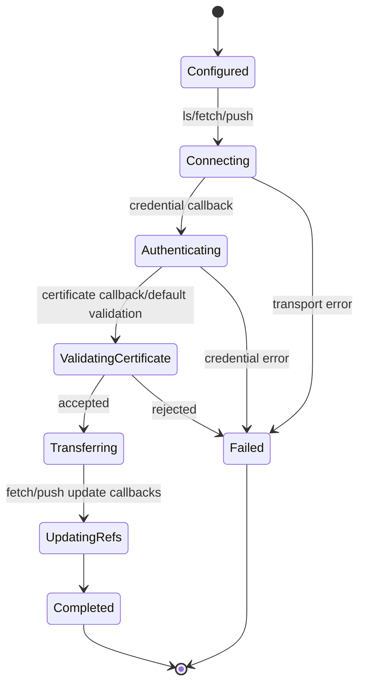

# State Machines

> These state machines combine explicit enums and documented operation contracts. Transitions not directly encapsulated by one high-level method are marked inferred.

## Repository Operation State

- 🟢 States are defined by `GitRepositoryState`: none, merge, revert, revertSequence, cherrypick, cherrypickSequence, bisect, rebase, rebaseInteractive, rebaseMerge, applyMailbox, applyMailboxOrRebase.
- 🟢 Merge documentation explicitly requires `stateCleanup` after commit/abort.
- 🟡 Some transitions are available through libgit2 state observed by this package but are not all started by dedicated high-level wrappers.

## Rebase Lifecycle

All main transitions are 🟢 confirmed by `lib/src/rebase.dart`; conflict detection is represented through the index rather than an explicit Dart rebase status field.

## Index Conflict Lifecycle

- 🟢 `hasConflicts` and ancestor/ours/theirs entries define conflicted state.
- 🟢 `writeTree` rejects unresolved conflicts.
- 🟢 `addFromBuffer` moves conflict history to REUC when resolving a path.

## Reference Lifecycle

Representation-changing updates are not exposed through a single matching operation; direct and symbolic compare-and-set paths require matching representations.

## Native Resource Lifecycle

- 🟢 Explicit `free()` detaches the finalizer.
- 🟢 Borrowed entries and callback views do not enter this owned lifecycle and must not outlive their parent.

## Remote Operation Lifecycle

This is 🟡 inferred from the native callback and high-level operation order; libgit2 owns the internal transport state machine.

