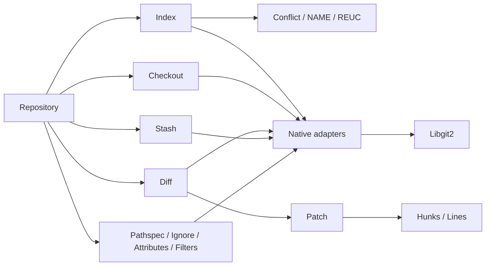
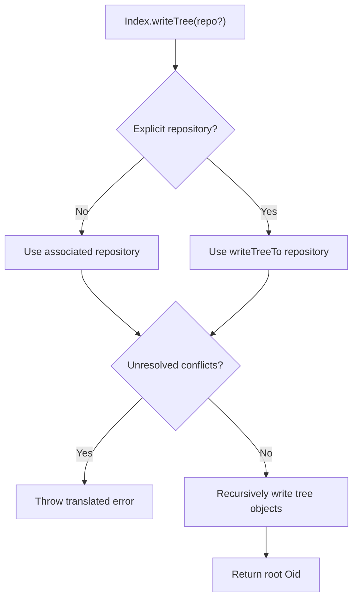
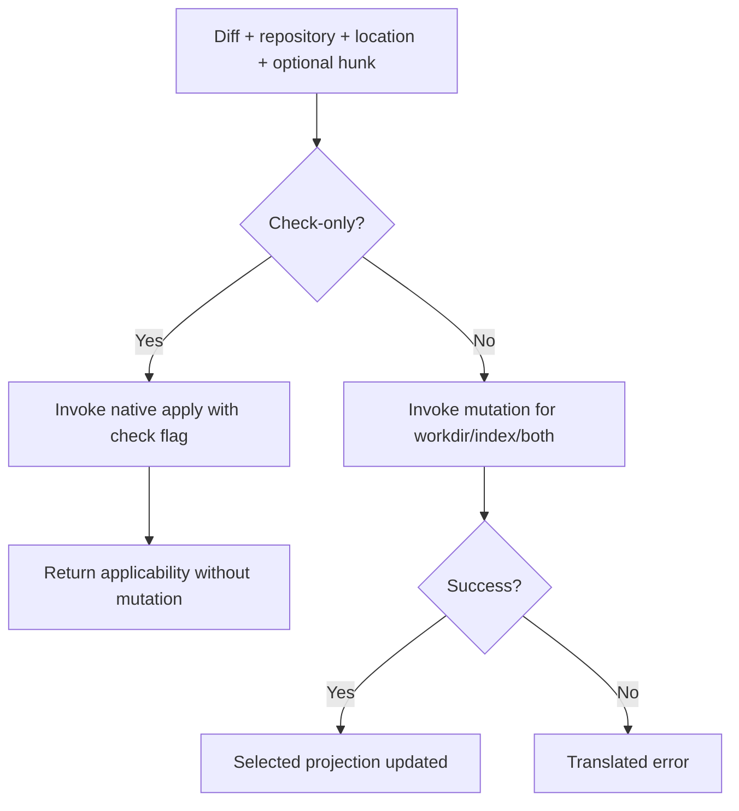

# Working Tree and Index — Technical Design

> 🟢 **CONFIRMED** — This unit is the principal mutable-state boundary between immutable Git objects, the staging index, and filesystem workdir.

## Components

## Interface and Algorithms

| Component | Principal operations | Design behavior | Confidence |
| --- | --- | --- | --- |
| `Index` | add/addAll/updateAll/remove/clear/read/write/writeTree | Runtime dispatch for entry/path; bulk pathspec marshalling; conflict gate on tree write. | 🟢 CONFIRMED |
| Conflicts | iterator/get/add/remove/cleanup, NAME/REUC | Nullable three-way sides and preserved resolve-undo metadata. | 🟢 CONFIRMED |
| Checkout | head/index/tree/reference/commit | Typed strategy flags, optional paths, progress/notify callbacks, workdir mutation. | 🟢 CONFIRMED |
| `Diff` | tree/index/workdir/buffer/blob constructors, merge, stats | Endpoint-specific native constructors and owned diff pointer. | 🟢 CONFIRMED |
| Similarity | `findSimilar` | Fold flags and assign thresholds/limit before in-place detection. | 🟢 CONFIRMED |
| Apply | `applies`, `apply`, tree application | Same native engine with check-only versus mutation target. | 🟢 CONFIRMED |
| `Patch` | from diff/blob/buffer; hunks/lines/stats | Project nested native coordinates/content into Dart values. | 🟢 CONFIRMED |
| `Stash` | save/list/apply/pop/drop | Index-based native stash lifecycle with checkout callbacks/options. | 🟢 CONFIRMED |
| `Pathspec` | compile and match endpoints | Immutable patterns; match flags; optional failed entries. | 🟢 CONFIRMED |

## Index-to-Tree Flow

## Diff Apply Flow

## Internal State

| State | Representation | Transition | Confidence |
| --- | --- | --- | --- |
| Index entries | native index plus `IndexEntry` projection | add/update/remove/read/write | 🟢 CONFIRMED |
| Conflict | stage 1/2/3 entries and nullable ancestor/ours/theirs | merge/rebase/addConflict; resolution/cleanup | 🟢 CONFIRMED |
| REUC/NAME | native resolve-undo/rename metadata | resolution and explicit removal/cleanup | 🟢 CONFIRMED |
| Diff | owned native delta collection | construct/merge/findSimilar/free | 🟢 CONFIRMED |
| Patch | owned/native projected file change | construct, enumerate hunks/lines, free | 🟢 CONFIRMED |
| Stash | repository-native ordered entries | save/apply/pop/drop | 🟢 CONFIRMED |

## Ownership and Errors

- 🟢 **CONFIRMED** — Index/diff/patch/pathspec and other owned native pointers use matching destructors/finalizers.
- 🟢 **CONFIRMED** — Bulk path arrays and option structs are call-scoped.
- 🟢 **CONFIRMED** — Diff hunk/line views must be copied or bounded by parent lifetime.
- 🟢 **CONFIRMED** — Both-null tree diff is rejected locally; other invalid state/filesystem/conflict failures are translated.
- 🔴 **GAP** — Atomic rollback is not guaranteed across multi-file checkout/apply/stash operations.

## Design Decisions

| Decision | Consequence | Confidence |
| --- | --- | --- |
| Keep index conflict sides explicit rather than flattening them. | Three-way resolution remains faithful. | 🟢 CONFIRMED |
| Use the same apply engine for check and mutation. | Applicability predicts native apply behavior without intended mutation. | 🟢 CONFIRMED |
| Expose detailed patch coordinates/content. | Consumers can build review tools without parsing unified diff text. | 🟢 CONFIRMED |
| Leave destructive strategy selection to typed caller flags. | Power is preserved; callers own data-loss policy. | 🟢 CONFIRMED |

## Observability and Gaps

- 🟢 **CONFIRMED** — Progress/notify callbacks, returned deltas/stats, filesystem/index changes, and exceptions are the observability surface.
- 🔴 **GAP** — Callback isolation under overlapping checkout/stash/diff operations is not proven.
- 🔴 **GAP** — Crash/interruption atomicity and rollback semantics are not documented.
- 🔴 **GAP** — Exhaustive native resource audit remains pending.

