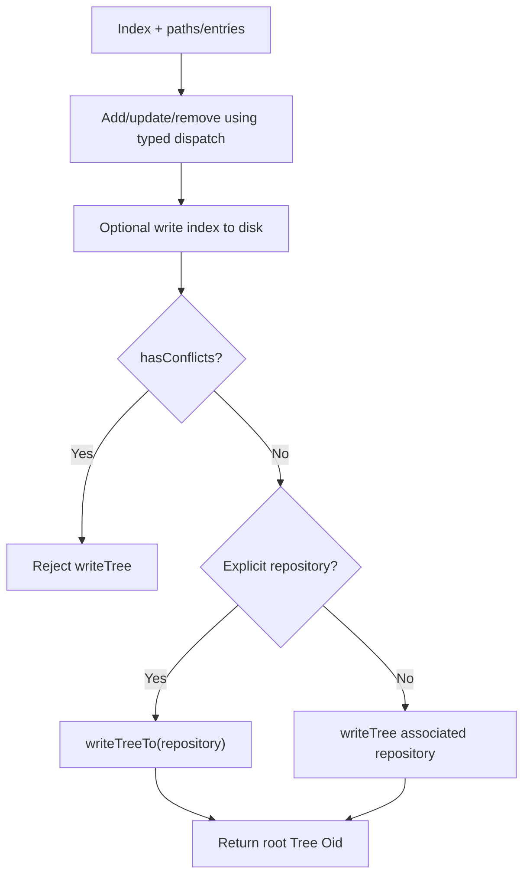
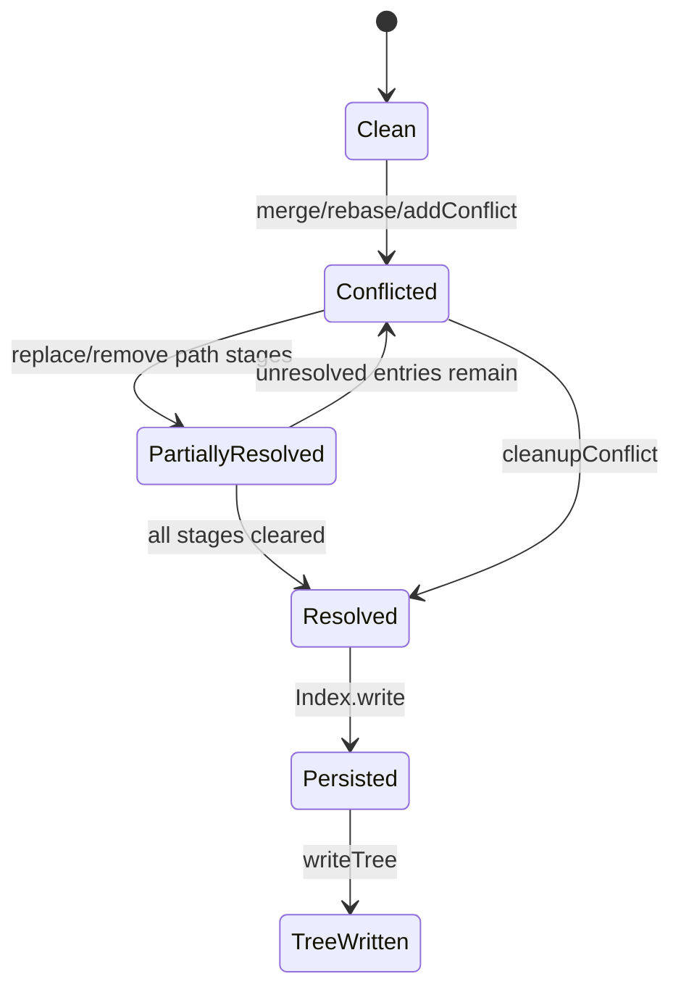
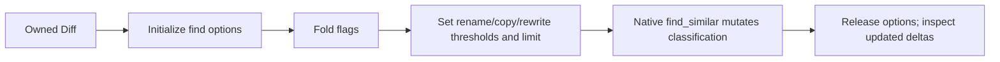
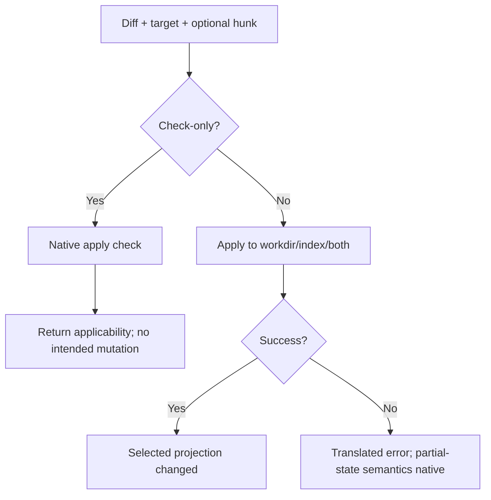
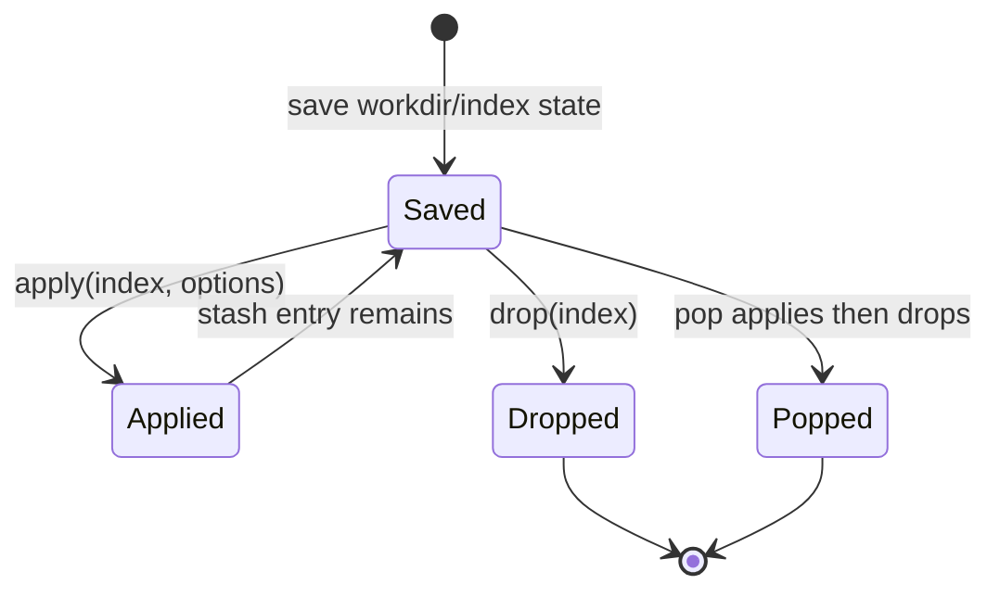

# Working Tree and Index — Operational Flows

> 🟢 **CONFIRMED** — These flows define mutable projection sequencing and conflict gates.

## FL-WI-01 — Stage Paths and Write a Tree

- 🟢 **CONFIRMED** — Bulk strings are arena-scoped.
- 🟢 **CONFIRMED** — `addFromBuffer` bypasses ignore and updates resolve-undo state.

## FL-WI-02 — Resolve a Conflict

- 🟢 **CONFIRMED** — Ancestor/ours/theirs are independently nullable.
- 🟢 **CONFIRMED** — REUC may retain prior conflict-side OIDs/modes after resolution.

## FL-WI-03 — Construct and Inspect a Diff

1. 🟢 **CONFIRMED** — Select supported endpoints: tree/tree, tree/index, index/workdir, tree/workdir, index/index, blob/buffer, or buffer/buffer.
2. 🟢 **CONFIRMED** — Reject structurally meaningless input such as two null trees.
3. 🟢 **CONFIRMED** — Marshal typed diff options and acquire an owned diff.
4. 🟢 **CONFIRMED** — Enumerate deltas/files and optionally materialize patches, hunks, lines, and stats.
5. 🟢 **CONFIRMED** — Release nested/parent resources under their ownership contracts.

## FL-WI-04 — Detect Renames and Copies

- 🟢 **CONFIRMED** — Defaults are 50/50/50/60 with limit 200 unless overridden.

## FL-WI-05 — Check and Apply a Diff

## FL-WI-06 — Checkout Content

1. 🟢 **CONFIRMED** — Select HEAD, index, tree, reference, or commit source.
2. 🟢 **CONFIRMED** — Fold checkout strategies and marshal optional paths/target directory.
3. 🟢 **CONFIRMED** — Install progress/notify callbacks when supplied.
4. 🟢 **CONFIRMED** — Invoke libgit2 to materialize the selected content.
5. 🟢 **CONFIRMED** — Translate conflicts/safety/filesystem failures.
6. 🔴 **GAP** — Do not infer transactional rollback after a mid-checkout failure.

## FL-WI-07 — Stash Lifecycle

- 🟢 **CONFIRMED** — Index validation is native and options control index reinstatement/checkout/path restrictions.

## FL-WI-08 — Match a Pathspec

1. 🟢 **CONFIRMED** — Compile immutable pattern strings.
2. 🟢 **CONFIRMED** — Fold match flags.
3. 🟢 **CONFIRMED** — Select workdir, index, tree, diff, or one path as target.
4. 🟢 **CONFIRMED** — Return matching entries and optional failed patterns.
5. 🟢 **CONFIRMED** — Release the native match list and pathspec owner correctly.

## Cross-Flow Gaps

- 🔴 **GAP** — Crash/interruption and partial mutation semantics for checkout/apply/stash.
- 🔴 **GAP** — Callback concurrency/isolation.
- 🔴 **GAP** — Borrowed hunk/line lifetime after patch/diff release.
- 🔴 **GAP** — Exhaustive native cleanup proof on all failures.

