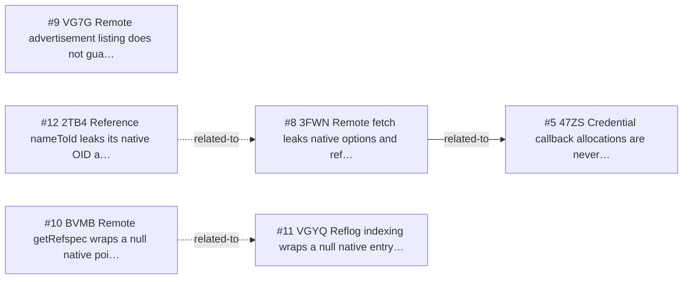

<!-- GENERATED, DO NOT EDIT: regenerated by /reversa-debugger-graph at 2026-08-21T05:03:12.641685Z from 5 bugs -->

# Bug Graph: references-and-remotes

## Clusters
- `references-and-remotes`: reversa/sdd/references-and-remotes/requirements.md is shared by BUG-20260817-3FWN, BUG-20260817-VG7G, BUG-20260817-BVMB, BUG-20260817-VGYQ, BUG-20260817-2TB4, indicating a common specification chain to review together.
- `references-and-remotes`: reversa/sdd/references-and-remotes/edge-cases.md is shared by BUG-20260817-VG7G, BUG-20260817-BVMB, BUG-20260817-VGYQ, indicating a common specification chain to review together.
- `references-and-remotes`: reversa/sdd/references-and-remotes/flows.md is shared by BUG-20260817-3FWN, BUG-20260817-VG7G, indicating a common specification chain to review together.
- `references-and-remotes`: reversa/sdd/adrs/003-use-arenas-and-finalizers-for-native-memory.md is shared by BUG-20260817-3FWN, BUG-20260817-2TB4, indicating a common specification chain to review together.

## Impact score

Heuristic for triage only; it does not replace priority or severity.

| Bug | Score |
| --- | ---: |
| BUG-20260817-3FWN | 1 |
| BUG-20260817-VG7G | 0 |
| BUG-20260817-BVMB | 0 |
| BUG-20260817-VGYQ | 0 |
| BUG-20260817-2TB4 | 0 |
